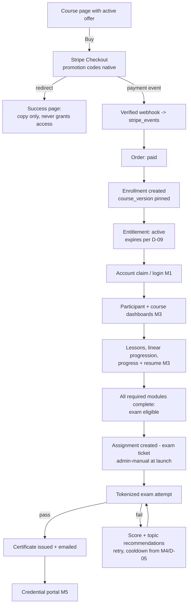
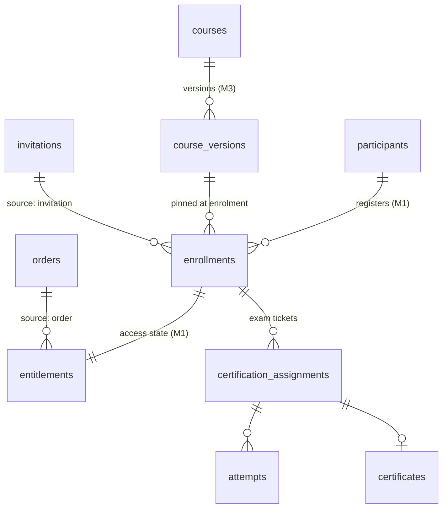

# Target product specification — roles, journeys, course/learning/assessment/certification/payment/access models

**Date:** 2026-08-01 · **Basis:** the 112-row capability matrix ([01-capability-matrix.md](01-capability-matrix.md)), locked architecture decisions A-01…A-12 ([03-target-architecture.md](03-target-architecture.md)), and the verified production audit (read-only probes of the live database and site). Deliverable 2 of the scope package.

This document specifies **what the finished academy does and for whom**. It is written against
the locked direction: evolve, don't rewrite — the certification chain (courses → topics →
questions → questionnaires → assignments → attempts → certificates) stays intact and everything
new layers around it. Every element carries its milestone (M0–M6); anything not marked for the
first release boundary (M0 + M1 + M2-or-M3 per **D-01**) is explicitly deferred. Open decisions
are referenced by D-number; the full register is [08-decision-register.md](08-decision-register.md).
Entity names used here (`enrollments`, `entitlements`, `orders`, `invitations`, `jobs`,
`course_versions`, `modules`, `lessons`, `lesson_progress`, …) are canonical across the package;
schemas live in [04-data-model.md](04-data-model.md).

---

## 1. User roles

Four roles. Two exist and launch; two are **designed in M1, built in M6** (A-11). Staff roles
live in `admin_profiles.role`; participants are a separate population on Supabase Auth (A-02) —
a participant is never an `admin_profiles` row.

### 1.1 Participant (launches M1)

Today a participant is an admin-created row reached by an unguessable 192-bit token
(`supabase/migrations/0001_core_schema.sql:176`) with no login of any kind. From M1 the
participant gains an optional Supabase Auth account, linked additively via
`participants.auth_user_id` and claimed by verified email using the existing OTP machinery
(`src/lib/certification/email-verification-core.ts:14-66`). The account is the durable home;
the token remains the exam credential (A-02).

| Capability | Milestone |
|---|---|
| Create account by claiming an existing participant record (verified email) | M1 |
| Manage profile: name, certificate display name, email, password, language preference | M1 |
| Redeem an invitation link into an enrolment | M1 |
| Purchase a course via Stripe Checkout | M2 |
| See own enrolments, entitlement status and access-expiry dates | M1 (expiry display meaningful from M2) |
| Learn: dashboards, lessons, progress, resume | M3 |
| Take the certification exam via the tokenized surface (unchanged) | live today |
| See own results per the feedback policy (§6.5) | live today; richer in M4 |
| Credential portal: all own certificates, downloads, verify links, LinkedIn metadata | M5 |
| Contact support with a reference ID (D-10) | M1 (entry point), M6 (workflow) |
| Personal-data export, correction and deletion/anonymization requests | M6 (GDPR program; D-12) |

**Explicit non-capabilities** (by design, all milestones): cannot see any other participant or
their results; cannot see per-question outcomes, correct answers or the question bank for final
exams (§6.5); cannot gain access through a checkout success page, redirect or query parameter —
access flows only from an entitlement (A-04); no self-service hard delete at launch (deletion
is a mediated GDPR workflow because certificate and financial snapshots embed personal data —
D-12); no in-app messaging or notification inbox at launch (notifications are email-only via
the M1 `jobs` outbox).

### 1.2 Academy administrator (live today; capability envelope grows per milestone)

The admin/superadmin binary stays for launch (A-11). All 36 existing admin server actions call
`requireAdmin()`/`requireSuperadmin()` first (`src/lib/auth/admin.ts:25-46`, grep-verified) and
RLS mirrors the gate. In M1 a code-level **capability map** (namespaced action registry:
`content.write`, `participants.write`, `certificates.revoke`, `finance.read`, …) is
formalised — it changes nothing for launch admins but makes instructor/support tiers additive
and gives the generalized `audit_log` its action vocabulary.

| Capability | Milestone |
|---|---|
| Content CRUD: courses/seminars, topics, question bank, questionnaires, certificate templates | live today |
| Participants: create, edit, assignment create with auto-invite, manual pass, link regenerate, resend invite | live today |
| Certificates: revoke/reinstate, send email, regenerate assets | live today |
| Certificate issue-retry for passed-but-uncertificated assignments; asset failure visibility | M0 |
| List search, pagination, filters (participants, questions, certificates) | M1 |
| Manual enrolment; record manual payments as real orders; invitations | M1 |
| Enrollment/entitlement management (extend, revoke, suspend, restore) | M1 (lifecycle controls complete in M2) |
| Review attempts, exact answers, duration, manual-pass flag (attempt viewer) | M4 — recommended pull-forward to M1 (zero schema cost, data already captured) |
| Course authoring: versions, modules, lessons, media, publish/archive | M3 |
| Revenue, orders, refunds, disputes review | M2 |
| Attempt invalidation; assessment analytics | M4 |
| Certificate replacement with lineage; bulk certificate operations; social/badge templates | M5 |
| Exports, email copy editing, GDPR workflows, impersonation, cohorts (if D-03 confirms) | M6 |

**Explicit non-capabilities:** never sees card data (Stripe-hosted checkout only, A-04); no
WYSIWYG email template editor at any milestone — layout stays code-owned, only text copy blocks
become editable in M6 (standing disposition); no hidden impersonation — until formal
impersonation (M6) exists, opening a candidate link from the admin UI writes an audit event
(M1 mitigation). **Superadmin-only:** admin provisioning and role changes, platform language
settings (`/admin/settings/language`).

### 1.3 Instructor / mentor — designed M1, built M6 (A-11)

Assigned-courses-only tier. Not built until cohorts (D-03) and instructor headcount (D-11)
exist; M1 only widens the role CHECK, reserves `instructor_courses`, and bakes the capability
map so the tier is later additive.

- **Capabilities (M6):** view assigned courses and cohorts only; review participant progress
  and results within assigned courses; internal notes on participants; communicate with
  participants in assigned scope; limited cohort operations.
- **Explicitly blocked (permanent):** financials, Stripe, global settings, GDPR requests, any
  unassigned course.

### 1.4 Support administrator — designed M1, built M6 (A-11)

Capability-map subset built alongside the M6 support workflow, when volume justifies it (three
staff users today make the tier pure overhead).

- **Capabilities (M6):** search participants; review access/enrolment/payment state; review
  email delivery (`email_events`) and support history; resend invitations and certificate
  emails; support-scoped impersonation (read-only, reason-required, audited).
- **Explicitly blocked (permanent):** exam content, manual pass, certificate revocation,
  financial configuration, global rules.

---

## 2. Participant journeys

### 2.1 Primary journey: purchase → enrol → learn → exam → certificate (M2 + M3 complete)

Step detail and rules:

1. **Course page + offer (M2).** One active offer per course: price (EUR v1, D-07), access
   duration (D-09, proposed 12 months), optional enrolment window, terms version. German
   digital-goods consent (Widerruf waiver) captured at checkout (D-14, professional review).
2. **Stripe Checkout (M2).** One-time payments only in v1 (D-07). Promotion codes are entered
   natively in Checkout (A-04); no academy coupon UI exists.
3. **Access grant (M2).** The success URL renders copy only. Access is granted exclusively by
   the verified webhook path: `checkout.session.completed` → order `paid` → `enrollments` row
   (course version pinned, A-06) → `entitlements` row `active` (A-03/A-04). Duplicate,
   delayed and out-of-order events are no-ops by state-machine guard; a nightly reconciliation
   sweep catches misses ([05-production-safety-plan.md](05-production-safety-plan.md)).
4. **Learn (M3).** Dashboards, lessons, progress, resume per §5. Every learning read is gated
   by an active entitlement, fail-closed (§9).
5. **Exam eligibility (M3).** Computed as *all required modules complete AND active
   entitlement*, surfaced as status on the course dashboard. **At launch the
   `certification_assignments` row is still created by an admin**, exactly as today;
   auto-creating the assignment on eligibility is post-launch (cross-domain with M4).
6. **Exam (live today).** The tokenized attempt flow, unchanged: server-side grading from DB
   truth (`src/lib/certification/scoring.ts:66-94`), per-questionnaire threshold, autosave,
   frozen attempt language.
7. **Certificate (live today, hardened M0).** Issued on pass, never shows the score, publicly
   verifiable; issuance gains explicit states and a retry path in M0 (§7).

**D-01 dependency:** if the client picks M2-first, this journey runs end-to-end *without* the
learn phase — purchase → entitlement → admin-created assignment → exam → certificate, which is
exactly how the business operates today plus payments. If M3-first, purchases are bridged by
manual payment recording (2.3) until M2 lands.

### 2.2 Invited / complimentary participant (M1)

1. Admin creates an **invitation** (new entity, M1): course-bound, signed non-guessable token
   stored hashed, expiring, optional max-uses and email binding, partner/label attribution.
   This replaces today's practice of the permanent exam `access_token` doubling as the invite
   credential.
2. Participant opens the link → creates/claims an account (A-02) → redemption creates
   `enrollments` + `entitlements` (source `invitation` or `complimentary`) **and a zero-amount
   order** so reporting sees every grant.
3. Learning/exam proceed as 2.1 steps 4–7.
4. Discount and fixed-price invitations arrive with M2, mapped onto Stripe promotion codes or a
   dedicated Stripe price — no academy-side price arithmetic.

### 2.3 Manually-enrolled participant (M1)

The revenue bridge while D-01 is decided. Admin records an offline payment (§3.4) → a real
`orders` row (`status='paid'`, method bank_transfer/invoice/cash/partner/complimentary) →
enrolment + active entitlement in the same flow → invite email via the jobs pipeline. The
participant experiences exactly journey 2.1 from step 4 onward.

### 2.4 Existing token-based candidate, continuing (unchanged from M0)

Nothing breaks for a candidate mid-flight. The token surface
(`src/app/certification/[accessToken]/`) remains: hub → email OTP (if unconfirmed) → attempt
with autosave → result → certificate. Invalid/inactive tokens keep the neutral anti-probing
card (`src/lib/certification/data.ts:129-145`). From M1 the hub gains one addition: a
low-pressure "create your account" prompt for confirmed participants. The assignment gains a
nullable `enrollment_id` (A-03) but its behaviour as the exam ticket is untouched.

### 2.5 Account claim for the 17 existing participants (M1)

Verified in prod 2026-08-01: 17 participants, 17/17 with an email, 11 confirmed, 0 duplicates —
the backfill is instant.

1. **Backfill (migration):** one `enrollments` + one perpetual `entitlements` row per existing
   assignment's course; unique index on `lower(email)` added first (prerequisite; prod is
   clean).
2. **Invitation to claim:** a one-off email (jobs pipeline) invites each participant to create
   their account.
3. **Claim flow:** participant enters their email → existing OTP verification proves ownership
   (the same code path that already confirmed 11 of them) → Supabase Auth user created and
   linked via `participants.auth_user_id`.
4. **Result:** the dashboard immediately shows their historic enrolment, exam results per the
   feedback policy, and issued certificates (9 live certificates, verified in prod 2026-08-01).
   Participants who never claim lose nothing — the token surface keeps working indefinitely.

---

## 3. Admin journeys

### 3.1 Author a course (M3)

Create course (root row, `kind='course'`, exists today) → version 1 draft (`course_versions`)
→ add `modules` (sort order, required flag) → add `lessons` (video via the D-02 provider,
written, download, external, quiz) → attach resources → link the final exam
(`course_versions.final_exam_questionnaire_id` → existing questionnaire chain) → preview
(participant components rendered read-only in admin context — not impersonation) → **publish**.
One published version per course; editing a published version with enrolments = duplicate to a
new draft (extends the locked edit-=-duplicate decision that already governs questionnaires).
Reorder uses the proven up/down pattern; drag-drop is polish, not scope.

### 3.2 Run a cohortless launch (M2 + M3; cohorts are D-03)

Publish the version (3.1) → create the offer: price, currency (EUR v1), access duration
(D-09), optional enrolment window → Stripe product/price created and referenced → promotion
codes managed in the Stripe dashboard → announce (outside the platform; no marketing tooling in
scope) → monitor from the admin dashboard: orders, webhook health, failed jobs, enrolment count
(§11). Self-paced is the v1 delivery model; cohort mode, if D-03 confirms, is a clean additive
layer (M6) because `enrollments.cohort_id` is reserved from M1.

### 3.3 Enrol a participant manually (M1)

Form: participant + course (version pinned automatically) + access duration override + required
reason + payment classification → creates the order (3.4), enrolment and active entitlement in
one flow → responsible admin stamped → `audit_log` event → invite email. This replaces
"create assignment as access grant"; the assignment returns to being only the exam ticket.

### 3.4 Record a manual payment (M1)

Manual payments are **real orders** (A-04): participant, course, amount, currency, method
(bank_transfer/invoice/cash/partner/complimentary), reference, paid date, note →
`orders.status='paid'`, `recorded_by_admin_id` set. Receipt handling v1 is a free-text
reference field; generated invoices are a D-13 outcome (professional review). Today the client
has zero revenue records in the system — this journey is what fixes that before Stripe exists.

### 3.5 Review attempts (M4; recommended pull-forward to M1)

Read-only drill-in from the participant detail page: attempt list → per-question view of
question snapshot vs selected vs correct answers, duration, topic scores (M4 freeze), and the
`manual_pass` flag rendered prominently so a synthetic 100 % attempt
(`src/lib/certification/data.ts:443-575`) is never mistaken for a real exam. The data has been
fully captured in `attempt_answers` since Slice 1 (392 rows, verified in prod 2026-08-01);
only the surface is missing. Deliberately minimal integrity metadata: duration and stored
display order — no per-question timers, no tab/focus tracking.

### 3.6 Handle a refund (M2; policy D-08)

Refund is executed in the Stripe dashboard → `charge.refunded` webhook → `refunds` row +
order arithmetic (partial/full). Policy engine, deliberately explicit:

- Full refund, **no certificate issued** on the enrolment → entitlement revoked
  (`status_reason='refund'`); access ends on the next request.
- Any refund where a certificate **exists** → entitlement revoked or suspended per admin
  choice, **certificate untouched**, and the order is flagged `needs_review` into the admin
  review queue. A credential is never auto-revoked by a money event (D-08 confirms the exact
  policy; professional review for consumer-law interaction, D-14).

Chargebacks (M2): dispute event → order `disputed`, entitlement suspended (reversible), admins
notified via the jobs pipeline, same review queue; won restores, lost revokes. Participant
data is never deleted during a dispute (financial tables are participant-RESTRICT).

### 3.7 Revoke a certificate (live today; hardened M0; D-04)

Revoke with reason (+ optional **public note** rendered on the verify page, M0) → status
`revoked`, revoking admin and timestamp recorded (`src/app/(dashboard)/admin/certificates/actions.ts:35-173`)
→ from M0, assets stop being fetchable: private bucket + short-lived signed URLs minted only
for valid certificates via an authorizing endpoint (A-09; D-04 is the client sign-off). The
verify page stays up and honestly shows the revoked state. Reinstatement clears revocation
fields. Replacement with lineage (wrong name, design refresh) is M5: a new certificate row
keeps the certificate number, the predecessor flips to `replaced`, and old verify links point
forward (§7.3).

### 3.8 Handle a support request (M1 entry point; D-10; M6 workflow)

v1 per D-10 (recommended: reference-ID mailto): candidate and account surfaces show a contact
entry stamped with a human reference code (participant short-ID + context) → mail lands in the
client's inbox → admin looks the reference up on the participant detail page (360° view, M1) →
a minimal `support_requests` log row records status
(new/in-progress/waiting/resolved/closed) so history accrues from day one. The full linked
ticket inbox — or, cheaper, an external helpdesk tool — is built in M6 only if volume proves
the need.

---

## 4. Course model

`courses` stays the single program root (A-06), with `kind` (`course` | `seminar`) exactly as
live today (verified in prod 2026-08-01: 1 course + 1 seminar). New layers, all additive:

| Layer | Purpose | Milestone |
|---|---|---|
| `courses` | Program root: kind, titles (DE/EN), seminar `event_date`, certificate template pin | live |
| `course_versions` | Learning-content container: draft → published → archived; one published per course; intro + instructor copy; `final_exam_questionnaire_id` | M3 |
| `modules` → `lessons` | Curriculum structure (§5) | M3 |
| `course_offers` | Commercial offering: price, duration, window (§8) | M1 schema / M2 Stripe |
| `courses.series_code` | Certificate ID series segment (D-16) | M5 |
| `cohorts` | Scheduled delivery — schema-ready (`enrollments.cohort_id` reserved M1), built only if D-03 confirms | M6 |

**Versioning is deliberately simple (locked simplification):** publish/archive states plus a
version pin on the enrolment. A published version with enrolments is structurally frozen by a
guard trigger (the proven `guard_questionnaires_update` pattern,
`supabase/migrations/0001_core_schema.sql:427-443`); copy stays editable; edit = duplicate to
a new draft. No migration tooling in v1 — at 17 participants an admin repoints a pin by hand.
Existing enrolments stay on their version; new enrolments get the latest published.
Assessment and certificate compatibility is already guaranteed by the existing snapshot and
content-locking machinery and is not rebuilt.

Seminars continue unchanged: same certification chain, single event date, per-seminar
certificate template. Seminars gain offers/enrolments like courses; whether they gain learning
content is a content decision, not an engineering one — the model permits it.

---

## 5. Learning model (M3 core; deferrals explicit)

### 5.1 Structure and lesson types (M3)

`modules` (sort order, `required` flag, `visibility`, reserved `parent_module_id` for
subtopics and typed `release_rule` for drip — both dormant at launch) → `lessons` with type:

- **video** — hosted provider per **D-02** (Mux/Bunny/Vimeo; blocks the M3 build start and is
  a GDPR-processor question — the earliest client decision needed for M3); playback via signed
  URLs; no DRM engineering (A-07).
- **written** — markdown body (DE/EN columns).
- **download** — resource attachment (covers the scope's PDF and downloadable types).
- **external** — link out.
- **quiz** — pointer to a questionnaire. **Sequencing rule:** quiz lessons must never create
  `certification_assignments` (any assignment locks content and its pass path issues
  certificates). M3 ships quizzes as ungraded inline self-checks; graded quizzes arrive with
  M4 practice semantics (§6.1).

Lesson metadata (title, description, objective, duration, required, instructor notes,
attached resources) ships as plain columns in M3. Mixed-media as a distinct type: not at
launch.

### 5.2 Progress and completion (M3)

`lesson_progress` keyed (enrolment, lesson): not_started → in_progress → completed, with a
completion source (auto-view, video threshold, quiz pass, download acknowledgement, manual by
participant, manual by admin). Course progress % = completed required lessons ÷ total required
lessons, unweighted at launch (weighted progress deferred; adding a weight later is
non-breaking). Course completion = all required modules complete. Resume is derived data —
most recent in-progress lesson, video position from the last heartbeat — not new state.

**Video completion (simplified per standing disposition, A-07):** a ~10 s heartbeat records
position and cumulative watched-%; the lesson auto-completes at a configurable threshold
(default 90 %, per-lesson override). Seeking, speed changes and rewatching are explicitly
allowed; there is **no anti-cheat** — watch data is a compliance signal, competence is proven
by the exam chain. Accessibility path: admin manual completion + written alternative.

### 5.3 Gating (M3)

Two server-side gates in the participant DTO layer (same discipline as
`src/lib/certification/data.ts` — explicit columns, never client-only):

1. **Access gate:** valid enrolment + active entitlement on every learning read, fail-closed
   (§9).
2. **Progression gate:** linear locked progression — previous required lesson/module complete —
   toggleable per course version (`linear_progression`, default on).

Quiz-score, scheduled-date, cohort and admin-approval gates are representable in the typed
release/gating fields but **deferred**; only `immediate` release is honoured at launch.

### 5.4 Launch scope vs deferred (per matrix)

| Launch (M3) | Deferred (milestone) |
|---|---|
| Participant dashboard (course cards, progress, resume, certification status, expiry, certificates list) | Cohort deadlines, saved-resources/notes widgets, in-app notifications (M6; notifications email-only at launch) |
| Course dashboard (module list with lock state, intro/instructor, resources, exam eligibility) | Cohort info panel (D-03/M6) |
| Modules + lessons, five types, metadata | Subtopics UI, mixed-media type (M6) |
| Completion tracking, video threshold, linear progression, resume | Drip release logic (M6; schema-ready), weighted progress (M6) |
| Resource attachments + entitlement-authorised downloads (private bucket, A-09 pattern) | Central faceted resource library (M6; metadata columns carried from day one) |
| Course builder (versions → modules → lesson editor, preview, publish/archive) | Drag-drop reorder, cohort/drip config UI |
| Self-paced delivery (the v1 model, stated explicitly) | Cohort mode (D-03, M6, XL), glossary (M6), personal notes (M6), bookmarks (M6), content search (M6), audio-only mode (M6, only on curriculum demand) |

---

## 6. Assessment model

### 6.1 Assessment types

Today exactly one construct exists: questionnaire = final certification exam, and every pass
issues a certificate (`src/lib/certification/data.ts:399-407`). **M4** introduces
`questionnaires.purpose`: `final_exam` (default) | `practice_exam` | `diagnostic` |
`lesson_quiz` | `module_quiz` — frozen once assigned, with certificate issuance and pass/fail
semantics gated to `final_exam` only. Practice exams reuse pools with zero cooldown;
diagnostics run the existing chain without certifying and power initial-vs-final comparison
per enrolment. Until M4, lesson quizzes are ungraded self-checks (§5.1).

### 6.2 Question bank

Single- and multiple-choice CRUD is live and reliable; content-locking freezes any question
used by an assignment. **M0:** transactional option replace (the current delete-then-insert
can lose options, `src/app/(dashboard)/admin/questions/actions.ts:176-190`) + a locked-state
precheck. **M1:** search/filters/pagination and a **duplicate** action — the operational
counterpart of edit-=-duplicate. **M4:** difficulty, author, duplicate-with-lineage
(`superseded_by_question_id`). Deferred/simplified: true/false = an authoring preset on
single_choice (no new type); ordering/matching = client decision, default **no** (they force
the first non-set-based response model and a partial-credit policy); scenario/hotspot/
written/file/video types = post-launch backlog (M6) only on concrete curriculum demand —
human-graded items dilute the auto-graded, snapshot-frozen value proposition. Import/export:
deferred (44 questions; manual authoring outpaces building an importer).

### 6.3 Pools, randomization, selection (M4)

Today the full question set is always served in stored order; the shuffle flags exist but are
display-only, re-randomize per render, and are **off for both live questionnaires** (verified
in prod 2026-08-01). M4 replaces this with the **attempt blueprint**: at attempt-start the
question set and per-question option order are frozen into `attempts.question_set`, fixing
resume-reshuffle and making the displayed-order audit server-authoritative. On top of the
blueprint: per-topic selection rules (required counts, optional difficulty mix), pool mode,
exclusion of retired questions at serve time, and repeat-penalising sampling across attempts.
**The long pole is content, not code:** pools do nothing until the client authors a 2–3×
question surplus per topic. Topic floors and critical-safety question rules are **D-06** —
schema-ready in M4, inert until the client confirms curriculum policy (today's exam serves
every topic, so "accidental pass via unrelated strength" is structurally limited until
sampling exists). Weighted questions: schema-ready nullable weight, wired only on client
confirmation — weighting fights understandable results.

### 6.4 Thresholds, retries, cooldowns

- **Threshold:** per-questionnaire `passing_percentage` (default 80; both live questionnaires
  at 80, verified in prod 2026-08-01), frozen by DB trigger once any assignment exists
  (`supabase/migrations/0001_core_schema.sql:433-437`). Already exactly what the target asks.
- **Attempts:** unlimited, full history preserved (locked scope position). M0 closes the
  integrity races: DB-enforced single open attempt per assignment, post-submit immutability
  trigger, double-submit and fail-overwrites-pass guards (A-08).
- **Cooldowns (M4, values are D-05):** per-questionnaire ladder — suggested first fail
  immediate review, second 12 h, subsequent 24 h (defaults 0/720/1440 minutes) — enforced
  server-side at attempt-start, next-eligible time shown on the hub. Practice purposes get
  cooldown 0. Until M4, the only brake is the 20/min submit rate limit — a single fixed
  cooldown is an S-sized M1 pull-forward if the client wants it earlier.
- **Invalidation (M4):** admin voids an attempt (technical malfunction / duplicate /
  integrity / admin error); the original row is preserved forever, results and status are
  recomputed from remaining attempts; invalidating a certifying attempt routes into
  certificate revocation, never silent deletion.

### 6.5 Feedback rules — what candidates see vs never see

| Candidates see | Candidates **never** see |
|---|---|
| Total score % and pass/fail (latest attempt) | Per-question right/wrong |
| Threshold line on fail | Correct answers or the question bank |
| Topic-grouped recommendation texts on fail (`src/lib/certification/scoring.ts:96-127`) | Which questions produced the recommendations |
| M4: per-topic performance bars, readiness guidance, diagnostic "start here" | Other participants' results, admin notes, internal reasons |
| M4: explanations **only** on purposes ≠ final_exam with `show_explanations` set | Explanations on final exams — the no-leakage stance is untouchable |

This is the current compliant surface (`src/lib/certification/data.ts:596-616` selects only
score/passed/recommendations) and must not be loosened when practice modes arrive. German
native-speaker QA of candidate copy remains open (**D-15**).

---

## 7. Certification model

### 7.1 Issuance and states (M0 hardening, M1 async)

Issuance stays automatic on a passing final exam (or manual pass) and idempotent
(`src/lib/certificate/issue.ts:42-50`). M0 makes the pipeline honest: certificate lifecycle
`valid | revoked | replaced` plus a separate **assets state** `pending | generating | complete
| failed` with the last error surfaced verbatim to admins, an admin **issue-retry** for
passed-assignments-without-certificate (today a silent dead-end), and state-consistency
triggers (A-08). `expired` and `pending-review` states are **excluded by locked decision** —
certificates never expire and there is no review workflow. M1 moves asset generation and
certificate email onto the `jobs` outbox with retry, so the candidate's submit request no
longer renders 300-DPI assets inline. The certificate never displays the score (locked, and
true today — the snapshot omits it).

### 7.2 Verification (live; M0 touches; M5 additions)

Public verify by QR token or by certificate ID, serving the frozen
`certificate_public_snapshot` and status only
(`src/lib/certification/data.ts:689-700` — never email/score/attempt history). M0: assets are
consumed via the authorizing signed-URL endpoint (A-09/D-04) and a revoked certificate shows
the optional public revocation note. M5: issuer, series label and course version become
structured snapshot fields for newly issued certificates (old snapshots stay frozen; rendered
conditionally). Certificate ID format: current scheme retained; the series segment
(`IIS-<SERIES>-YYYY-XXXXXX`) is adopted only for new certificates at M5 if **D-16** confirms —
existing numbers are frozen in print, QR and snapshots and are never renamed.

### 7.3 Revocation and replacement

Revocation: §3.7 (M0). Replacement (M5): a new certificate row with a fresh verification
token and render, **retaining the certificate number**; predecessor → `replaced`, linked both
ways with a reason (name correction, admin error, design update, upgrade); old verify links
resolve honestly and point to the current document; verify-by-number resolves to the
non-replaced row.

### 7.4 Credential portal and sharing (M5)

Account-based portal listing all of a participant's certificates: status, verify links,
per-format downloads through the authorizing endpoint, LinkedIn add-to-profile with a
copyable metadata block (the cheapest high-value item in the domain — pullable into the M1
account shell), then social formats (Instagram story/portrait/square, LinkedIn post) and the
website badge once client designs exist (**explicitly blocked on designs**). Social assets are
static pre-rendered per-certificate files via the proven designer-SVG pipeline — no parametric
template editor (challenge answered in the matrix). Badge embed v1 = downloadable image + a
documented link snippet; the badge is served through the authorizing endpoint so a revoked
certificate's badge renders a greyed variant. English certificate language work stays
deferred until EN is actually enabled (**D-17**; EN has never been enabled in prod, verified
2026-08-01).

---

## 8. Payment model

**Principle (A-04, non-negotiable): Stripe confirms payment; entitlements control access.**
Stripe is never consulted at request time; no success page, redirect or query parameter ever
grants anything.

- **Orders (M1):** the full schema lands in M1 so manual payments are real orders immediately
  and M2 only wires Stripe transitions. States: draft → checkout_created → pending → paid |
  failed | cancelled, then refunded / partially_refunded / disputed. "Manually paid" is
  `status='paid'` + method ≠ stripe — one state machine, the method column carries the how.
  Financial fields freeze after `paid` (guard trigger); financial rows are
  participant-RESTRICT and survive erasure requests via field anonymization (D-12). Card data
  is never stored — Stripe IDs only.
- **Stripe (M2):** Checkout for one-time payments (subscriptions out of scope v1, D-07);
  signature-verified webhook receiver — the app's first API route — with `stripe_events`
  idempotency ledger, live/test-mode isolation, admin replay, and alerting on failure (a
  silent webhook failure is silent revenue loss; M0/M1 observability is a hard prerequisite).
  `payments`, `refunds`, `disputes` as first-class records feeding §3.6.
- **Coupons:** Stripe promotion codes natively; **no academy coupon engine** (locked
  disposition). The order snapshots code, discount and campaign/partner attribution so revenue
  reporting never needs a Stripe call.
- **Manual payments (M1):** §3.4.
- **Pricing and legal:** prices/currency **D-07**; refund policy incl. post-certificate
  **D-08**; tax/VAT + invoicing (Stripe Tax vs Kleinunternehmerregelung) **D-13**;
  AGB/Widerruf checkout consent **D-14** — the last two are professional-review items and do
  not block engineering, but D-14's consent capture must be in the M2 checkout.
- **Reporting:** M2 ships revenue basics on the admin dashboard (§11); the Stripe dashboard
  remains the deep reporting surface v1.

---

## 9. Access model

**Three concepts, never collapsed (A-03):**

| Concept | Question it answers | Entity | Since |
|---|---|---|---|
| Enrolment | *Is this person registered for this course (which version, from which source)?* | `enrollments` (registration fact; pins `course_version_id`; reserved `cohort_id`) | M1 |
| Entitlement | *May they access it right now?* | `entitlements` — state machine `pending / active / expiring / expired / revoked / suspended`, source `order / manual / complimentary / invitation`, `expires_at` | M1 |
| Assignment | *May they sit this exam?* | `certification_assignments` — unchanged exam ticket, gains nullable `enrollment_id` | live |

The scope's "refunded / disputed / complimentary / manually-paid entitlement states" are
normalized: refunded/disputed are `status_reason` values on revoked/suspended;
complimentary/manually-paid are **sources** — six states, not ten (deliberate vocabulary
decision, matrix-confirmed).

Rules:

- **Gating (M1):** a single lookup helper — active-or-expiring entitlement AND
  (`expires_at` null or future) — enforced in the server DTO layer on every protected read.
  **Fail-closed** with a friendly error page (a deliberate reversal of the platform's current
  fail-soft idiom, which is wrong for access control). Per-request caching only; no Redis.
- **Expiry (M2, default D-09 — proposed 12 months):** expiry lives on the entitlement,
  enforced at read time (revocation and expiry bite on the next request, no cache
  invalidation). A daily job flips active → expiring (T-30 d) → expired for reporting and
  enqueues reminder emails at 30/7/1 days plus an expired notice, deduplicated via
  `email_events`.
- **Independence (locked):** account/portal access is persistent; **certificate validity never
  expires** and is never coupled to entitlement state — a lapsed learner keeps their
  credential and their portal.
- **Admin lifecycle (M1/M2):** extend, revoke, suspend, restore, pause — every transition
  audited with actor and reason.
- **Existing data:** backfill per §2.5 — one enrolment + perpetual entitlement per live
  assignment (20 assignments, instant; verified in prod 2026-08-01).

---

## 10. Support model (simplified per D-10)

- **M1:** contact-support entry points on candidate and account surfaces, stamped with a
  human-readable reference ID; requests land as email (mailto or trivial form-to-email via the
  jobs pipeline — D-10 chooses); a minimal `support_requests` log (status
  new/in-progress/waiting/resolved/closed, linked participant) accrues history from day one.
- **Admin side (M1):** the participant detail page is the resolution surface — profile,
  enrolments, entitlements, orders (M2), attempts (viewer, §3.5), certificates, email
  delivery feed (`email_events`), audit trail.
- **M6, only on proven volume:** the full linked-ticket inbox (or an external helpdesk tool,
  which is cheaper and recommended for evaluation first) and the support administrator role
  (§1.4).

Not in scope at any milestone: in-app chat, SLAs, auto-responders.

---

## 11. Analytics model (proportionate by design)

Production reality caps ambition: 17 participants, 23 attempts, 9 certificates (verified in
prod 2026-08-01). Analytics ship as thin derived reads over data that is already captured —
no event-tracking infrastructure, no third-party analytics on participant surfaces.

| Milestone | Surface |
|---|---|
| M1 | Admin dashboard tiles: attempts, pass rate, failed attempts, certificates issued (computable today); ops-health tiles: failed jobs, failed emails, certificate generation failures, dead-letter count (fed by `jobs`/`email_events`) |
| M2 | Revenue, refunds, disputes, new enrolments; access-expiry pipeline counts |
| M3 | Course starts, course completion, per-course progress distribution |
| M4 | Assessment analytics v1: two SQL views — question stats (usage, failure rate) and questionnaire stats (pass rate, average score, attempts per participant, topic weakness); abandonment = open attempts stale > 24 h (prod has 2 open attempts to show today) |
| M5/M6 | Share/verification analytics — **minimal and privacy-conscious** per the standing disposition: a single aggregate counter table (verify views, QR scans via `?src=qr` on new certificates only, downloads, share clicks); no per-visitor rows, no IP/UA storage |
| M6 | Analytics dashboards proper; diagnostic-vs-final cohort insight (anonymized aggregates) |

**Explicitly deferred:** question discrimination statistics and ambiguous-question detection —
at 21 submitted attempts any discrimination index is noise; revisit above a stated minimum
sample. "System warnings" are a Sentry link-out plus the jobs dead count, not a bespoke
alerting UI ([05-production-safety-plan.md](05-production-safety-plan.md)).

---

*Sibling documents: architecture [03-target-architecture.md](03-target-architecture.md) ·
data model and state machines [04-data-model.md](04-data-model.md) · migration sequencing
[06-migration-strategy.md](06-migration-strategy.md) · milestone acceptance criteria
[07-milestone-backlog.md](07-milestone-backlog.md) · open decisions
[08-decision-register.md](08-decision-register.md).*
