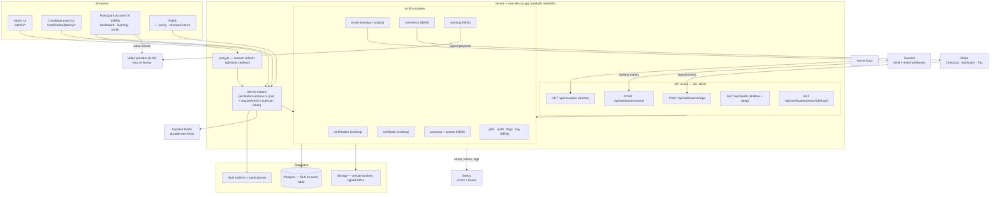
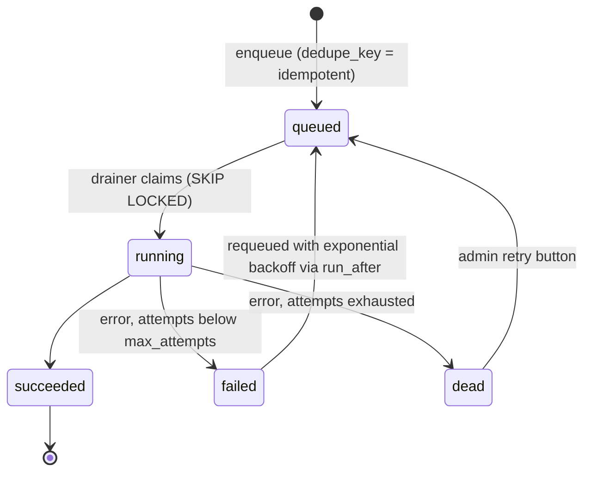

# Target architecture — components, boundaries, jobs, payments, storage, email, observability, deploy flow

**Date:** 2026-08-01 · **Basis:** locked architecture decisions A-01…A-12, the seven subsystem audits (code claims cited as `file:line`), and read-only live probes (facts marked *verified in prod 2026-08-01*). Deliverable 3 of the scope package (see [README.md](README.md)); entity shapes are finalized in [04-data-model.md](04-data-model.md), sequencing in [07-milestone-backlog.md](07-milestone-backlog.md).

The target is **one Next.js application as a modular monolith on Vercel + Supabase** — the shape that exists today, extended. Nothing in the target requires a second service, a queue vendor, or a rewrite; it requires new modules beside the well-built certification core, an operational spine (API routes, jobs, observability) that currently does not exist at all (zero route handlers, zero logging — ops audit, grep-verified), and the discipline already proven in `src/lib/certification/data.ts` applied to every new surface.

---

## 1. Architecture principles (A-01…A-12)

These are locked. Challenge only with new evidence, via [08-decision-register.md](08-decision-register.md).

**A-01 — Single academy, no multi-tenancy.** No tenant column, no org concept, no per-tenant config exists anywhere in the 17-table schema (`supabase/migrations/0001_core_schema.sql`), and the target explicitly permits a single academy. Retrofitting tenancy later is expensive, but building it speculatively now would tax every table, every RLS policy and every query for a requirement nobody has stated. Extensibility means more courses, series and instructors inside one academy.

**A-02 — Participant accounts on Supabase Auth, additive.** Participants currently have no identity beyond a permanent 192-bit `access_token` plus an email OTP gate (auth audit: `0001_core_schema.sql:176`, `src/lib/certification/email-verification-core.ts:14-66`). Every target feature — dashboards, purchases, credential portal, GDPR — presupposes an account. The additive path (nullable `participants.auth_user_id → auth.users`, claim by the already-OTP-verified email) keeps all 20 live assignments working untouched, and prod data makes the claim backfill trivial: 17 participants, 17/17 with email, 0 duplicates (*verified in prod 2026-08-01*). The token surface remains the exam-access mechanism; the account becomes the durable home.

**A-03 — Entitlement is the authoritative access record.** Today `certification_assignments` plays four roles at once — enrollment, entitlement, exam ticket and invitation (00-executive-assessment.md §5). Payments cannot land on that: nothing separates "may access this course" from "was assigned this exam". New `enrollments` (registration fact, version-pinned) and `entitlements` (access state machine: pending/active/expiring/expired/revoked/suspended, with source: order/manual/complimentary/invitation) become the access backbone; assignments survive as the exam ticket and gain a nullable `enrollment_id`. Never collapse the three into one row.

**A-04 — Stripe confirms payment; entitlements gate access.** The webhook receiver will be the app's first-ever API route (ops audit: zero `route.ts` files in 82 `src/app` files). Access must never be inferred from a Stripe redirect or a client claim: signature-verified webhook → `stripe_events` idempotency ledger → `orders`/`payments` state transitions → entitlement activation, plus a reconciliation job because webhooks get missed. Manual payments are real `orders` rows (method ≠ stripe), so reporting has one source of truth. Coupons are Stripe promotion codes — no academy coupon engine in v1.

**A-05 — Jobs = Postgres outbox table + Vercel Cron drainer.** The system currently performs its heaviest work (300-DPI native resvg render + PDF embed + two Storage uploads) inline in the candidate's submit request, with failure recorded only as an `account_history` row (`src/lib/certificate/issue.ts:189`, `generate.ts:118-131`) — the single most likely timeout/OOM point (ops audit). A `jobs` table with explicit states plus a cron-drained executor gives retry, backoff and visibility without a new vendor; at this scale (23 attempts total, *verified in prod 2026-08-01*) Postgres is comfortably sufficient as a queue.

**A-06 — Learning content extends `courses`.** `courses` already carries `kind` (course|seminar) and is the root of the certification chain; the entire chain (topics → questions → questionnaires → assignments) hangs off it with DB-enforced integrity triggers (database audit). Learning adds `course_versions` → `modules` → `lessons` beside that chain rather than a parallel "programme" concept. Versioning v1 is publish/archive + a version pin on the enrollment — full draft trees and participant migration tooling are explicitly not v1 (locked decision D3 "edit = duplicate" already covers assessment integrity).

**A-07 — Video via a hosted provider (Mux or Bunny — D-02), not Supabase Storage.** Serving adaptive video from Supabase Storage means building transcoding, HLS packaging and CDN behaviour that Mux/Bunny sell off the shelf. Progress is a completion signal (lesson completion + last-position heartbeat), not anti-cheat; no DRM engineering.

**A-08 — Explicit state machines everywhere new; retrofit the worst existing gaps.** The audits found the cost of implicit state: no DB constraint against two open attempts, a double-submit that duplicates `attempt_answers`, a fail-path that can overwrite `passed` (`src/lib/certification/data.ts:353-413`), and a certificate flow where "failed" and "still generating" are indistinguishable in the admin UI (certificates audit). Every new table carries a text+CHECK status column with a guard trigger (the house style already used for assignments and certificates); attempts gain a partial unique index and post-submit immutability trigger; certificates gain `assets_status`.

**A-09 — Certificate assets go private-with-signed-URLs.** The `certificates` bucket is public (*verified in prod 2026-08-01*) and revocation is a status flip only — revoked certificates' pristine PDFs remain downloadable forever at stable public URLs (`src/app/(dashboard)/admin/certificates/actions.ts:49-57`, `src/lib/certificate/storage.ts:12-20`). For a credentialing platform this defeats revocation. Target: private bucket, short-TTL signed URLs minted by an authorizing route that checks certificate status. Cutover kills old public URLs — acceptable and cheap at 9 certificates (*verified in prod 2026-08-01*), noted for comms (D-04).

**A-10 — Observability first-class.** The platform is operationally blind: zero `console.*` calls in `src/`, no error tracking, no error boundaries, no health endpoint, no CI, hand-pasted migrations (ops audit, all grep-verified). A production incident would be discovered by a user. Sentry, a structured logger at every catch site, `error.tsx` boundaries, `/api/health`, GitHub Actions CI and Supabase CLI migration tracking precede all feature work (M0).

**A-11 — Roles stay admin/superadmin for launch.** The role model is binary by design (`admin_profiles.role` CHECK, `is_admin()`/`is_superadmin()` — `0001_core_schema.sql:509-533`) and every one of the 36 admin server actions gates on it correctly (auth audit, grep-verified). Instructor/support tiers are designed in M1 (role CHECK widened, capability map, RLS predicate shapes) but built only in M6 when there are instructors and support volume to serve. Impersonation waits for participant accounts, then ships with reason, banner, read-only and audit.

**A-12 — i18n stays as-is: DE-first, EN dormant.** The DE/EN plumbing is shipped and disciplined (`_de`/`_en` columns, `pickLocalized`, `getServerT`/`useT`) and English has never been enabled in production — all 23 attempts are `de`, settings say `['de']` (*verified in prod 2026-08-01*). New surfaces follow the existing pattern; new content tables take `_de`/`_en` columns only (no legacy third column); the certificate-language gap stays deferred until EN activation is actually scheduled (D-17).

---

## 2. Component map

One deployable. Modules are boundaries inside the monolith — enforced by convention (each module's tables are written only through its exported functions) rather than by process isolation.



New versus existing, by component:

| Component | Today | Target |
|---|---|---|
| Admin surfaces `src/app/(dashboard)/admin/*` | Content CRUD, participants, certificates, settings | + offers/orders/refunds, enrollments/entitlements, learning content, jobs/email dashboards, audit log, attempt viewer |
| Candidate token surface `src/app/certification/[accessToken]/*` | Full exam flow, unauthenticated, service-role DTO | Unchanged in shape; gains cooldowns, async-asset "preparing" state |
| Participant account surface | **Absent** | NEW route group: login/claim, dashboard, course player, credential portal (M1/M3/M5) |
| API routes | **Zero route handlers exist** (ops audit) | NEW: Stripe webhook, Resend webhook, cron jobs drainer, health, certificate-asset authorizer |
| Background execution | **None** — heavy work inline in requests | `jobs` outbox + Vercel Cron drainer (§5) |
| Observability | **None** — no logs, no Sentry, no boundaries | Sentry + structured logger + error boundaries + health (§10) |
| CI/CD | Push-to-main → Vercel, no gates | GitHub Actions gate + tracked migrations (§11) |

---

## 3. Data ownership per module

Every table has exactly one owning module; other modules read via the owner's exported functions (or plain RLS reads for admin list pages) and never write another module's tables. Final column shapes: [04-data-model.md](04-data-model.md).

| Module | Status | Owns (writes) | Notes |
|---|---|---|---|
| `src/lib/auth` + admin settings actions | existing | `admin_profiles` | `requireAdmin()`/`requireSuperadmin()` stay the only admin gates; M0 adds the explicit `.eq("active", true)` check the code comment already claims (auth audit: `src/lib/auth/admin.ts:35-43`) |
| `src/lib/accounts` | NEW (M1) | `participants` (incl. `auth_user_id`, anonymization fields), `invitations` | Claim flow, profile management, GDPR anonymize. Participant CRUD actions move their writes behind this module over time |
| `src/lib/access` | NEW (M1) | `enrollments`, `entitlements` | The access backbone. Entitlement state transitions only via exported helpers that also write `audit_log`; `expiring`/`expired` flipped only by the reconciliation job |
| `src/lib/commerce` | NEW (M1 manual / M2 Stripe) | `course_offers`, `orders`, `payments`, `refunds`, `disputes`, `stripe_events` | Financial rows use `ON DELETE RESTRICT` to participants — erasure is field anonymization, never row deletion (D-12/D-13) |
| `src/lib/learning` | NEW (M3) | `course_versions`, `modules`, `lessons`, `lesson_progress`, `cohorts` (schema-ready, deferred, D-03) | Participant reads via a NEW service-role DTO `src/lib/learning/data.ts` mirroring the certification DTO discipline |
| Admin content actions (`admin/courses`, `questions`, `questionnaires`) | existing | `courses`, `course_topics`, `questions`, `question_options`, `questionnaires`, `questionnaire_questions` | Content locking triggers stay authoritative (database audit); M4 adds selection rules/pools per the assessment data model |
| `src/lib/certification` | existing | `certification_assignments`, `certification_assignment_topics`, `attempts`, `attempt_answers`, `email_verification_codes`, `account_history` | `account_history` **stays participant-scoped** (146 rows untouched, *verified in prod 2026-08-01*); admin-ops/config/auth events go to `audit_log` only |
| `src/lib/certificate` | existing | `certificates`, `certificate_assets`, `certificate_templates` | Gains explicit `assets_status` states and the jobs-based pipeline (§7) |
| `src/lib/email` | existing, extended | `email_events` | Builders stay pure and unit-tested; sends become jobs (§9) |
| `src/lib/jobs` | NEW (M1) | `jobs` | One implementation; every domain enqueues through it — no per-domain job tables |
| `src/lib/audit` | NEW (M1) | `audit_log` | Generalized, append-only (same trigger pattern as `account_history` — `0001_core_schema.sql:502-504`); namespaced action registry shared with the capability map |
| `src/lib/flags` | NEW (M0/M1) | `feature_flags` | Superadmin-gated writes mirroring `platform_settings` RLS (§11) |
| `src/lib/i18n` | existing | `platform_settings` | Unchanged (A-12) |
| `src/lib/log`, `src/lib/observability` | NEW (M0) | — (no tables) | Structured logger + Sentry helpers; `src/lib/rate-limit.ts` continues as-is on Upstash |

---

## 4. Service boundaries: RLS client vs service-role

Today's discipline — verified clean in the auth audit — continues unchanged and extends to new surfaces:

1. **Admin reads/writes → RLS client** (`src/lib/supabase/server.ts`), always behind `requireAdmin()`/`requireSuperadmin()` as the first awaited call (grep-verified across all 36 existing actions; every new action follows).
2. **Anonymous/tokenized flows → service-role DTO layers only.** The service-role client stays confined to one `server-only` factory (`src/lib/supabase/service.ts:1-29`, auth audit: key never read elsewhere, never `NEXT_PUBLIC_`). DTO modules select explicit columns, never `select("*")`, and return constant-shape nulls against probing (`src/lib/certification/data.ts:133-174` is the reference implementation; `src/lib/learning/data.ts` copies it).
3. **Participant account surfaces → RLS client with participant policies.** New per-table SELECT policies of the form `USING (auth.uid() = participants.auth_user_id)` (and joins through it for enrollments, entitlements, lesson_progress, own certificates) phase in as A-02 matures. The tokenized exam flow does **not** migrate to these policies — it stays service-role, because it must work without a session.
4. **API routes → service-role, gated at the boundary.** Webhooks authenticate by provider signature (Stripe signing secret, Resend Svix signature); the cron drainer and deep health check by a shared secret header (`CRON_SECRET`); the certificate-asset route by certificate status + short-TTL signed URL issuance. No API route ever trusts a body-supplied identity.
5. **Jobs handlers → service-role**, since they run with no user context; every handler writes its outcome (jobs row terminal state + `audit_log`/`email_events` as appropriate) so service-role work is never silent.
6. **RLS on every table from day one, zero anon policies** — including all new tables. The single deliberate exception stays `platform_settings`-style public reads (`feature_flags` gains anon SELECT so public surfaces can read flags).

---

## 5. Background jobs design

One `jobs` table (owned by `src/lib/jobs`, M1), drained by Vercel Cron, kicked on demand after enqueue. No queue SaaS (A-05).

**Row shape (summary — full DDL in [04-data-model.md](04-data-model.md)):** `id`, `job_type`, `payload jsonb`, `status` CHECK (`queued` | `running` | `succeeded` | `failed` | `dead`), `run_after timestamptz` (default now), `attempts int` / `max_attempts int` (default 5), `locked_at`/`locked_by`, `last_error text`, `dedupe_key text UNIQUE NULL`, timestamps. Index `(status, run_after)`.



- **Enqueue** is a single insert; `dedupe_key` (e.g. `cert-assets:{certificateId}:{content_version}`, `email:certificate:{certificateId}`) makes retried callers idempotent via `ON CONFLICT DO NOTHING`.
- **Drain**: `GET /api/cron/jobs` (Vercel Cron every minute, secret-gated) claims due rows with `UPDATE … SET status='running', locked_at=now(), locked_by=<invocation id> WHERE id IN (SELECT … WHERE status='queued' AND run_after <= now() ORDER BY run_after LIMIT n FOR UPDATE SKIP LOCKED)`, executes handlers by `job_type`, and writes terminal state + `last_error`. A stale-lock sweep requeues `running` rows whose `locked_at` exceeds the max function duration (crash recovery).
- **On-demand kick**: after enqueue, callers fire a non-awaited fetch to the drain route so users don't wait up to a minute (certificate assets after a pass; receipt email after a webhook).
- **What runs on it** (initial job-type registry): `certificate.generate_assets`, `email.send` (**all** outbound email — invite, OTP, certificate, receipt, reminders), `reminder.entitlement_expiry`, `reminder.attempt_incomplete`, `reconcile.stripe`, `reconcile.invariants` (the invariant sweep from [05-production-safety-plan.md](05-production-safety-plan.md), doubling as the jobs heartbeat that `/api/health?deep=1` checks), `cleanup.verification_codes`.
- **Admin visibility**: an `/admin/settings/jobs` list (status, attempts, last_error, retry button for `dead`). This directly replaces today's pattern of results discarded by callers (`issue.ts:189`, `participants/actions.ts:555`).

**Timing note:** M0 makes the certificate pipeline *visible and retryable* synchronously (state columns + retry actions + logging); M1 moves execution onto jobs. The two-step avoids changing behaviour and infrastructure in the same release (certificates audit recommendation).

---

## 6. Payment integration flow

Stripe Checkout, one-time payments first (D-07). The webhook receiver and `stripe_events` ledger are the pattern-setters for all webhook handling (the Resend receiver shares the shape).

```mermaid
sequenceDiagram
  autonumber
  participant B as Browser (participant)
  participant SA as Server Action (commerce)
  participant ST as Stripe
  participant WH as POST /api/webhooks/stripe
  participant DB as Postgres
  participant J as jobs drainer

  B->>SA: buy course (active course_offer)
  SA->>DB: insert orders row (status = checkout_created)
  SA->>ST: create Checkout Session (metadata: order_id; Stripe Tax per D-13)
  SA-->>B: redirect to Stripe-hosted Checkout
  B->>ST: pays
  ST-->>B: redirect to success URL ("payment is being confirmed")
  ST->>WH: checkout.session.completed (signed)
  WH->>WH: verify signature (reject otherwise, 400)
  WH->>DB: INSERT stripe_events(id = event id) ON CONFLICT DO NOTHING
  alt event id already processed
    WH-->>ST: 200 — replay is a no-op
  else new event
    WH->>DB: orders → paid (guard trigger: forward-only) + payments row
    WH->>DB: enrollments + entitlements → active (source = order) — idempotent upsert
    WH->>DB: enqueue jobs: email.send (receipt, welcome)
    WH->>DB: stripe_events → processed
    WH-->>ST: 200
    WH->>J: on-demand drain kick
  end
  Note over B,DB: success page polls the entitlement, never trusts the redirect (A-04)
  Note over ST,DB: reconcile.stripe job (nightly) lists recent Stripe sessions/refunds and diffs against orders/payments — missed webhooks surface as flagged orders, not silent revenue loss
```

Idempotency and failure layers, in order: (1) `stripe_events.id` primary key — exact replay suppression; (2) order lookup by `stripe_checkout_session_id` UNIQUE — duplicate sessions cannot double-fulfil; (3) entitlement activation is an idempotent state transition; (4) any handler error marks `stripe_events.processing_status = 'failed'` with the error and returns 500 so Stripe retries; (5) `reconcile.stripe` catches whatever all of that misses. Refunds and disputes arrive by the same route (`charge.refunded`, `charge.dispute.*`) and drive `refunds`/`disputes` rows plus entitlement `revoked`/`suspended` per policy (D-08). Card data never touches the platform — Stripe IDs only.

---

## 7. Certificate generation pipeline (target)

Today issuance is a non-transactional sequence with silent dead-ends: if the `certificates` insert fails after the assignment flips to `passed`, the candidate sees "being prepared" forever and **no retry path exists** (`src/lib/certificate/issue.ts:167-169`); asset generation runs inline in the submit request and its result is discarded (`issue.ts:189`); "failed" and "still generating" are indistinguishable in the admin UI (certificates audit). Target:

**Explicit states** (M0, columns on `certificates`): `assets_status` CHECK (`pending` | `generating` | `complete` | `failed`) + `assets_error text` (surfaced verbatim to admins). Backfill existing rows to `complete` — 9/9 prod certificates already have both assets (*verified in prod 2026-08-01*). Certificate `status` gains `replaced` (M5 lineage); a consistency trigger ties statuses to their timestamps (A-08).

**Pipeline** (M1, async):

1. Pass recorded → `issueCertificate()` inserts the certificate row (snapshot frozen exactly as today — that part is sound) with `assets_status='pending'`, then enqueues `certificate.generate_assets` (dedupe-keyed) and kicks the drainer. The candidate result page renders immediately; the certificate page shows "your files are being prepared" with refresh until `complete`.
2. The job flips `generating` → renders PNG/PDF → uploads to the **private** bucket (§8) → upserts `certificate_assets` rows (with `content_version`) → `complete`. Failure: `failed` + `assets_error`, job retries with backoff up to `max_attempts`, then `dead` — visible in both the jobs dashboard and on the certificate row.
3. `certificate.send_email` is a separate job (attaching the **official PDF**, not the snapshot SVG — fixing the acknowledged gap, certificates audit) enqueued on completion where auto-send is configured, or by the existing admin/candidate buttons.

**Retry paths, admin-visible:** "Issue certificate" button for a passed assignment with no certificate row (re-invokes the already-idempotent `issueCertificate` — closing the dead-end above); "Regenerate files" re-enqueues the asset job and bumps `content_version`; `dead` jobs re-queue from the jobs dashboard. **Guard:** issuance refuses to run when `NEXT_PUBLIC_SITE_URL` is unset, because a relative verification URL would otherwise be frozen into an immutable snapshot and QR forever (`src/lib/public-url.ts:6-18`, `issue.ts:126-151`; prod is currently clean — 0 relative URLs, *verified in prod 2026-08-01*).

---

## 8. Storage strategy

Per A-09: **private buckets + short-TTL signed URLs**, mediated by authorizing routes. The current model — public bucket, stable guessable-once-known paths, revocation leaves files untouched — is the confirmed weakness this replaces (auth audit; bucket public, *verified in prod 2026-08-01*).

| Bucket | Visibility | Contents | Layout |
|---|---|---|---|
| `certificates-private` (NEW) | private | official PDF, PNG preview, future social/badge formats | `{certificateId}/v{content_version}/official.pdf` etc. — version in the path is the CDN cache-buster regeneration currently lacks (certificates audit) |
| `course-content` (NEW, M3) | private **from birth** | lesson downloads, resources, optional audio | `{courseVersionId}/{lessonId}/{filename}` |
| `certificates` (existing, public) | public → retired | legacy assets (18 objects, *verified in prod 2026-08-01*) | dual-read window, then cutover |
| Video | — | **not in Supabase Storage** — hosted provider per A-07/D-02 | provider-signed playback URLs |

**Access route:** `GET /api/certificates/assets/[certificateId]/[assetType]` checks certificate status — `valid` → 302 to a signed URL (TTL minutes); `revoked` → 403 (or a greyed badge variant for badge types, D-04); `replaced` → 302 to the successor's asset. Verify page, candidate certificate page, admin links and emailed links all route through it, so emailed links stop being permanent credentials. Lesson downloads get the equivalent entitlement-checked route in M3.

**Migration note:** upload new assets to the private bucket while readers try private-then-public (dual-read); backfill-copy the 18 legacy objects (instant at this volume); flip surfaces to the authorizing route; delete the public bucket. Previously emailed public URLs die — client sign-off + comms note under D-04. Full sequence: [06-migration-strategy.md](06-migration-strategy.md).

---

## 9. Email architecture

Today email truth ends at the Resend API: acceptance is recorded as success (`emailed_at` stamped after a 200 — `src/app/(dashboard)/admin/certificates/actions.ts:119-134`), failures are swallowed generically, `resendInvite` fails invisibly, and there is nowhere for bounce webhooks to land (certificates + ops audits). Target:

- **Outbox via jobs.** Every send is an `email.send` job (`email_type` + reference IDs in the payload). Builders stay pure, localized and unit-tested exactly as now (`src/lib/email/*-core.ts`; 13 existing builder tests, ops audit); the job handler renders, sends via Resend, records the provider message id, and retries transient failures with backoff. A send failure is a `failed`/`dead` job an admin can see and retry — never a swallowed generic string.
- **Delivery truth via `email_events`.** `POST /api/webhooks/resend` (Svix signature-verified, same receiver pattern as Stripe) appends `sent`/`delivered`/`delivery_delayed`/`bounced`/`complained` events keyed by provider message id. `certificates.emailed_at` becomes derived/display-only; admin surfaces show real delivery state (invite delivered? certificate bounced?) instead of inferring from history rows.
- **Template ownership in code, editable copy blocks in data.** Per the standing disposition (no template-editor UI), layout/structure live in versioned code; admin-editable greeting/intro/sign-off copy blocks live in a small table with `_de`/`_en` columns (A-12), fetched by the builders with code defaults as fallback. This gives the client copy control without a WYSIWYG surface that could break rendering (M6).
- **Reminders** (entitlement expiry, incomplete attempts, unclaimed invitations) are enqueued by the reconciliation/expiry jobs — no new mechanism.

---

## 10. Observability stack

Everything here is M0 and precedes behaviour-changing repairs, so their rollout is watchable (safety-security audit sequencing note).

- **Sentry** — server, client and edge/proxy, wired via `instrumentation.ts` (absent today, ops audit). Release tagging per deploy; alert rules for new-issue and error-rate spikes. Unhandled server-action errors (e.g. `recordAttempt`'s bare throw, `data.ts:369-371`) stop being invisible.
- **Structured logger** (`src/lib/log.ts`) — JSON to stdout (Vercel log-drainable), levels + event names + reference IDs, called at **every** catch site. The audit catalogued the current idioms — discard, void-swallow, silent fallback (ops audit "error-handling idioms") — each one gains a log line and, where user-facing, a Sentry capture. Silent fallbacks that mask misconfiguration (rate-limit in-memory fallback `src/lib/rate-limit.ts:105-121`, i18n default-DE, email-disabled) log a warning on first occurrence per boot.
- **Error boundaries** — `error.tsx` per route group + `global-error.tsx` (none exist today): candidates mid-exam get a localized recover-or-retry screen, admins get a reference ID; both report to Sentry.
- **`GET /api/health`** — shallow (default): process up, build/commit id, required env vars *present* (never values). Deep (`?deep=1`, secret-gated): DB round-trip, storage bucket reachability, Resend/Upstash config presence, jobs heartbeat (last `reconcile.invariants` success within threshold), migration parity (latest applied migration matches the build's expectation). Uptime monitoring pings shallow every minute, deep on a longer interval — this is the platform's pager, replacing "a user tells us".
- **Metrics** — deliberately minimal, derived from tables the architecture already produces: jobs throughput/dead count, email bounce rate, webhook failure count, certificate pipeline failure count — surfaced on an admin ops dashboard (M6) and checked by the invariant sweep long before that. No separate metrics vendor. Vercel function duration/timeout data covers the render-latency question the audits could not answer (ops audit open questions).
- **Env validation at boot** — a Zod env schema (zod is already a dependency) fails the deploy on missing/malformed required vars, replacing today's mixed eager/lazy/silent handling; the M0 production env audit (Upstash presence — the single biggest unverified security variable, production-truth) closes the loop on the client-owned Vercel account.

---

## 11. Deployment flow

Today: push to main → Vercel auto-build, no CI, migrations hand-pasted into the SQL editor (README.md:46-50; ops audit). All migrations happen to be applied and parity is clean (*verified in prod 2026-08-01*) — by care, not by tooling. Target:

1. **GitHub Actions CI** on every PR and on main: `pnpm typecheck` → `pnpm lint` → `pnpm test` (the 171 existing tests currently run only when someone types the command locally — ops audit) → `pnpm build` → `supabase db diff --linked` drift gate. Main is branch-protected; Vercel deploys only green commits (deployment gating on the CI check).
2. **Tracked migrations** — Supabase CLI adopted in M0: `supabase link`, baseline `0001–0007` into `supabase_migrations.schema_migrations`, SQL-editor pasting forbidden thereafter. Migrations stay small, single-purpose, additive-first (expand → migrate → contract); new columns nullable-or-defaulted before code depends on them.
3. **Migrate-before-deploy order** — CI applies pending migrations to production (`supabase db push` in the deploy workflow) **before** Vercel promotes the new build. Combined with additive-first discipline, old code always runs against the new schema during the promotion window; brief maintenance windows for anything sharper are essentially free at current volume (production-truth).
4. **Feature flags** — a `feature_flags` table (key/enabled/description, superadmin-gated writes mirroring `platform_settings` RLS, anon SELECT, cached read helper with per-flag fail-safe defaults; env-var override for boot-critical toggles). New verticals — accounts, checkout, learning — ship dark behind flags and are enabled per environment, decoupling deploy from release. This is how M1–M3 code reaches production without D-01 being decided.
5. **Post-deploy smoke test** — a workflow step hits `/api/health?deep=1` and the public verify page of a known certificate; failure alerts and blocks promotion.
6. **Rollback** — code: Vercel instant rollback to the previous deployment (safe because schema changes are additive). Schema: roll forward with a compensating migration (down-migrations not maintained; each migration header notes its compensation). Data: PITR/backup posture per [05-production-safety-plan.md](05-production-safety-plan.md), including the M0 backup-restore verification and the Supabase-dashboard audit items the repo cannot see (production-truth open items).

---

*Sibling docs: product behaviour in [02-target-product-spec.md](02-target-product-spec.md) · entities and state machines in [04-data-model.md](04-data-model.md) · monitoring/reconciliation detail in [05-production-safety-plan.md](05-production-safety-plan.md) · cutover sequences in [06-migration-strategy.md](06-migration-strategy.md) · per-milestone scope in [07-milestone-backlog.md](07-milestone-backlog.md) · open decisions (D-01…D-17) in [08-decision-register.md](08-decision-register.md).*
