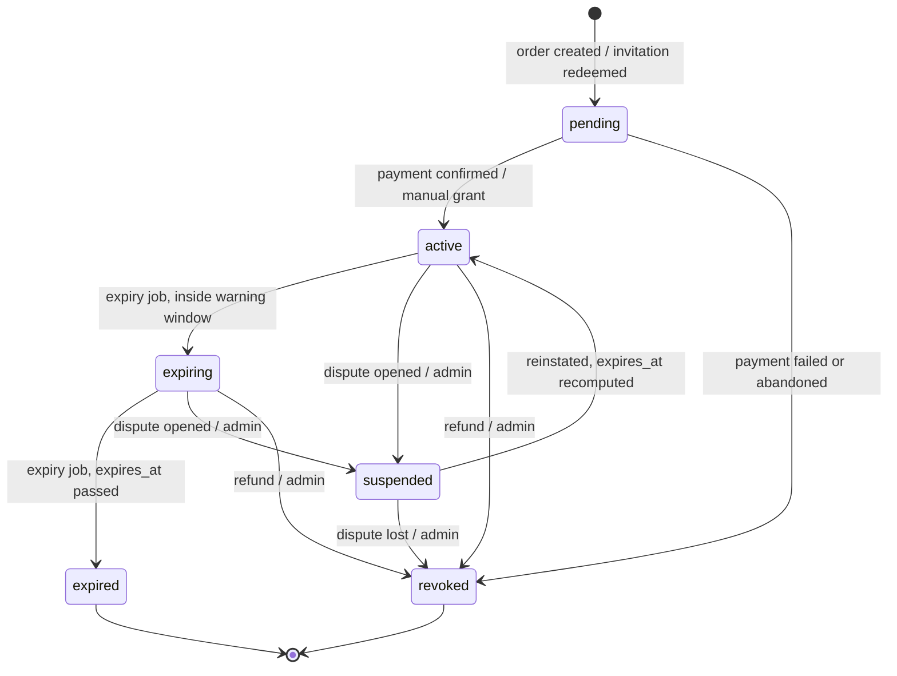
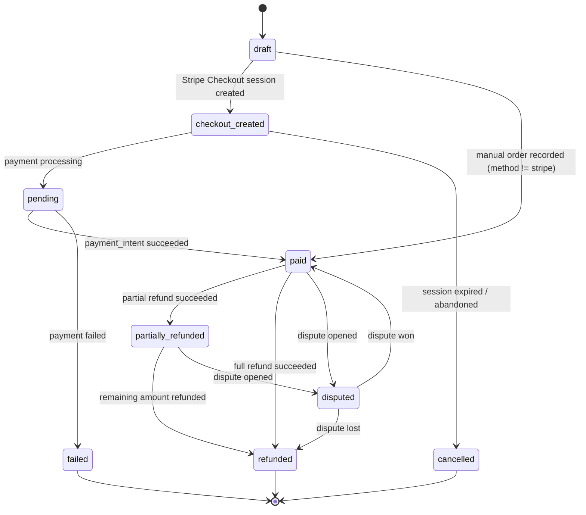
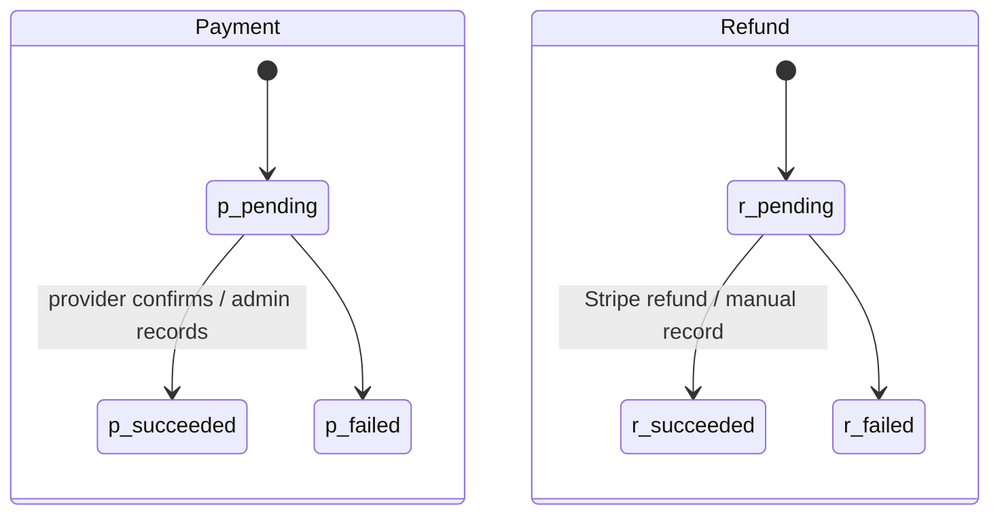
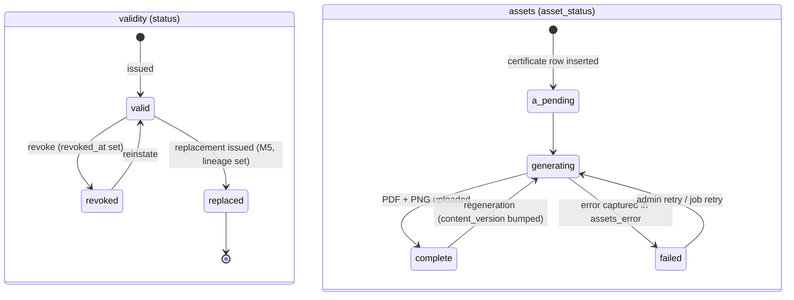
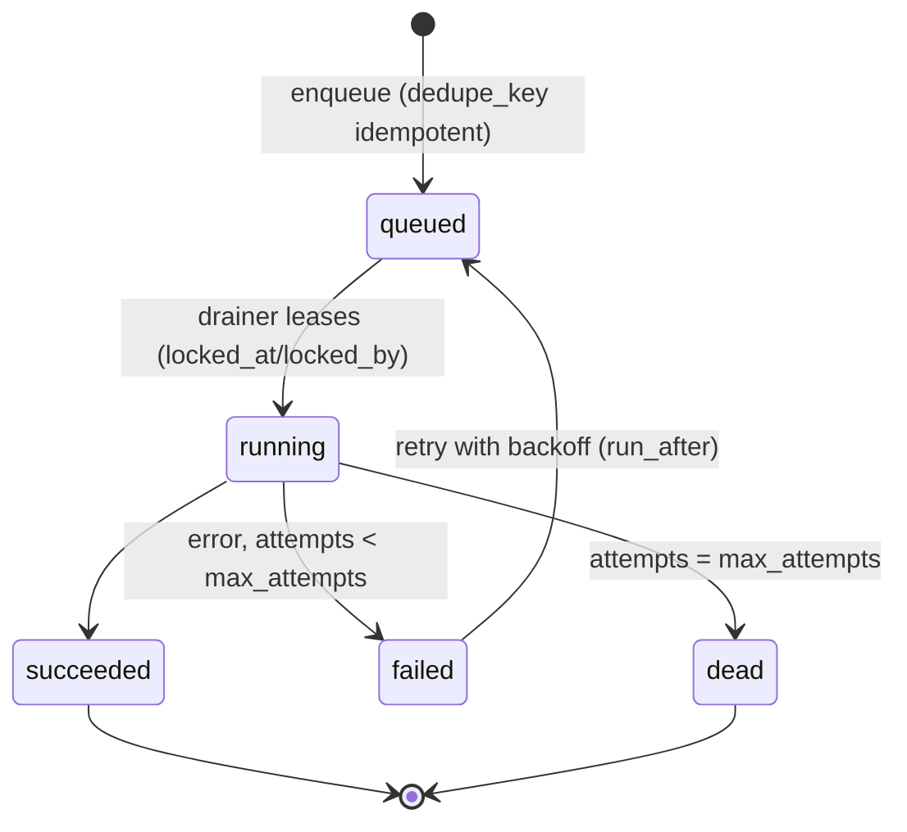
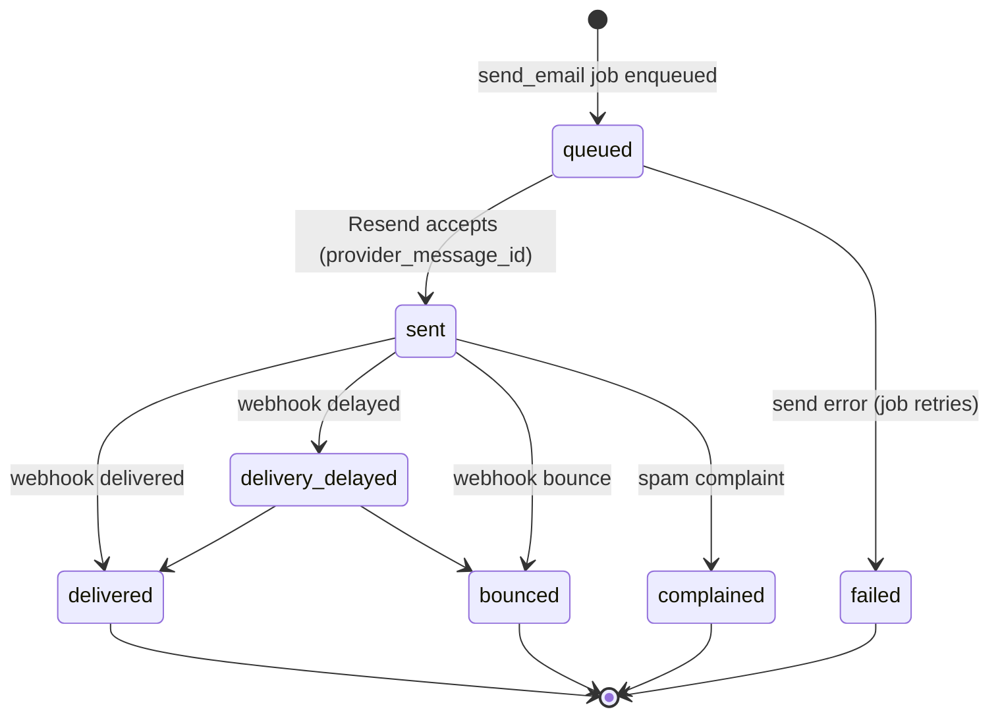
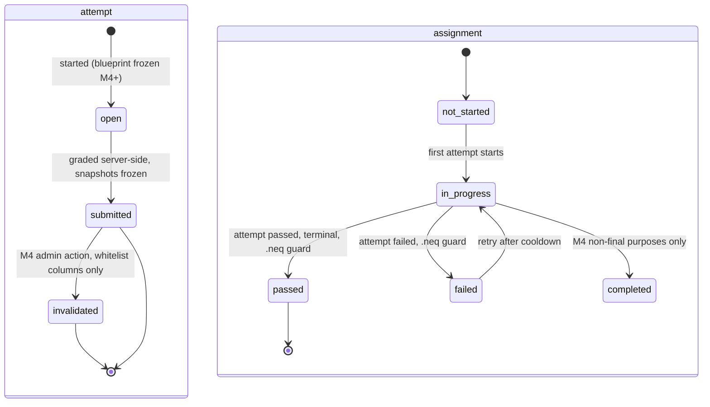
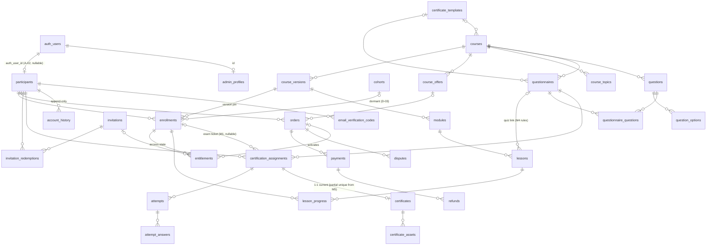

# Data model — entities, relationships, state machines, immutability, migration implications

**Date:** 2026-08-01 · **Basis:** migration-by-migration schema inventory (0001–0007, verified
against `src/types/database.ts`), read-only live-database probes ("verified in prod 2026-08-01"),
and the six per-domain data-model proposals in [01-capability-matrix.md](01-capability-matrix.md),
synthesized here into one coherent model. Deliverable 4 of the scope package (see
[README.md](README.md)). Architecture decisions A-01…A-12 and decision IDs D-01…D-17 are as
defined in [08-decision-register.md](08-decision-register.md).

Everything in this document is **additive** to the existing 18 tables. No existing table is
renamed or dropped; deprecations are column-level. Production data is tiny (17 participants,
392 rows in the largest table, verified in prod 2026-08-01), so every backfill described here is
instant — the design constraints are integrity and operational visibility, never migration
volume.

---

## 1. Current model recap — the 18 existing tables

Schema facts cited from `supabase/migrations/` (line numbers verified against the files).
Verdict legend: **keep** = unchanged; **extend** = gains columns/constraints/triggers per §3;
no table is deprecated wholesale.

| Table | Defined | Role today | Verdict |
|---|---|---|---|
| `admin_profiles` | 0001:42-48 | Admin/superadmin roster, PK → `auth.users` CASCADE, `role` CHECK `('admin','superadmin')`, `active` flag | **extend** — role CHECK widened for instructor/support (M1 design, M6 activation, A-11) |
| `participants` | 0001:54-62 | Candidate identity; no auth, no email uniqueness | **extend** — `auth_user_id` (A-02), email partial unique, `anonymized_at`, coherence CHECK |
| `courses` | 0001:67-74, 0007:25-68 | Program root, both kinds (`kind` CHECK `('course','seminar')`, `event_date`, per-course template) | **extend** — kind-immutability trigger (M0), `series_code`/`series_label` (M5, D-16); becomes the anchor for `course_versions` (A-06) |
| `course_topics` | 0001:79-88 | Topics per course; printed on course certificates | **keep** |
| `questions` | 0001:94-106, 0003:15-25 | Question bank (single/multiple choice), content-locked once assigned | **extend** — M4 metadata (difficulty, weight, is_critical, lineage, author) |
| `question_options` | 0001:111-119 | Options incl. `is_correct` (never leaves the server) | **keep** |
| `certificate_templates` | 0001:124-131, 0004:33-38 | Designer SVG templates, 4 `template_type` values | **extend** — `template_type` CHECK gains `linkedin_post`, `badge` (M5) |
| `questionnaires` | 0001:138-151 | Exam definition: threshold, randomize flags, template override | **extend** — M4 purpose / cooldown / pool-mode columns |
| `questionnaire_questions` | 0001:158-165 | Exam membership, UNIQUE(questionnaire, question), frozen by lock trigger | **keep** — reinterpreted as pool membership when `pool_mode` (M4) |
| `certification_assignments` | 0001:172-190 | **The central object**: participant + questionnaire + unguessable token; partial unique active assignment (0001:188-190) | **extend** — `enrollment_id` (A-03), status coherence CHECK, dead `in_progress` value finally written |
| `certification_assignment_topics` | 0001:197-204 | Per-assignment topic selection printed on course certificates | **keep** |
| `attempts` | 0001:209-223, 0002:44-47, 0005:14-15 | Exam runs; snapshots + frozen `language`; `submitted_at IS NULL` = open; draft `answers` jsonb | **extend** — M0 single-open-attempt index + post-submit immutability trigger; M4 blueprint/invalidation columns |
| `attempt_answers` | 0001:228-240 | Per-question graded snapshot (authoritative record) | **keep** — gains companion post-submit immutability trigger (M0) |
| `certificates` | 0001:247-263 | 1:1 with assignment, frozen `certificate_public_snapshot`, `status` `('valid','revoked')` | **extend** — `asset_status` machine, `'replaced'` status + lineage (M5); **`file_url` deprecated since 0004:40-42 → drop** |
| `certificate_assets` | 0004:6-23 | Rendered PDF/PNG per certificate; row existence = generated (no state) | **extend** — `storage_path` + `content_version` for the A-09 private bucket; `file_url` deprecated after cutover |
| `account_history` | 0001:279-288 | Append-only participant timeline (trigger 0001:493-504 fires even for service-role) | **keep** — stays participant-scoped; `audit_log` (§2.11) generalizes admin/system events |
| `email_verification_codes` | 0006:13-25 | Hashed OTP for candidate email confirmation | **extend** — attempts CHECK, cleanup job |
| `platform_settings` | 0002:3-19 | Singleton language settings (boolean PK), only anon-readable table | **keep** |

Column-level deprecations: `certificates.file_url` (dead since 0004, dropped in a contract
migration once A-09 lands); `certificate_assets.file_url` (legacy during the A-09 dual-read
window, then nullable); legacy single-language content columns (`title`, `question_text`,
`option_text`, …, kept NOT NULL by 0003:3-37 forcing permanent dual-writes) — contracting them
is deliberately **out of scope** for M0–M6 (working, low-risk, EN dormant per D-17); new
learning tables do **not** repeat the pattern (§2 preamble).

Conceptual overload being unwound: `certification_assignments` today plays four roles —
enrollment, entitlement, exam ticket, invitation (its never-expiring token doubles as the
credential in invite emails). §2 splits the first, second, and fourth into `enrollments`,
`entitlements`, and `invitations`; the assignment survives as exactly what it is well-built to
be: the exam ticket (A-03). See §5 for the full separation argument.

---

## 2. New entities

### House style (applies to every table below)

Matches the conventions verified in 0001: `id uuid primary key default gen_random_uuid()`;
text + CHECK pseudo-enums (no native enums); `created_at`/`updated_at timestamptz not null
default now()` with the `set_updated_at()` trigger (0001:27-35); RLS **enabled in the same
migration** with explicit policies; zero anon policies (public flows via service-role server
code); guard triggers for immutability copied from the `block_account_history_mutation`
pattern (0001:493-504); **never** `ON DELETE CASCADE` into an append-only table (the proven
`participants → account_history` collision, 0001:281 vs 0001:493-504). New translatable
columns are `_de` (NOT NULL where required) + `_en` (NULL) **only** — no legacy single column.

### Synthesis decisions (where domain proposals diverged, the resolution and why)

| Conflict | Resolution |
|---|---|
| `entitlements` keyed by `participant+course` vs by `enrollment_id` | **`enrollment_id NOT NULL`.** Enrollment is the registration fact (A-03); the entitlement attaches to it; renewal = new entitlement row on the same enrollment. Participant+course reachable via join; one partial-unique live entitlement per enrollment. |
| `payments` folded into `orders` vs first-class table | **First-class `payments`** (canonical entity list). `orders` carries the aggregate state; `payments` is the transaction log (Stripe PI/charge IDs live here). v1 has one payment per paid order; the split means partial payments/retries never require remodelling. |
| Per-asset `status` column on `certificate_assets` vs single authority on `certificates` | **Single `certificates.asset_status`.** Per-asset rows would recreate the existence-as-state ambiguity across five asset types. Regeneration granularity comes from `certificate_assets.content_version`; issue-failure events go to the `account_history` vocabulary (`certificate_issue_failed`, …), so no separate `certificate_events` table. |
| `audit_events` vs `audit_log` naming; action vocabulary as reference table vs code registry | **`audit_log`** (canonical name). Actions are a namespaced **code-owned const union** (mirrors the `account_history` precedent); a CHECK can be added later. No `audit_event_types` reference table — avoids migration churn per new event. |
| `orders` with `order_items` vs single-course orders | **Single-course orders v1** (`orders.course_id`). One-time single-course payments are the confirmed v1 model (D-07); `order_items` is a re-modelling trigger only if bundles/carts ever become real. |
| `enrollments.course_version` as text vs FK | **FK `course_version_id NOT NULL → course_versions`**, and `course_versions` is therefore **created (minimal) in M1** with an instant backfill (one published v1 per existing course — 2 rows), so the access backbone never needs a second migration when M3 arrives. |
| Invitation shape: simple single-use vs commercial on-ramp | **Commerce shape** (grant types, max_uses, redemption ledger). The invitation is the commercial/access on-ramp; it does **not** replace `certification_assignments.access_token` (the exam ticket). |

Entities are presented in dependency order. "RLS: admins_all" means the standard
`FOR ALL TO authenticated USING/WITH CHECK is_admin()` policy (0001:561-586); "participant
self-read (A-02 phase-in)" means a `SELECT` policy `USING` ownership via
`participants.auth_user_id = auth.uid()`, added per-surface as accounts mature.

---

### 2.1 `course_versions` — M1 (create + backfill v1), M3 (authoring UI) — A-06

The version pin that keeps "what did this participant enrol into" stable while content evolves.
Versioning v1 = publish/archive states + duplicate-to-edit (extends locked decision D3);
no draft/publish trees, no participant-migration tooling.

| Column | Type | Null | Default / FK / notes |
|---|---|---|---|
| `id` | uuid | NN | PK `gen_random_uuid()` |
| `course_id` | uuid | NN | → `courses` RESTRICT |
| `version_number` | int | NN | |
| `status` | text | NN | `'draft'` CHECK `('draft','published','archived')` |
| `intro_de` / `intro_en` | text | NULL | course-dashboard introduction (markdown) |
| `instructor_name` | text | NULL | plain column v1; FK deferred to A-11 |
| `instructor_bio_de` / `_en` | text | NULL | |
| `linear_progression` | bool | NN | `true` (M3 locked progression) |
| `final_exam_questionnaire_id` | uuid | NULL | → `questionnaires` SET NULL; trigger enforces same `course_id` (mirrors `enforce_questionnaire_question_course`, 0001:357-372) |
| `published_at` | timestamptz | NULL | |
| `created_by_admin_id` | uuid | NULL | → `admin_profiles` SET NULL |
| `created_at` / `updated_at` | timestamptz | NN | `now()` |

Constraints/indexes: `UNIQUE(course_id, version_number)`; **partial unique `(course_id) WHERE
status = 'published'`** (one live version per course). Lock: `course_version_is_locked(id)` =
EXISTS enrollment pinned to it; guard trigger (pattern of `guard_questionnaires_update`,
0001:427-443) blocks status regression, `final_exam_questionnaire_id` changes, and
module/lesson structural writes under a locked version — copy fields stay editable, mirroring
the questionnaire lock's copy-vs-structure split. State machine: `draft → published →
archived` (terminal; re-publish = duplicate to new draft). Backfill (M1, instant): one
`(version_number 1, status 'published')` row per `courses` row.
RLS: admins_all; participant reads via the learning DTO layer (service-role).

### 2.2 `enrollments` — M1 — A-03

The registration fact: this participant is in this course, on this version. Not an access
grant (that is the entitlement) and not an exam ticket (that is the assignment).

| Column | Type | Null | Default / FK / notes |
|---|---|---|---|
| `id` | uuid | NN | PK |
| `participant_id` | uuid | NN | → `participants` RESTRICT (never CASCADE) |
| `course_id` | uuid | NN | → `courses` RESTRICT |
| `course_version_id` | uuid | NN | → `course_versions` RESTRICT (the A-06 pin, set at enrolment) |
| `cohort_id` | uuid | NULL | **no FK until cohorts confirmed** (D-03); reserved, dormant |
| `source` | text | NN | CHECK `('order','manual','invitation','import','backfill')` — "complimentary" is a *manual* enrolment whose **entitlement** source is `complimentary` (vocabulary normalization, A-03) |
| `status` | text | NN | `'active'` CHECK `('active','completed','withdrawn')` |
| `reason` | text | NULL | manual-grant rationale (audit field) |
| `created_by_admin_id` | uuid | NULL | → `admin_profiles` SET NULL |
| `import_batch_id` | uuid | NULL | → `import_batches` SET NULL (column added with M6 CSV import) |
| `enrolled_at` | timestamptz | NN | `now()` |
| `progress_pct` | numeric(5,2) | NN | `0` — denormalized rollup, recomputed by the server action that writes `lesson_progress` (M3 column) |
| `last_lesson_id` | uuid | NULL | → `lessons` SET NULL (resume pointer, M3 column) |
| `created_at` / `updated_at` | timestamptz | NN | `now()` |

Constraints/indexes: **partial unique `(participant_id, course_id) WHERE status = 'active'`**;
indexes `(participant_id)`, `(course_id)`. Backfill (M1, instant): one `source='backfill'`
enrollment per existing participant×course derived from the 20 assignments (verified in prod
2026-08-01), so gating can be switched on without disturbing any live candidate.
RLS: admins_all; participant self-read (A-02 phase-in).

### 2.3 `entitlements` — M1 — A-03 (the authoritative access record)

The **only** thing gating code may consult. The single shared access predicate — any domain
inventing its own access flag is a defect:

```
has_access ⇔ status IN ('active','expiring') AND (expires_at IS NULL OR expires_at > now())
```

Access checks **fail closed** — a deliberate break from the codebase's fail-soft idiom
(i18n, rate limit, asset generation all degrade silently today).

| Column | Type | Null | Default / FK / notes |
|---|---|---|---|
| `id` | uuid | NN | PK |
| `enrollment_id` | uuid | NN | → `enrollments` RESTRICT |
| `source` | text | NN | CHECK `('order','manual','complimentary','invitation')` (A-03) |
| `status` | text | NN | `'pending'` CHECK `('pending','active','expiring','expired','revoked','suspended')` (A-03 six states; the target scope's "refunded"/"disputed" states normalize to `status_reason`) |
| `status_reason` | text | NULL | CHECK `('refund','dispute','admin','expiry','payment_failed')` |
| `order_id` | uuid | NULL | → `orders` SET NULL |
| `invitation_id` | uuid | NULL | → `invitations` SET NULL |
| `starts_at` | timestamptz | NN | `now()` |
| `expires_at` | timestamptz | NULL | NULL = perpetual; default seeded from `course_offers.access_duration_days` (D-09 proposes 365 days) |
| `suspended_at` | timestamptz | NULL | |
| `suspension_remaining_ms` | bigint | NULL | pause bookkeeping: store remaining time on suspend, recompute `expires_at` on reinstate |
| `granted_by_admin_id` | uuid | NULL | → `admin_profiles` SET NULL |
| `revoked_at` / `revoked_by` / `revoke_reason` | timestamptz / uuid / text | NULL | `revoked_by` → `admin_profiles` SET NULL |
| `created_at` / `updated_at` | timestamptz | NN | `now()` |

Constraints: **partial unique `(enrollment_id) WHERE status IN
('pending','active','expiring','suspended')`** (one live entitlement per enrollment; renewal =
new row). Coherence CHECKs baked in from day one (the discipline §1's existing tables lack):
`status <> 'revoked' OR revoked_at IS NOT NULL`; `status NOT IN ('expiring','expired') OR
expires_at IS NOT NULL`. Forward-only transition trigger (A-08); `expiring`/`expired` are
flipped **only** by the expiry job (A-05), never by read paths; every transition writes
`audit_log`. Backfill (M1, instant): one active perpetual entitlement (`source='manual'`) per
backfilled enrollment. RLS: admins_all; participant self-read (A-02 phase-in).

### 2.4 `orders` — M1 (manual), M2 (Stripe) — A-04

The commercial fact. Manual payments are **real orders** (`payment_method <> 'stripe'`) from
M1, which is what makes D-01 ("sell first vs teach first") non-blocking. Stripe is payment
confirmation only; entitlements gate access. **No card/PAN/expiry columns ever** — Stripe IDs
only. Financial FKs are RESTRICT, never CASCADE: financial records outlive erasure requests
(GDPR via field anonymization, D-12).

| Column | Type | Null | Default / FK / notes |
|---|---|---|---|
| `id` | uuid | NN | PK |
| `order_number` | text | NN | UNIQUE, generated like `certificate_number` |
| `participant_id` | uuid | NN | → `participants` RESTRICT |
| `course_id` | uuid | NN | → `courses` RESTRICT (single-course orders v1) |
| `offer_id` | uuid | NULL | → `course_offers` SET NULL (§2.17) |
| `status` | text | NN | `'draft'` CHECK `('draft','checkout_created','pending','paid','failed','cancelled','refunded','partially_refunded','disputed')` |
| `payment_method` | text | NN | `'stripe'` CHECK `('stripe','bank_transfer','invoice','cash','partner','complimentary')` — the scope's "manually paid" = `status='paid'` + method ≠ stripe |
| `amount_cents` | int | NN | CHECK `>= 0` |
| `currency` | text | NN | `'eur'` (widen later, D-07) |
| `tax_cents` / `discount_cents` | int | NULL | Stripe Tax outputs (D-13) |
| `refunded_cents` | int | NN | `0` — rollup of succeeded `refunds` |
| `refund_status` | text | NN | `'none'` CHECK `('none','partial','full')` |
| `dispute_status` | text | NULL | CHECK `('needs_response','under_review','won','lost','warning_closed')` |
| `stripe_customer_id` | text | NULL | |
| `stripe_checkout_session_id` | text | NULL | UNIQUE |
| `stripe_promotion_code_id` / `promo_code` | text | NULL | Stripe promotion codes natively (A-04); no academy coupon engine |
| `campaign_label` / `partner_source` | text | NULL | reporting facets |
| `terms_version` | text | NULL | frozen at checkout (D-14 AGB/Widerruf) |
| `needs_review` | bool | NN | `false` |
| `review_reason` | text | NULL | CHECK `('refund_after_certificate','dispute','manual')` (D-08) |
| `paid_at` / `failed_at` / `cancelled_at` | timestamptz | NULL | |
| `recorded_by_admin_id` | uuid | NULL | → `admin_profiles` SET NULL (manual orders) |
| `manual_reference` / `manual_note` | text | NULL | |
| `manual_paid_at` | date | NULL | |
| `created_at` / `updated_at` | timestamptz | NN | `now()` |

Constraints: `guard_orders_update` trigger (A-08) — forward-only status transitions (§4.2) and
freezes `amount/currency/payment_method/participant_id/course_id` once paid (refund/dispute/
review columns stay mutable). Indexes: `(participant_id)`, `(course_id)`, `(status)`.
RLS: admins_all **minus DELETE — no delete policy at all** (corrections are new rows/status
changes); participant self-read (A-02 phase-in, for receipts).

### 2.5 `payments` — M1 (manual), M2 (Stripe)

The transaction log under an order. v1: one succeeded payment per paid order (manual orders
get a `provider='manual'` row so refunds always have a parent).

| Column | Type | Null | Default / FK / notes |
|---|---|---|---|
| `id` | uuid | NN | PK |
| `order_id` | uuid | NN | → `orders` RESTRICT |
| `provider` | text | NN | CHECK `('stripe','manual')` |
| `status` | text | NN | `'pending'` CHECK `('pending','succeeded','failed')` — refund/dispute state deliberately lives on `refunds`/`disputes` + order rollups, not here (single source) |
| `amount_cents` | int | NN | CHECK `> 0` |
| `currency` | text | NN | |
| `stripe_payment_intent_id` | text | NULL | UNIQUE |
| `stripe_charge_id` | text | NULL | |
| `occurred_at` | timestamptz | NULL | provider confirmation time |
| `recorded_by_admin_id` | uuid | NULL | → `admin_profiles` SET NULL |
| `raw` | jsonb | NULL | provider payload excerpt |
| `created_at` / `updated_at` | timestamptz | NN | `now()` |

Index `(order_id)`. RLS: admins_all, no DELETE policy.

### 2.6 `refunds` — M2 (schema M1-ready; manual refunds recordable from M1)

| Column | Type | Null | Default / FK / notes |
|---|---|---|---|
| `id` | uuid | NN | PK |
| `payment_id` | uuid | NN | → `payments` RESTRICT |
| `stripe_refund_id` | text | NULL | UNIQUE (NULL = manual/offline refund) |
| `amount_cents` | int | NN | CHECK `> 0` |
| `status` | text | NN | `'pending'` CHECK `('pending','succeeded','failed')` |
| `reason` | text | NULL | |
| `created_by_admin_id` | uuid | NULL | → `admin_profiles` SET NULL |
| `created_at` | timestamptz | NN | `now()` |

`SUM(succeeded refunds)` drives `orders.refunded_cents`/`refund_status` (recomputed in the
same transaction; verified by the reconciliation job). Refund after certificate issuance sets
`orders.needs_review + review_reason='refund_after_certificate'` and **never** touches the
certificate (locked: certificate validity is outside commerce; policy is D-08). RLS:
admins_all, no DELETE policy.

### 2.7 `disputes` — M2

| Column | Type | Null | Default / FK / notes |
|---|---|---|---|
| `id` | uuid | NN | PK |
| `order_id` | uuid | NN | → `orders` RESTRICT |
| `payment_id` | uuid | NULL | → `payments` SET NULL |
| `stripe_dispute_id` | text | NN | UNIQUE |
| `status` | text | NN | CHECK `('needs_response','under_review','won','lost','warning_closed')` |
| `amount_cents` | int | NN | |
| `currency` | text | NN | |
| `opened_at` | timestamptz | NN | |
| `closed_at` | timestamptz | NULL | |
| `resolution_note` | text | NULL | |
| `created_at` / `updated_at` | timestamptz | NN | `now()` |

Dispute opening suspends the entitlement (`status_reason='dispute'`); resolution reinstates or
revokes per outcome — via the entitlement machine, never ad hoc. RLS: admins_all, no DELETE.

### 2.8 `stripe_events` — M2 — A-04 (webhook idempotency ledger)

The app's first API route (`src/app/api/stripe/webhook/route.ts`) verifies the raw-body
signature **before anything else**, then `INSERT … ON CONFLICT (stripe_event_id) DO NOTHING`
— processing runs only on fresh insert. It shares the route-handler + signature-verification +
event-ledger pattern with the Resend webhook (whichever ships first sets the convention — see
[03-target-architecture.md](03-target-architecture.md)).

| Column | Type | Null | Default / FK / notes |
|---|---|---|---|
| `id` | uuid | NN | PK |
| `stripe_event_id` | text | NN | UNIQUE — the idempotency key |
| `event_type` | text | NN | |
| `api_version` | text | NULL | |
| `livemode` | bool | NN | reject on mismatch with the deployment's mode (test/prod isolation) |
| `payload` | jsonb | NN | pruned to a skeleton after 90 days (cron job) |
| `order_id` | uuid | NULL | → `orders` SET NULL (resolved during processing) |
| `processing_status` | text | NN | `'received'` CHECK `('received','processed','skipped','failed')` |
| `attempts` | int | NN | `0` |
| `last_error` | text | NULL | |
| `received_at` | timestamptz | NN | `now()` |
| `processed_at` | timestamptz | NULL | |

Indexes: `(event_type)`; partial `(processing_status) WHERE processing_status='failed'`.
Out-of-order/delayed events: handlers are pure state-machine guards — an event that would move
an order backwards is recorded `'skipped'`; refund/dispute events for unknown orders re-fetch
from the Stripe API before failing. Failed processing → Sentry alert + reconciliation pickup;
manual replay = admin action re-running a stored row. RLS: admin SELECT only; all writes via
service-role in the webhook route.

### 2.9 `invitations` — M1 (+ `invitation_redemptions`)

The commercial/access on-ramp: signed, expiring, optionally email-bound, free or discounted.
Replaces the invite email's overloaded use of the assignment token; **does not** replace
`certification_assignments.access_token`, which remains the exam ticket (A-03). Token
handling copies the `email_verification_codes` pattern (0006:13-25): store `token_hash`
(SHA-256 of a 192-bit random token), show the raw token once — non-guessable +
server-verified satisfies "signed" without a JWT layer.

| Column | Type | Null | Default / FK / notes |
|---|---|---|---|
| `id` | uuid | NN | PK |
| `token_hash` | text | NN | UNIQUE |
| `course_id` | uuid | NN | → `courses` RESTRICT |
| `course_version_id` | uuid | NULL | → `course_versions` SET NULL (default: live published version at redemption) |
| `cohort_id` | uuid | NULL | reserved (D-03) |
| `invited_email` | text | NULL | redemption must match, case-insensitive, when set |
| `grant_type` | text | NN | `'free'` CHECK `('free','discount','fixed_price')` — discount/fixed_price activate in M2, mapped to Stripe promotion codes / dedicated prices, never academy price math |
| `discount_percent` | int | NULL | CHECK 1–100 |
| `fixed_price_cents` | int | NULL | |
| `access_duration_days` | int | NULL | overrides offer default (D-09) |
| `expires_at` | timestamptz | NN | |
| `max_uses` | int | NN | `1` CHECK `> 0` |
| `use_count` | int | NN | `0` — maintained atomically: `UPDATE … WHERE use_count < max_uses` in the redemption transaction |
| `label` / `partner_source` | text | NULL | |
| `revoked_at` / `revoked_by` | timestamptz / uuid | NULL | `revoked_by` → `admin_profiles` SET NULL |
| `created_by_admin_id` | uuid | NN | → `admin_profiles` |
| `created_at` | timestamptz | NN | `now()` |

States are timestamp-derived (fresh / consumed / expired / revoked) — acceptable here because
each is a single self-describing transition; no status column.

`invitation_redemptions`: `id` PK; `invitation_id` NN → `invitations` RESTRICT;
`participant_id` NN → `participants` RESTRICT; `enrollment_id` NULL → `enrollments` SET NULL;
`order_id` NULL → `orders` SET NULL (free grants create a zero-amount order so revenue
reporting stays complete); `redeemed_at` NN `now()`; `UNIQUE(invitation_id, participant_id)`.
RLS (both): admins_all; redemption writes via service-role.

### 2.10 `jobs` — M1 — A-05 (Postgres outbox + Vercel Cron drainer)

One jobs table for the whole platform — certificate asset generation, every email send,
entitlement expiry, reconciliation, cleanup. No queue SaaS. Drained by a secret-gated
`/api/cron/jobs` route plus an on-demand poke after enqueue; the `reconcile_invariants` job's
last success is the heartbeat `/api/health` checks (see
[05-production-safety-plan.md](05-production-safety-plan.md)).

| Column | Type | Null | Default / FK / notes |
|---|---|---|---|
| `id` | uuid | NN | PK |
| `job_type` | text | NN | registry in code: `send_email`, `certificate.generate_assets`, `certificate.send_email`, `expire_entitlements`, `reconcile_invariants`, `cleanup_verification_codes`, `prune_stripe_payloads`, … |
| `payload` | jsonb | NN | `'{}'` |
| `dedupe_key` | text | NULL | UNIQUE — idempotent enqueue |
| `status` | text | NN | `'queued'` CHECK `('queued','running','succeeded','failed','dead')` |
| `run_after` | timestamptz | NN | `now()` — backoff scheduling |
| `attempts` | int | NN | `0` |
| `max_attempts` | int | NN | `5` |
| `locked_at` | timestamptz | NULL | drainer lease |
| `locked_by` | text | NULL | |
| `last_error` | text | NULL | |
| `created_at` / `updated_at` | timestamptz | NN | `now()` |

Index `(status, run_after)`. RLS: admin SELECT (ops dashboard tiles count `failed`/`dead`);
writes via service-role only.

### 2.11 `email_events` — M1 — A-05 (delivery truth)

Today email truth ends at the Resend API: `certificates.emailed_at` records "send attempted",
bounces look like success, and no receiver exists (verified: no API routes in the codebase).
Sends become `jobs` rows; this table is fed by both the send path and a signature-verified
`/api/webhooks/resend` receiver. `certificates.emailed_at` becomes derived/display-only.

| Column | Type | Null | Default / FK / notes |
|---|---|---|---|
| `id` | uuid | NN | PK |
| `provider_message_id` | text | NULL | |
| `email_type` | text | NN | `('invite','verification_code','certificate','receipt','reminder','payment_failed',…)` — code registry |
| `recipient` | text | NN | |
| `participant_id` | uuid | NULL | → `participants` SET NULL |
| `related_object_type` / `related_object_id` | text / uuid | NULL | e.g. `certificate`, `order` |
| `event` | text | NN | CHECK `('queued','sent','delivered','delivery_delayed','bounced','complained','failed')` |
| `payload` | jsonb | NULL | webhook excerpt |
| `occurred_at` | timestamptz | NN | |
| `created_at` | timestamptz | NN | `now()` |

Indexes: `(provider_message_id)`, `(participant_id)`. This is an **event stream** (append
semantics, multiple rows per message), not a state row — the per-message lifecycle in §4.6 is
derived. RLS: admin SELECT; writes via service-role (send path + webhook).

### 2.12 `audit_log` — M1 (generalized; `account_history` stays participant-scoped)

Answers "which actor did what to which object, when" for admin, system, and auth events —
everything `account_history` (participant lifecycle timeline, 146 prod rows, untouched) was
never meant to hold. Participant detail pages merge both feeds.

| Column | Type | Null | Default / FK / notes |
|---|---|---|---|
| `id` | uuid | NN | PK |
| `occurred_at` | timestamptz | NN | `now()` |
| `actor_type` | text | NN | CHECK `('admin','participant','system')` |
| `actor_id` | uuid | NULL | admin_profiles.id or participants.id — **deliberately no FK** (record permanence over referential integrity) |
| `actor_email` | text | NULL | denormalized for non-repudiation after admin deletion |
| `action` | text | NN | namespaced code registry (below) |
| `object_type` / `object_id` | text / uuid | NULL | |
| `participant_id` | uuid | NULL | → `participants` **SET NULL — never CASCADE** (avoids the account_history cascade-vs-trigger collision, 0001:281 vs 0001:493-504) |
| `impersonation_session_id` | uuid | NULL | → `impersonation_sessions` SET NULL (M6) |
| `metadata` | jsonb | NULL | **never raw PII** (M1 code rule, D-12) |
| `created_at` | timestamptz | NN | `now()` |

Append-only trigger identical to `block_account_history_mutation()` (0001:493-504). Indexes:
`(occurred_at DESC)`, `(actor_id, occurred_at DESC)`, `(object_type, object_id)`,
`(participant_id)`, `(action)`. RLS: INSERT + SELECT to `is_admin()`; service-role writes for
system/candidate events; no UPDATE/DELETE policies.

**Minimum action list (v1 registry; each milestone ships its events with the feature, not as
retrofit):** `admin.created`, `admin.role_changed`, `admin.deactivated`, `auth.login`,
`auth.login_failed`, `auth.logout`, `enrollment.manual_created`, `entitlement.granted`,
`entitlement.revoked`, `entitlement.suspended`, `entitlement.reinstated`,
`order.manual_recorded`, `payment.refunded`, `attempt.invalidated`, `certificate.revoked`,
`certificate.reinstated`, `certificate.replaced`, `course.published`, `exam.config_changed`,
`impersonation.started`, `impersonation.ended`, `data.exported`, `participant.anonymized`.

### 2.13 `modules` — M3 — A-06

| Column | Type | Null | Default / FK / notes |
|---|---|---|---|
| `id` | uuid | NN | PK |
| `course_version_id` | uuid | NN | → `course_versions` CASCADE |
| `title_de` | text | NN | |
| `title_en` / `description_de` / `description_en` | text | NULL | |
| `sort_order` | int | NN | `0` |
| `required` | bool | NN | `true` |
| `visibility` | text | NN | `'visible'` CHECK `('visible','hidden')` |
| `parent_module_id` | uuid | NULL | → `modules` CASCADE — subtopics, reserved; no UI in M3 |
| `release_rule` | jsonb | NULL | typed in TS: `{type:'immediate'}` \| `{type:'days_after_enrollment',days}` \| `{type:'fixed_date',date}` \| `{type:'cohort'}` \| `{type:'admin'}`; only `'immediate'` honored in M3; evaluated read-time (pure function, no cron) |
| `created_at` / `updated_at` | timestamptz | NN | `now()` |

Index `(course_version_id, sort_order)`. Structural writes blocked by the course-version lock
trigger once the version is pinned by any enrollment (§2.1). RLS: admins_all; participant
reads via DTO layer.

### 2.14 `lessons` — M3 — A-06, A-07

| Column | Type | Null | Default / FK / notes |
|---|---|---|---|
| `id` | uuid | NN | PK |
| `module_id` | uuid | NN | → `modules` CASCADE |
| `sort_order` | int | NN | `0` |
| `lesson_type` | text | NN | CHECK `('video','written','download','external','quiz','audio')` — `'audio'` reserved (standing disposition: optional audio file, no extraction pipeline) |
| `title_de` | text | NN | |
| `title_en` / `description_de` / `_en` / `objective_de` / `_en` / `instructor_notes_de` / `_en` | text | NULL | |
| `body_de` / `body_en` | text | NULL | markdown, written lessons |
| `duration_minutes` | int | NULL | |
| `required` | bool | NN | `true` |
| `active` | bool | NN | `true` |
| `video_provider` | text | NULL | CHECK `('mux','bunny')` (D-02); video never lives in Supabase Storage (A-07) |
| `video_asset_id` / `video_playback_id` | text | NULL | provider IDs only |
| `video_duration_seconds` | int | NULL | |
| `audio_url` | text | NULL | reserved |
| `external_url` | text | NULL | |
| `questionnaire_id` | uuid | NULL | → `questionnaires` SET NULL — quiz lessons; trigger enforces same course via module→version→course; **quiz lessons never create `certification_assignments`** (practice-vs-exam split, M4; M3 ships quizzes as ungraded self-checks) |
| `completion_rule` | jsonb | NULL | `{type:'view'}` \| `{type:'video_pct',threshold_pct}` \| `{type:'quiz_pass'}` \| `{type:'download_ack'}` \| `{type:'manual'}`; NULL = type default (video→`video_pct` 90, download→`download_ack`, else `view`). Watch-% is a completion signal, not anti-cheat (A-07) |
| `created_at` / `updated_at` | timestamptz | NN | `now()` |

Indexes `(module_id, sort_order)`, `(questionnaire_id)`. RLS: admins_all; participant reads
via DTO layer, gated by the entitlement predicate (§2.3).

### 2.15 `lesson_progress` — M3

Mutable by design (heartbeat writes, last-write-wins — same philosophy as `attempts.answers`,
0005:14-15). Admin manual completion/reset writes `audit_log`.

| Column | Type | Null | Default / FK / notes |
|---|---|---|---|
| `id` | uuid | NN | PK |
| `enrollment_id` | uuid | NN | → `enrollments` CASCADE |
| `lesson_id` | uuid | NN | → `lessons` CASCADE |
| `status` | text | NN | `'not_started'` CHECK `('not_started','in_progress','completed')` |
| `started_at` | timestamptz | NULL | |
| `completed_at` | timestamptz | NULL | CHECK `(status = 'completed') = (completed_at IS NOT NULL)` — state/timestamp coherence from day one |
| `completion_source` | text | NULL | CHECK `('auto_view','video_threshold','quiz_pass','download_ack','manual_participant','manual_admin')` |
| `last_position_seconds` | int | NULL | resume pointer |
| `watched_pct` | numeric(5,2) | NULL | CHECK 0–100 |
| `created_at` / `updated_at` | timestamptz | NN | `now()` |

Constraints/indexes: `UNIQUE(enrollment_id, lesson_id)`; `(enrollment_id, updated_at)` for
resume. Rollup: `enrollments.progress_pct` = completed required lessons / total required
lessons of the **pinned version** (unweighted v1; a later `weight` on lessons is additive).
RLS: admins_all; participant self-read/self-write via DTO layer then RLS (A-02 phase-in).

### 2.16 `cohorts` — deferred, schema sketch only (D-03)

Built only if the client confirms cohort-based delivery. Until then the entire footprint is
the dormant `enrollments.cohort_id`/`invitations.cohort_id` columns (no FK). Sketch:

```
cohorts: id PK; course_version_id NN → course_versions RESTRICT; name text NN;
  starts_on / ends_on date NULL; access_until date NULL;
  exam_opens_at / exam_closes_at timestamptz NULL;
  instructor_admin_id uuid NULL → admin_profiles SET NULL; active bool NN default true;
  created_at / updated_at.
cohort_module_releases: cohort_id NN CASCADE; module_id NN CASCADE; release_at timestamptz NN;
  UNIQUE(cohort_id, module_id).
```

Membership = `enrollments.cohort_id` (FK added when built); no separate join table. A client
"no" collapses a whole chain: cohort filters, cohort dashboard tiles, cohort release rules,
and most of the instructor role's v1 value (A-11).

### 2.17 Supporting entities (referenced above; owned by their milestones)

| Table | Milestone | One-line shape |
|---|---|---|
| `course_offers` | M1 | Pricing config per course: `course_id` NN RESTRICT; `active`; `price_cents` NN CHECK ≥0; `currency` `'eur'`; `stripe_product_id`/`stripe_price_id` (NULL until M2); `tax_mode` `('stripe_tax','none')` (D-13); `enrollment_opens_at`/`closes_at`; `access_duration_days` (D-09); `terms_version` NN; partial unique `(course_id) WHERE active` |
| `questionnaire_selection_rules` | M4 | Pool sampling per topic: `questionnaire_id` NN CASCADE; `topic_id` NULL RESTRICT; `required_count` NN CHECK >0; `difficulty_mix` jsonb; `min_percentage` (topic floor — **inert** until D-06); `UNIQUE(questionnaire_id, topic_id)`; frozen by the content-lock trigger family |
| `resources` + `lesson_resources` + `course_version_resources` | M3 | Downloadable/library assets in a **private** `course-content` bucket (bucket + policies created via tracked migration, unlike the dashboard-created public `certificates` bucket, 0004:40-42); access iff active entitlement on an attached course |
| `feature_flags` | M1 | `key` PK; `enabled` NN false; `description` NN; superadmin UPDATE, broad SELECT (mirrors `platform_settings` policy split, 0002:29-42) |
| `instructor_courses`, `impersonation_sessions`, `participant_notes`, `support_requests`, `data_requests`, `consent_records`, `legal_holds`, `import_batches`, `email_copy_blocks` | M6 (designs fixed in the matrix) | Role scoping (A-11), audited read-only impersonation, admin notes, support references (D-10), GDPR workflow (D-12), CSV import reversibility, editable email copy blocks (not a template editor) |
| `certificate_stats` | M6 | Privacy-minimal counters: `(certificate_id, day, metric)` PK, upsert-increment, no per-visitor rows |

---

## 3. Extensions to existing tables

Grouped by table; milestone in brackets. Every constraint listed against live data was checked:
**all invariant probes came back clean, so every CHECK below can be applied without data
repair** (verified in prod 2026-08-01).

### `participants`
- **[M0]** CHECK `(email_confirmed = false OR email IS NOT NULL)` (representable today,
  0001:54-62; 0 violations in prod).
- **[M1]** `auth_user_id uuid NULL UNIQUE → auth.users(id) ON DELETE SET NULL` (A-02 —
  additive account claim; token+OTP flow untouched). `anonymized_at timestamptz NULL` (GDPR
  primitive, §8). **Partial unique index on `lower(email) WHERE email IS NOT NULL AND
  anonymized_at IS NULL`** — no uniqueness exists today (0001:54-62); prod has 0 duplicates,
  so this is instant, and it is a hard prerequisite for account claim by verified email.

### `certification_assignments`
- **[M0]** CHECK `(status <> 'passed' OR passed_at IS NOT NULL)` (0 violations in prod).
  **Fail-path guard:** the pass path already guards with `.neq("status","passed")`
  (`src/lib/certification/data.ts:399-405`) but the fail path checks only in-memory context
  (`src/lib/certification/data.ts:408-412`) — a concurrent pass can be overwritten by a fail.
  Fix: identical `.neq("status",'passed')` on the fail-path UPDATE. Also start writing
  `'in_progress'` at attempt-start — the value exists in the CHECK (0001:177-178) but has
  never been written (verified in prod: only `not_started/passed/failed` occur).
- **[M1]** `enrollment_id uuid NULL → enrollments SET NULL` (A-03 — the exam ticket points at
  the registration it examines; nullable so legacy assignments stay valid).
- **[M4]** status CHECK widened with `'completed'` (legal only for non-final questionnaire
  purposes; app-enforced, documented in the migration).

### `attempts` (+ `attempt_answers`) — the A-08 hardening
- **[M0]** **Partial unique index** `uniq_open_attempt_per_assignment ON
  attempts(certification_assignment_id) WHERE submitted_at IS NULL` — closes the two-open-
  attempts race (no such constraint exists: 0001:209-223; 2 open attempts in prod, both on
  different assignments — clean).
- **[M0]** **Post-submit immutability trigger** `guard_attempt_immutable`: once
  `OLD.submitted_at IS NOT NULL`, raise on UPDATE **unless it touches only the four M4
  invalidation columns** (`invalidated_at`, `invalidated_by_admin_id`, `invalidation_kind`,
  `invalidation_reason`) and on DELETE. The whitelist is designed now so M4 does not need a
  second trigger migration. Companion trigger on `attempt_answers`: no UPDATE/DELETE once the
  parent attempt is submitted. Today submitted attempts are freely mutable under `admins_all`
  (0001:581-584) — this closes the gap between the platform's snapshot promise and its RLS
  reality. CHECK `(submitted_at IS NULL OR passed IS NOT NULL)` (21/21 submitted prod rows
  conform).
- **[M4]** `question_set jsonb NULL` (blueprint frozen at attempt-start: question + option
  order, replacing per-render randomization); `topic_scores jsonb NULL` (frozen at submit —
  single source for candidate feedback, admin viewer, and analytics); `last_activity_at
  timestamptz NULL`; the four invalidation columns with an all-or-none CHECK and
  `invalidation_kind` CHECK `('technical_malfunction','duplicate','integrity_concern',
  'admin_error')`. Invalidating a certifying attempt routes to certificate revocation (M5),
  never row deletion.

### `certificates` — the asset_status pick
- **[M0]** `asset_status text NN DEFAULT 'pending' CHECK
  ('pending','generating','complete','failed')` + `assets_error text NULL` — the issuance
  half of the A-08 state machine. Today row-existence-in-`certificate_assets` is the only
  state (0004:6-23) and generation errors are discarded. Backfill `'complete'` — 9/9 prod
  certificates have both official assets (verified in prod 2026-08-01). **Pick per matrix:
  single authority on `certificates`, no per-asset status column, no separate
  `certificate_events` table** (rationale in §2 synthesis table); issue-failure history goes
  to `account_history` vocabulary additions (`certificate_issue_failed`,
  `certificate_issue_retried`, `certificate_email_failed`).
- **[M0]** status CHECK widened to `('valid','revoked','replaced')` (`'expired'` deliberately
  never added — locked: certificates do not expire). Lineage columns (written first in M5):
  `replaces_certificate_id` / `replaced_by_certificate_id` uuid NULL self-FK SET NULL;
  `replaced_at timestamptz NULL`; `replacement_reason text NULL` CHECK
  `('name_correction','admin_error','design_update','upgrade','other')`.
  `public_revocation_note text NULL` (rendered on /verify when set; `revoke_reason` stays
  internal). State-coherence trigger: `revoked → revoked_at NOT NULL`; `replaced →
  replaced_by_certificate_id AND replaced_at NOT NULL`; `valid → revoked_at IS NULL`.
- **[M0]** Issuance guard: refuse to issue when `NEXT_PUBLIC_SITE_URL` is unset (prevents
  permanently frozen relative QR URLs in snapshots; 0 bad snapshots in prod).
- **[M5]** `certificate_number` UNIQUE and `certification_assignment_id` UNIQUE (0001:249-250)
  each convert to **partial unique `WHERE status <> 'replaced'`** — replacement keeps the same
  number on a new row; `assignments.certificate_id` repoints to the current certificate.
  M0 triggers must not assume the 1:1 is forever.
- Contract migration (post-A-09): drop `file_url` (deprecated since 0004:40-42, unused).

### `certificate_assets`
- **[M0/M1 with A-09]** `storage_path text NULL` (bucket-relative path in the new **private**
  `certificates-private` bucket) + `content_version int NN DEFAULT 1` (bumped on regeneration;
  embedded in the path `{certId}/v{n}/…` for cache-busting). `file_url` serves the dual-read
  window, then goes nullable/ignored — access shifts to an authorizing route minting
  short-lived signed URLs (valid → 302; revoked → 403; replaced → successor's asset). Old
  public URLs die at cutover (accepted, D-04 sign-off; comms note).
- **[M5]** `asset_type` CHECK extended: + `'linkedin_post_png'`, `'badge_svg'`, `'badge_png'`
  (existing five kept, 0004:9-11).

### `questionnaires` — M4 pool/cooldown configuration
- `purpose text NN DEFAULT 'final_exam'` CHECK `('final_exam','practice_exam','diagnostic',
  'lesson_quiz','module_quiz')`; `show_explanations bool NN DEFAULT false` (honored only when
  purpose ≠ final_exam). Certificate issuance + pass semantics gated to `purpose='final_exam'`.
- Retry policy (D-05 — suggested values): `cooldown_minutes_first int NN DEFAULT 0`,
  `cooldown_minutes_second int NN DEFAULT 720` (12 h), `cooldown_minutes_subsequent int NN
  DEFAULT 1440` (24 h), `max_attempts int NULL` (NULL = unlimited). Enforced at attempt-start
  against the newest **non-invalidated** submitted attempt.
- `pool_mode bool NN DEFAULT false` — when true, `questionnaire_questions` rows are pool
  membership and serving samples per `questionnaire_selection_rules` (§2.17); when false,
  exact-set as today. `guard_questionnaires_update` (0001:427-443) extended to freeze
  `purpose`, cooldowns, and `pool_mode` once assigned — pool edits = duplicate questionnaire,
  per locked decision D3.

### `questions` — M4 metadata
`difficulty text NULL` CHECK `('easy','medium','hard')`; `weight numeric(4,2) NULL` (**inert**
until D-06; NULL = 1.0); `is_critical bool NN DEFAULT false` (**inert** until D-06);
`created_by_admin_id uuid NULL → admin_profiles SET NULL`; `superseded_by_question_id uuid
NULL` self-FK SET NULL (duplicate-with-lineage — operationalizes locked decision D3 for locked
questions); `review_state text NN DEFAULT 'published'` CHECK `('draft','published')`.
`guard_questions_update` (0003:39-61) extended to lock the new content-bearing columns;
lineage/author/review_state stay mutable. Serve-time selection additionally excludes
`active = false` for **new** blueprints (today a retired question keeps appearing in live
exams — `loadQuestionnaireQuestions` never filters `active`); frozen blueprints keep their
frozen set.

### `courses`
- **[M0]** `guard_courses_kind_immutable` trigger: raise when `NEW.kind <> OLD.kind` — today
  kind-immutability is an app-code comment only (0007:21-23).
- **[M5]** `series_code text NULL` + `series_label text NULL` (D-16; no separate series table
  per A-01 — a series is a labelling of courses). New certificate numbers become
  `IIS-<SERIES>-YYYY-XXXXXX`; legacy numbers stay valid forever (verify matches the raw
  column; both shapes work unchanged).

### `admin_profiles`
- **[M1]** role CHECK widened to `('superadmin','admin','instructor','support')` — activation
  is M6 (A-11), widening early is free. `is_admin()` (0001:509-520) keeps meaning "full
  admin"; new `is_staff()` / `has_role(text[])` helpers; instructor/support get **new
  narrower** SELECT policies per table when built, never a widening of `admins_all`.

### `email_verification_codes`
- **[M1]** CHECK `(attempts BETWEEN 0 AND 10)` (no ceiling exists today, 0006:18; prod max
  observed 0); cleanup via `jobs` (`cleanup_verification_codes`: delete consumed/expired rows
  older than 30 days — rows currently accumulate forever).

### `account_history`
- Structurally unchanged (append-only trigger stays sacred). **[M1]** code sweep: stop writing
  raw PII (emails) into `event_data` — `invite_sent` events carry recipient emails today,
  which collides with erasure (§8, D-12). Vocabulary additions (certificate failure/retry/
  replacement events, `attempt_invalidated`) enforced via an exported const union in app code;
  `event_type` remains free text at the DB level (0001:283).

---

## 4. State machines

Explicit machines everywhere new; retrofits per A-08. Forward-only transitions are
trigger-enforced where marked. Timestamps corroborate states (coherence CHECKs in §2/§3).

### 4.1 Entitlements (trigger-enforced; every transition writes `audit_log`)



`expiring`/`expired` are written only by the `expire_entitlements` job — read paths never
mutate. Renewal = a **new** entitlement row on the same enrollment (the partial unique allows
it once the old row is terminal). The access predicate is fixed in §2.3.

### 4.2 Orders (trigger-enforced forward-only; frozen after `paid` except refund/dispute/review fields)



Webhook handlers are pure guards against this machine: an out-of-order Stripe event that would
move an order backwards is recorded in `stripe_events` as `skipped`, never applied.

### 4.3 Payments and refunds



Deliberately minimal: refund/dispute state never lives on the payment row — `refunds` rows
plus the `orders` rollup (`refunded_cents`, `refund_status`) are the single source, verified
by the reconciliation job.

### 4.4 Certificates — validity and assets (two orthogonal axes on one row)



M0 keeps generation synchronous but stateful (explicit writes at each step + retry buttons);
M1 moves it onto `jobs` (`certificate.generate_assets`), taking the 300-DPI render out of the
candidate's submit request. Asset **access** follows validity via the authorizing route
(A-09): valid → signed URL, revoked → 403, replaced → successor.

### 4.5 Jobs (A-05)



`dead` rows are an alert condition and an ops-dashboard tile; a stale `reconcile_invariants`
success is the health-check heartbeat failure.

### 4.6 Email delivery (derived per-message lifecycle over `email_events` rows)



`bounced`/`complained`/`failed` surface on the participant detail and ops dashboard — today a
bounce is recorded as success (`certificates.emailed_at` set, nothing else).

### 4.7 Attempts and their assignment (M0 trigger-enforced; M4 adds invalidation)



`open` is DB-guaranteed singular per assignment (partial unique index); `submitted` is
DB-immutable (trigger) except the four invalidation columns; invalidation never deletes and
routes certifying attempts to certificate revocation (M5).

---

## 5. Conceptual separation — why these are eight entities, not one

`certification_assignments` currently absorbs four of these concepts (§1). The split is the
architectural core of M1 (A-03); each row answers a different question with a different
lifecycle, owner, and retention rule:

| Entity | Question it answers | Why it cannot be collapsed into its neighbour |
|---|---|---|
| **Enrollment** | "Is this participant registered in this course, and on which version?" | Registration is a historical fact that survives expiry, refund, and revocation; the version pin must outlive any access state. Collapsing into entitlement would delete the registration record whenever access ends. |
| **Entitlement** | "May this participant access this course content *right now*?" | Access is a state machine (suspend, expire, renew) that can cycle multiple times per enrollment — renewal is a new row. Folding it into enrollment forces one flat status to mean both "registered" and "allowed", which is exactly today's assignment overload. |
| **Progress** (`lesson_progress`) | "Where is this participant inside the content?" | Deliberately mutable, high-write telemetry (heartbeats). Mixing it into immutable access/assessment records would force either mutable exam data or un-updatable progress. |
| **Assessment** (`certification_assignments` + `attempts`) | "Under what conditions was competence examined, and what happened?" | The exam ticket + frozen evidence chain (snapshots, content locking, 0001:383-489). It must stay valid even when access has expired (exam eligibility ≠ content access) and is the only part that is already well-built — layer around, never rebuild. |
| **Certification** (`certificates`) | "What credential was publicly asserted, and is it still valid?" | Credentials outlive everything — never expire (locked), survive refunds (D-08 sets `needs_review`, not revocation), survive anonymization discussions (D-12). Public verification must not depend on any commercial or access state. |
| **Order** | "What was agreed commercially (price, terms version, method)?" | The commercial agreement is frozen at `paid` and retained for tax law regardless of what happens to access or credentials. It must exist for manual/complimentary sales too — otherwise reporting and D-13 obligations have holes. |
| **Payment** | "What money actually moved, via which provider transaction?" | One order can see multiple transactions (failed then succeeded attempt, then partial refunds). Provider IDs and dispute evidence attach to transactions, not agreements. |
| **Invitation** | "Who was offered access, on what terms, until when?" | An offer is not an acceptance: it expires, is revocable, may be multi-use, and may carry pricing terms. Today's proxy (the assignment token in an invite email) is a permanent credential that can never expire or be scoped — the root of the invitation/exam-ticket overload. |

---

## 6. Immutability and audit rules

### Append-only (trigger-enforced, fires even for service-role)

| Surface | Mechanism |
|---|---|
| `account_history` | existing `trg_account_history_immutable` (0001:493-504) — stays sacred; never disabled again (§8) |
| `audit_log` | identical trigger, from creation (M1) |
| `attempts` after submit + their `attempt_answers` | M0 triggers (§3) — whitelist: the four M4 invalidation columns only |
| `orders`/`refunds` | no DELETE policy at all; `guard_orders_update` freezes the commercial core after `paid` |
| `stripe_events` / `email_events` | ledgers; admin SELECT only, service-role writes, no update paths in app code (stripe payload pruning is the single sanctioned exception, keeping row skeletons) |

### Snapshot-frozen (write-once jsonb/values; render conditionally on missing keys)

- `attempts.attempt_snapshot`, `recommendation_snapshot`, `language` (0002:44-47), and — M4 —
  `question_set` (at start) and `topic_scores` (at submit).
- `attempt_answers.question_snapshot` + graded arrays (0001:228-240).
- `certificates.certificate_public_snapshot` (0001:253) — old snapshots are never backfilled;
  new keys (`kind` since 0007, later `series_label`, `course_version`, `language`) render
  conditionally, exactly like the 4-of-9 prod snapshots that lack `kind` (verified in prod
  2026-08-01).
- `orders.terms_version` frozen at checkout; `enrollments.course_version_id` frozen at
  enrolment (RESTRICT prevents deleting a pinned version).

### Content locking (existing, extended)

The `questionnaire_is_locked`/`question_is_locked` trigger family (0001:383-489, 0003:39-61)
keeps freezing assigned exam content; M4 extends the guards to the new config columns
(`purpose`, cooldowns, `pool_mode`, selection rules, question difficulty/weight/criticality);
M3 adds the parallel `course_version` lock (§2.1). Known caveat carried forward: the lock is
derived from EXISTS(assignments), so deleting a questionnaire's assignments silently unlocks
it — mitigated in M0 by the attempt-immutability triggers (assignment deletion cascades into
attempts, which the new DELETE guard now blocks for submitted attempts).

### What `audit_log` records

Minimum action list in §2.12 — shipped **with** each feature (refunds ship `payment.refunded`,
invalidation ships `attempt.invalidated`, publication ships `course.published`, …), never
retrofitted. `account_history` remains the candidate-facing participant timeline; admin-ops,
configuration, and auth events go only to `audit_log`; participant detail merges both feeds.
Rule from M1 forward: **no raw PII in `event_data`/`metadata`** — reference IDs only (D-12).

---

## 7. ER overview

Major entities and FKs (ops ledgers `jobs`, `email_events`, `audit_log`, `stripe_events`,
`feature_flags` are deliberately unlinked or SET-NULL-linked and omitted for legibility;
`platform_settings` is a singleton). Existing tables carry solid production data today;
everything else is new per §2.



Reading the layers: **identity** (auth_users → participants), **registration/access**
(enrollments → entitlements), **commerce** (orders → payments → refunds; invitations),
**learning** (course_versions → modules → lessons → lesson_progress), and the untouched
**certification chain** (assignments → attempts → certificates) now anchored to enrollments
by one nullable FK.

---

## 8. Migration implications

### Preconditions (M0, before any schema work)

Adopt Supabase CLI migration tracking first (A-10): `supabase link`, baseline 0001–0007 into
`supabase_migrations.schema_migrations`, CI drift gate (`supabase db diff --linked`); SQL-editor
pasting forbidden thereafter. This is load-bearing — 0004/0005/0006 are headed "apply manually
in the Supabase SQL editor" (0004:2, 0006:2) and parity was only confirmed by live probing
(all seven applied, verified in prod 2026-08-01). Discipline for M1–M3 volume: small
single-purpose migrations; expand → migrate → contract for anything touching live reads; new
columns nullable-or-defaulted first, tightened after code deploy; roll forward, no
down-migrations.

### Ordering (numbers indicative; CLI timestamps will replace them)

| # | Milestone | Contents | Backfill (all instant at prod volume) |
|---|---|---|---|
| 0008 | M0 | Integrity retrofit: attempt partial-unique + immutability triggers, assignment/participant/certificate coherence CHECKs, `certificates.asset_status`/`assets_error`/`'replaced'` + lineage columns, `certificate_assets.storage_path`/`content_version`, kind-immutability trigger, private bucket `certificates-private` (tracked DDL) | `asset_status='complete'` for 9/9 certificates; all CHECKs pre-verified clean (verified in prod 2026-08-01) |
| 0009 | M1 | Identity & access: `participants.auth_user_id` + email partial unique + `anonymized_at`; `course_versions` (+ v1 rows); `enrollments`; `entitlements`; `certification_assignments.enrollment_id`; `invitations` + redemptions; `course_offers`; anonymization function | 2 course_versions; ~20 enrollments + entitlements derived from assignments (`source='backfill'`/`'manual'`) |
| 0010 | M1 | Ops ledgers: `jobs`, `email_events`, `audit_log`, `feature_flags`; `orders` + `payments` + `refunds` (manual-capable); admin_profiles role widening; email_verification_codes CHECK | none |
| 0011 | M2 | `stripe_events`, `disputes`; Stripe columns on offers/orders activate | none |
| 0012 | M3 | `modules`, `lessons`, `lesson_progress`, `resources` + joins; `enrollments.progress_pct`/`last_lesson_id`; private `course-content` bucket | none (new content) |
| 0013 | M4 | Questionnaire purpose/cooldowns/pool_mode; `questionnaire_selection_rules`; question metadata; attempt blueprint/invalidation columns; assignment `'completed'` CHECK widening; extended lock triggers | none (all nullable/defaulted; one CHECK drop+re-add, instant at 20 rows) |
| 0014 | M5 | `courses.series_code`/`series_label`; partial-unique conversions on `certificates`; template/asset type widenings; snapshot additions for new certificates (incl. `language` — closes the snapshot-language gap when re-render exists, D-17) | none (old snapshots immutable by design) |
| 0015+ | M6 | Roles/GDPR/support/import/copy-block set (§2.17); `certificate_stats`; cohorts **only** on D-03 confirmation | none |

Cutovers with blast radius (detail in [06-migration-strategy.md](06-migration-strategy.md)):
the A-09 private-bucket switch invalidates every previously emailed public asset URL
(dual-read window, then cutover + comms note, D-04); enabling entitlement gating flips
candidate access from "token exists" to the §2.3 predicate — the M1 backfill grants perpetual
entitlements to all existing participants precisely so this flip is a no-op for them.

### The `account_history` / participant-delete conflict (GDPR, D-12)

Current fact: hard-deleting a participant is impossible in-app — `participants.id` cascades
into `account_history` (0001:281) and the append-only trigger (0001:493-504) aborts the
cascade. The documented operational workaround (disable the trigger in the SQL editor) is
exactly what this model eliminates. Resolution, permanent:

1. **Erasure = anonymization, never deletion.** M1 service-role SQL function: set
   `full_name = 'Gelöschte Person'`, `certificate_display_name = NULL`, `email = NULL`,
   `email_confirmed = false`, `anonymized_at = now()`; delete `email_verification_codes`
   rows; append `participant.anonymized` to `audit_log`. History rows stay; FKs are never
   cascaded; the trigger is never disabled. (The primitive is pulled forward to M1; the full
   request workflow — `data_requests`, `legal_holds`, export — is M6.)
2. **New tables never repeat the collision:** financial and audit tables use
   RESTRICT/SET NULL toward `participants`, never CASCADE (§2 house style).
3. **Stop the PII leak at the source:** from M1, no raw emails/names in
   `account_history.event_data` or `audit_log.metadata` — the existing `invite_sent` rows
   containing emails become a retention-policy question for professional review (D-12), as
   does the credential-integrity exception (certificates retain the printed name; certificates
   and financial records are retained under legal bases distinct from consent).
4. **M0 verifies the trigger is actually enabled in prod** (unverifiable from repo; flagged in
   [05-production-safety-plan.md](05-production-safety-plan.md)) — the anonymization path
   removes the last reason it would ever be disabled again.

---

*Sibling documents: architecture boundaries in [03-target-architecture.md](03-target-architecture.md);
per-area cutover sequences in [06-migration-strategy.md](06-migration-strategy.md); milestone
acceptance criteria in [07-milestone-backlog.md](07-milestone-backlog.md); open decisions cited
here (D-02…D-17) in [08-decision-register.md](08-decision-register.md).*
