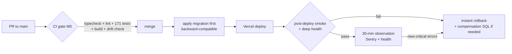

# Production safety plan — monitoring, alerts, health checks, smoke tests, reconciliation, backups, rollback

**Date:** 2026-08-01 · **Basis:** ops-testing audit sweep (all `file:line` citations re-verified
against this repo), read-only live-database and site probes (marked "verified in prod
2026-08-01"), and the safety-security rows of [01-capability-matrix.md](01-capability-matrix.md).
Deliverable 5 of the scope package (see [README.md](README.md)). Architecture anchor: **A-10**
(observability first-class); milestone anchors per [07-milestone-backlog.md](07-milestone-backlog.md).

---

## 1. Current posture summary

The platform is **operationally dark**. It is well-engineered at the code level (snapshots,
content-locking, 171 unit tests) and blind at the operations level: if production broke right
now, the team would learn about it from a user, not from the system.

| Capability | Today | Evidence |
|---|---|---|
| Application logging | **None.** Zero `console.*` calls in `src/`, no logger module | grep `console\.` across src: 0 matches |
| Error tracking | **None.** No Sentry/equivalent, no `instrumentation.ts` | grep Sentry/posthog/instrumentation: 0 matches |
| Error boundaries | **None.** No `error.tsx`/`global-error.tsx`/`not-found.tsx` anywhere | glob over `src/app`: 0 files |
| Health endpoint | **Impossible today** — the app has zero API route handlers | glob `src/app/**/route.ts`: 0 files (82 app files enumerated) |
| CI | **None.** Push to `main` → Vercel build → production; only gate is `next build`'s TS check | no `.github/`, no `vercel.json`, no hooks; `package.json:5-12` |
| E2E / smoke tests | **None.** All 17 test files are pure-logic under `src/lib`; nothing touches HTTP/DB/auth | no playwright/cypress config |
| Scheduled jobs / cron | **None.** All work is request-scoped, incl. 300-DPI certificate rendering inline in the candidate's submit request | `src/lib/certificate/issue.ts:186-189`, `assets.ts:20` |
| Alerting | **None.** "Nobody is paged, ever" | ops-testing audit |
| Migrations | Hand-pasted into the Supabase SQL editor; no tracking, no drift check | `README.md:46-50`; no `supabase/config.toml` |
| Backups | Whatever the Supabase tier silently provides; tier/PITR **unverified**, no restore ever attempted | production-truth open item |
| Durable rate limiting | In code + tested, but activation depends on Upstash env vars **unverifiable** in the client-owned Vercel account; falls back silently to per-instance memory | `src/lib/rate-limit.ts:105-121` |

The **only durable failure record in the entire system** is one `account_history` row written
when certificate asset generation fails (`src/lib/certificate/generate.ts:118-131`) — and only
when the participant id resolved. Every other failure is discarded at its catch site, converted
to a generic localized message, or swallowed in a void action (full retrofit list in §2.3).

Mitigating facts (verified in prod 2026-08-01): all data invariants are currently clean (0
passed-without-certificate, 9/9 certificates with both assets, 0 double-open attempts), all 7
migrations are applied, and the data set is tiny (17 participants, 392 `attempt_answers` rows —
the largest table). The blindness is a **latent** risk today; it becomes an active one the
moment payments, accounts, or learning content land. That is why nearly everything in this plan
is **M0/M1** and precedes feature work.

---

## 2. Monitoring & error tracking — **M0**

### 2.1 Sentry setup scope (M0)

- Sentry SDK (`@sentry/nextjs`) wired via `instrumentation.ts` (the Next.js hook, currently
  unused) — server + client, sourcemaps uploaded in CI.
- Environments `production` / `preview`; release = git SHA (also exposed by `/api/health`, §3).
- Tag conventions: `area` (admin | candidate | verify | certificate | email | jobs | webhook),
  `assignment_id` / `participant_id` / `certificate_id` where known — **ids only, never
  emails/names** in event payloads.
- Every captured server error gets a **support reference** = Sentry event id, surfaced to the
  user via the error boundary / `FormState` (an optional `supportRef` field) so an admin report
  of "it failed" is correlatable. (This is the same `supportRef` D-10 would print in a mailto.)
- Alert rules configured immediately (see §4) — an unwatched Sentry project is decoration.

### 2.2 Structured logging conventions (M0, then a standing rule)

A thin logger (JSON lines to stdout — Vercel captures function stdout; today the logs contain
only framework output) plus `Sentry.captureException`. Conventions, enforced in code review and
by an ESLint `no-empty-catch`-style rule:

1. **Every catch site logs with context** — event name, area, relevant ids, the actual error
   message + stack — *before* deciding what the user sees. Discarding the error object is a
   review-blocking defect from M0 onwards.
2. **Deliberate degradations log at `warn`, once per condition** — e.g. rate limiter falling
   back to in-memory (`rate-limit.ts:114-120`), i18n falling back to DE
   (`src/lib/i18n/index.ts:35-37,73-75`), email disabled by missing env. Degrading is fine;
   degrading *silently* is not.
3. **Void actions die.** Fire-and-forget Server Actions must check write results and surface
   failure (capability row "User-visible failure states", M0).
4. **No success UI before authoritative backend success.**
5. New subsystems (jobs, webhooks, imports) inherit the rule as they are built (M1+): the
   coverage classes in A-10 are a contract, not extra M0 work.

### 2.3 Retrofit list — today's silent-swallow sites

This is the enumerated M0 work list. Idiom classes (a)–(g) per the ops audit; representative
sites verified in this repo:

| # | Site | Idiom | Fix |
|---|---|---|---|
| 1 | `src/app/(dashboard)/admin/courses/actions.ts:84-86` (+ the same pattern in all 9 admin `actions.ts` files) | DB error → generic `FormState` message, error object discarded | log + `supportRef` before returning the message |
| 2 | `src/app/(dashboard)/admin/courses/actions.ts:151-160` `toggleCourseActive` | void action, update result unchecked | check result, visible failure state |
| 3 | `src/app/(dashboard)/admin/certificates/actions.ts:144-173` `reinstateCertificate` | two unchecked writes | check both, log, surface |
| 4 | `src/app/(dashboard)/admin/participants/actions.ts:539-557` `regenerateCertificateAssets` | returns void; `generateCertificateAssets` result discarded | surface `ok:false` + error to the admin |
| 5 | `src/lib/email/certificate-email.ts:49-55` (same in invite/verification email) | Resend error and thrown exceptions collapsed to one generic string | log actual error; feed `email_events` once it exists (M1) |
| 6 | `src/lib/certificate/issue.ts:167-169` | non-23505 `certificates` insert error → `return null`, **unlogged** — candidate stranded on "being prepared" forever | log + Sentry; admin issue-retry action (A-08, M0) |
| 7 | `src/lib/certificate/issue.ts:172-184` | `certificate_id` backlink + history insert unchecked | check + log |
| 8 | `src/lib/certificate/issue.ts:189` + caller of `generate.ts` | `AssetGenerationResult.error` discarded by both callers | consume result; `certificates.asset_status` state (A-08) |
| 9 | `src/lib/certificate/generate.ts:118-131` | catch-all → `account_history` only, and only if `participantId` resolved | also Sentry + log; keep the history row |
| 10 | `src/lib/certification/data.ts:369-371` + `src/app/certification/[accessToken]/actions.ts:242` | `recordAttempt` throws bare `"Failed to record attempt"`; `submitAttempt` has no catch and no boundary → candidate hits Next's default error screen mid-exam, nothing logged | catch, log, recoverable candidate state (answers persist via autosave) |
| 11 | `src/lib/certification/data.ts:395-397` | `attempt_answers` insert result ignored | check + log (reconciliation §6 backstops) |
| 12 | `src/lib/certification/data.ts:399-413` | assignment status updates unchecked | check + log |
| 13 | `src/app/certification/[accessToken]/actions.ts:216-240` `saveAttemptProgress` | swallows every failure path by documented design | keep fail-soft, add `warn` log + Sentry breadcrumb |
| 14 | `src/lib/i18n/index.ts:24-38,59-76` | any settings-read error → silent DE fallback | keep fallback, log `warn` once |
| 15 | `src/lib/rate-limit.ts:114-120` | Redis failure / missing env → silent in-memory fallback | keep fail-open, log `warn` + Sentry (capability row, M0) |
| 16 | Destructure-drop pattern: `src/lib/certificate/issue.ts:36-115`, `src/app/(dashboard)/admin/certificates/actions.ts:15-27` | `const { data } = await …` without reading `error` — read failure indistinguishable from not-found | read and log `error` |
| 17 | Env: `src/lib/supabase/service.ts:17-21` (lazy throw), `NEXT_PUBLIC_SITE_URL` relative fallback (proven by `src/lib/__tests__/utilities.test.ts:119-123`) | misconfigured deploy degrades silently; a relative URL would be **frozen into immutable certificate snapshots** (`issue.ts:127,142-152`) | boot-time Zod env schema + hard guard refusing issuance with a relative verification URL (M0, ships with §3) |

### 2.4 Error boundaries (M0)

- `src/app/global-error.tsx` + root `error.tsx` + `not-found.tsx`.
- Route-group boundaries with tailored copy: **candidate flow** (`certification/[accessToken]`)
  — German, reassuring ("your answers are saved" — true, autosave persists), retry action,
  support reference; **admin** — technical detail + supportRef; **verify** — neutral public
  copy. All boundaries report to Sentry.
- i18n: boundary copy goes through the existing `messages.{de,en}.json` mechanism per A-12.

---

## 3. Health checks — **M0** (first API routes in the app)

Today no health endpoint is *possible* — the app has zero route handlers, so uptime monitoring
can only fetch pages (the audit itself had to probe prod by fetching `/` and `/verify`).
`/api/health` is deliberately the first `route.ts` ever added, ahead of the M1 cron/webhook
routes that will follow the same pattern.

### 3.1 Endpoints

| Endpoint | Checks | Cost | Auth |
|---|---|---|---|
| `GET /api/health` (shallow) | app responds; DB reachable (1-row select on `platform_settings`) | ~1 query | none (no internals leaked) |
| `GET /api/health/deep` | everything shallow, plus: Supabase Auth reachable; storage bucket `certificates` exists; email config present (`RESEND_API_KEY`+`RESEND_FROM`); Upstash pair present; site-URL absolute; **jobs heartbeat** (last drain < 2× interval — from M1); **webhook backlog** (unprocessed `stripe_events` older than 10 min — from M2); cert-generation backlog (`asset_status='failed'` or pending > 15 min — from M0's A-08 state column) | several queries | bearer token (`HEALTH_CHECK_TOKEN`) — it names failing subsystems, which is operator-only information |

### 3.2 Response contract

```json
{
  "status": "ok",            // "ok" | "degraded" | "down"
  "version": "<git sha>",
  "timestamp": "2026-08-01T12:00:00Z",
  "checks": {
    "db":        { "status": "ok", "latency_ms": 12 },
    "storage":   { "status": "ok" },
    "email":     { "status": "degraded", "detail": "RESEND_FROM unset" },
    "jobs":      { "status": "ok", "last_heartbeat": "2026-08-01T11:58:02Z" }
  }
}
```

HTTP 200 when `ok` or `degraded`, 503 when `down` (any critical check failing: db, storage).
`degraded` = non-critical check failing (e.g. email config) — monitors don't page on it, but
it appears in the daily digest (§4). Never include secrets, connection strings, or row data.

### 3.3 Who calls them

| Caller | Target | Frequency |
|---|---|---|
| External uptime monitor (e.g. Better Stack / UptimeRobot — anything outside Vercel) | shallow | every 60 s; page after 2 consecutive failures |
| Same monitor, authed check | deep | every 5 min |
| Post-deploy smoke job (§5, §7) | deep | once per deploy, blocking |
| Vercel Cron drainer (M1, A-05) | writes the jobs heartbeat the deep check reads | every drain |
| Operator, manually | deep | during incidents and maintenance windows (§7.4) |

---

## 4. Alerting policy

**Principle: every alert is actionable, has an owner, and has a playbook line.** For a 1–2
person team (§10), an unactionable alert is worse than none — it trains the operator to ignore
the channel.

### 4.1 Channels

- **Page** (immediate push — phone-visible): uptime monitor + Sentry critical rules → the
  shared ops channel/app both operators have on their phones. Reserved for SEV-1 conditions.
- **Notify** (same channel, no urgency): CI failures, smoke failures, reconciliation findings.
- **Daily digest** (email or scheduled message): warn-level noise — rate-limit fallback events,
  `degraded` health, bounce list. Never a page.

### 4.2 The actionable-alert list

The ten alert conditions from the capability matrix ("Alerting" row), mapped to concrete
signals. Foundation rows land in M0; business-invariant rows are emitted by the jobs runner
and reconciliation sweeps (§6) as those exist.

| Alert | Concrete condition | Signal source | Channel | Milestone |
|---|---|---|---|---|
| Smoke-test failure | post-deploy or scheduled smoke run fails | GitHub Actions (§5) | Notify (post-deploy: blocks release, §7) | M0 |
| Migration failure | migration step of a deploy fails, or CI drift check fails (§8) | CI | Notify | M0 |
| Backup failure | Supabase backup alert, or quarterly restore test fails (§9) | Supabase dashboard + calendar task | Notify | M0 |
| Authz-error spike | Sentry: > 10 authz-tagged errors / 5 min (someone probing `requireAdmin` / token surfaces) | Sentry rule | Page | M0 |
| Cert-valid-without-assets | any valid certificate with `asset_status='failed'`, or missing either asset row | A-08 state column (M0) + reconciliation #5 (M1) | Notify | M0 |
| Pass-without-certificate | reconciliation #4 finding > 0 (a candidate is stranded) | reconciliation | Page | M1 |
| Job not running | jobs heartbeat older than 2× drain interval | deep health + cron self-report | Page | M1 |
| Repeated email failures | ≥ 3 email-job failures in 1 h, or a bounce recorded for a certificate/invite email | jobs + `email_events` | Notify | M1 |
| Repeated webhook failures | ≥ 3 consecutive `stripe_events` processing failures, or backlog > 10 min | webhook receiver + deep health | Page | M2 |
| Paid-order-without-entitlement | reconciliation #2 finding > 0 (someone paid and has no access) | reconciliation | Page | M2 |

Plus three M0 foundation rules: **uptime** (shallow health fails 2 consecutive checks → Page);
**new Sentry issue on the candidate/verify path** (Page — these users can't report problems);
**error-rate spike** anywhere (Notify).

### 4.3 Noise budget

- Steady-state target: **≤ 2 alerts per week**. If exceeded two weeks running, fixing alert
  quality becomes the priority over feature work.
- **Three-strikes rule:** any alert that fires three times without producing an action is
  redesigned (better threshold), demoted to the digest, or deleted.
- No "FYI" pages. Warnings accumulate in the digest.

---

## 5. Synthetic smoke tests

Nothing repeatable exists today — the system was verified end-to-end exactly once, manually,
on 2026-05-29 (CLAUDE.md note). The suite below starts in **M0** with the nine journeys that
exist today; each later milestone adds its journeys **as part of its definition of done**.

**Environments:** mutating journeys (anything that submits, pays, enrols) run against a
**staging Supabase project** — never prod. Read-only journeys run against prod using seeded
synthetic data (a flagged test participant/course, excluded from admin lists, stats and
reconciliation). Playwright is the harness for browser journeys; curl-able checks are plain
HTTP assertions an uptime monitor can also run.

| # | Journey | Method | When | Testable from |
|---|---|---|---|---|
| 1 | Participant sign-in (token resolves + OTP surface renders) | Playwright | post-deploy + scheduled daily | **M0** |
| 2 | Admin sign-in | Playwright | post-deploy | **M0** |
| 3 | Exam persists (attempt autosave → reload → answers present) | Playwright (staging) | post-deploy + scheduled daily | **M0** |
| 4 | Pass → certificate workflow (submit passing attempt → certificate issued with assets) | Playwright (staging only — creates rows) | post-deploy | **M0** |
| 5 | Verify resolves (`/verify/<seeded token>` → 200 + expected name) | curl-able | post-deploy + monitor every 15 min | **M0** |
| 6 | Certificate download (asset URL → 200, correct content-type; becomes signed-URL fetch after A-09/D-04) | curl-able | post-deploy + scheduled daily | **M0** |
| 7 | Admin views participant state (detail page renders assignments/attempts/history) | Playwright | post-deploy | **M0** |
| 8 | Manual enrollment (admin enrols test participant → entitlement active) | Playwright (staging) | post-deploy | **M1** |
| 9 | Invitation resolves (signed expiring invitation link → valid claim surface) | curl-able | scheduled daily | **M1** |
| 10 | Entitlement opens course (active entitlement → course home loads) | Playwright | post-deploy | **M1** (gate) / **M3** (course page) |
| 11 | Purchase → webhook → access (Stripe test-mode checkout → order paid → entitlement active) | Playwright + Stripe test mode (staging) | post-deploy + scheduled daily | **M2** |
| 12 | Coupon applies (Stripe promotion code in test-mode checkout, per A-04) | Playwright (staging) | post-deploy | **M2** |
| 13 | Expired entitlement blocks (seeded expired entitlement → access refused) | curl-able (expect block page/redirect) | scheduled daily | **M2** |
| 14 | Progress persists (complete lesson → reload → still complete, resume position kept) | Playwright | scheduled daily | **M3** |
| 15 | Quiz persists (lesson-quiz answer → reload → retained) | Playwright | scheduled daily | **M3** |

**Runner:** GitHub Actions — a `deploy-verify` job triggered after Vercel deploy (release gate,
§7) and a `scheduled-smoke` workflow (daily; the curl-able subset also lives in the uptime
monitor at higher frequency). Failures alert per §4.2.

---

## 6. Reconciliation jobs

Every cross-entity invariant is currently enforced only by code happening not to fail
mid-sequence — and §2.3 documents exactly where it can fail without a trace. The invariant
queries below were **run by hand for this audit and all came back clean** (verified in prod
2026-08-01); reconciliation is those queries given a scheduled home on the M1 jobs runner
(A-05: `jobs` table + Vercel Cron drainer).

**Iron rule: reconciliation detects and surfaces — it never rewrites.** Every finding creates
an alert (§4.2) plus an item on the admin ops dashboard with an explicit, human-triggered
repair action. State transitions (e.g. expiring an entitlement) belong to their own dedicated
jobs; reconciliation only checks that those jobs did their work.

| # | Comparison | Invariant checked | Frequency | On mismatch (surface, not rewrite) | Milestone |
|---|---|---|---|---|---|
| 1 | Passed assessments vs certificates | every `passed` assignment has `certificate_id` (today: 9/9 clean) | daily | Page + admin **"Issue certificate"** retry action (idempotent, reuses `issueCertificate` — the A-08/M0 repair path) | **M1** |
| 2 | Certificates vs assets | every valid certificate has PDF + PNG rows and `asset_status='complete'` | daily | Notify + admin **"Regenerate assets"** action (exists today, made result-checked in M0) | **M1** |
| 3 | Queued emails vs delivery | every sent email has an `email_events` delivered/bounced outcome within 24 h; bounces flagged (today `emailed_at` = "Resend accepted", not delivered) | daily | Notify + bounce list on ops dashboard; repair = resend / correct address | **M1** |
| 4 | Stuck jobs | no job `running` > 15 min or `queued` > 1 h; `dead` jobs listed | every drain run (~15 min) | Page on dead/stuck + **"Retry job"** button | **M1** |
| 5 | `stripe_events` vs `orders` | every received event reached a terminal processing outcome; every order's originating event exists | hourly | Page (money) + **"Replay event"** action (idempotent by `stripe_events` dedup, A-04) | **M2** |
| 6 | Paid `orders` vs `entitlements` | every paid order produced an active entitlement | hourly | Page + guided **"Grant entitlement"** repair | **M2** |
| 7 | Entitlements vs expiry dates | no `active` entitlement past `expires_at`; `expiring` reminders actually queued | daily | Notify; repair = run the expiry-transition job / investigate why it missed | **M2** |

---

## 7. Deployment safety

Today: push to `main` → Vercel auto-build → production, on a **client-owned Vercel account**
(project memory; not inspectable from the repo). No CI, no branch protection artifacts, no
post-deploy verification of any kind. "A change that breaks all 171 tests deploys to
production unimpeded" (ops audit).



### 7.1 Pre-deploy CI gates (M0)

GitHub Actions on every PR + on `main`, **blocking** via branch protection:
`pnpm typecheck` · `pnpm lint` · `pnpm test` (the existing 171 cases run automatically for the
first time) · `pnpm build` · migration drift check (§8) · env-schema completeness check (the
Zod env schema of §2.3 #17, run against a documented var manifest). Playwright smoke (§5) runs
post-deploy, not pre-merge. This is roughly half a day of work and the single
highest-leverage safety item in the entire plan.

### 7.2 Migrate-then-deploy order (M0 rule)

**Schema first, code second — every migration must be backward-compatible with the currently
deployed code** (expand → migrate → contract):

1. *Expand:* additive migration (new nullable column/table/index) applied to prod while old
   code runs. Old code ignores it.
2. *Deploy:* code that uses the new schema.
3. *Contract:* removal of old columns/paths ships only in a **later** release, after the
   observation window.

Never the reverse — Vercel's instant rollback restores *code* only; if new code requires new
schema and the migration failed or must be reverted, rollback is no longer one click. The
contract phase is where `certificates.file_url`-style deprecated leftovers get cleaned up.

### 7.3 Feature flags (M1)

A `feature_flags` table (key, enabled, description, updated_by — mirroring the
`platform_settings` singleton pattern from migration 0002), superadmin UI, cached read helper.
Booleans only — no percentage rollouts, no flag SaaS (one academy). Lifecycle rule: flags are
**temporary rollout devices removed after stabilization**, not permanent branches. Every
public-surface flag defines its fail-safe default (behaviour when the flag read fails). First
consumers: entitlement gating and participant accounts (M1); then checkout (M2) and learning
UI (M3). M0 adds no product features and therefore needs no flags.

### 7.4 Maintenance-mode policy

Production truth makes brief planned outages essentially free: 17 participants, 2 open
attempts, no time-critical usage (verified in prod 2026-08-01). Policy:

- **Acceptable:** planned windows for migrations of class "destructive/restructuring"
  (§8), storage cutover (A-09/D-04), auth cutover — anything where a dual-write window costs
  more than 30 minutes of downtime. **Not acceptable:** during any announced exam window, or
  unannounced.
- **Mechanism:** M0 interim — `MAINTENANCE_MODE` env var checked in `src/proxy.ts`, rendering
  a static bilingual maintenance page for candidate + verify surfaces (toggle = env change +
  redeploy, ~1 min on Vercel). From M1 — a `maintenance_mode` feature flag (no redeploy).
  Admin surfaces stay up unless the work requires otherwise.
- **Procedure:** (1) **announce** to the client/admins with a stated window (≥ 24 h notice for
  anything over 5 min); (2) confirm no in-progress attempts (query open attempts; autosave
  means an interrupted attempt survives, but don't rely on it); (3) **toggle** maintenance
  page on, verify it renders; (4) do the work, each step from the migration checklist (§8);
  (5) **verify**: deep health check + post-deploy smoke + the §6 invariant queries; (6)
  toggle off; (7) observation window per §7.5.
- **Rollback criterion:** if verification fails and the fix isn't obvious within the announced
  window, roll back (Vercel rollback + compensation SQL) rather than extend the outage.

### 7.5 Post-deploy observation (M0)

Every production deploy is followed by: automatic smoke + deep health (blocking), then a
**30-minute observation window** watching Sentry and the health endpoint. Rollback triggers:
smoke failure, `down` health, any new error class on the candidate/verify/certificate path.
Roll back first, diagnose second — Vercel instant rollback for code; pre-written compensation
script for any migration in the release (§8). A two-page deploy/rollback playbook documenting
exactly this lives in the repo (M0).

---

## 8. Database migration discipline — **M0**

Today migrations 0001–0007 are applied by pasting SQL into the Supabase editor
(`README.md:46-50`); nothing tracks what actually ran, and at least one undocumented hand-run
change is known (the append-only-trigger disable workaround in project memory). Parity between
repo and prod was confirmed for this audit **by manual probing, not tooling** (all 7 applied,
PostgREST table list matches `src/types/database.ts` exactly — verified in prod 2026-08-01).
That parity makes baselining safe and cheap *right now*.

### 8.1 Supabase CLI adoption (M0)

1. `supabase init` + `supabase link` to the live project; baseline migrations 0001–0007 as
   already-applied in `schema_migrations` (`supabase migration repair`).
2. All future schema changes are CLI migration files — small, single-purpose, sequential. No
   opaque mega-migrations.
3. **Hand-run SQL in the editor is forbidden from baseline day.** Emergency hotfix SQL follows
   the incident process (§10) and is captured as a retroactive migration file the same day.
4. Dashboard-only state gets captured as code/docs: storage bucket creation + policies (the
   `certificates` bucket exists in no migration file today), auth settings, the trigger states
   to confirm during the M0 env audit (`account_history` immutability enabled; `handle_new_admin`
   absent).

### 8.2 Drift check (M0, in CI)

`supabase db diff --linked` in the CI pipeline (§7.1), failing on any difference between repo
migrations and the live schema. This turns "did someone paste something?" from an audit
exercise into a red build.

### 8.3 Per-migration checklist

Answered in the migration file's header comment, reviewed in PR:

- **Class:** additive / backfill / destructive-restructuring / RLS-permission change?
  (Destructive class ⇒ consider a maintenance window, §7.4.)
- **Backward compatible** with currently deployed code (expand phase, §7.2)? If not, why, and
  what is the window plan?
- **Locking risk:** which locks, how long? (See §8.4 — near-zero today, still answer it.)
- **Defaults + nullability** defined for existing rows?
- **Backfill:** needed? idempotent? instant at current volumes? verified by what query?
- **RLS/permission changes** reviewed against the security model (no anon policies; admin via
  `is_admin()`)?
- **Compensation script** (down path) written where feasible; where not (data-destroying),
  stated explicitly plus the backup point to restore from?
- **Post-apply verification query** listed — and actually run against prod after applying.

### 8.4 The tiny-table advantage — and its limit

Largest table: `attempt_answers` at 392 rows (verified in prod 2026-08-01). Consequences:
every backfill is instant, table rewrites and index builds are sub-second, locking risk is
negligible, and maintenance windows are cheap. The M1 backfills (participants.email
uniqueness, enrollment/entitlement backfill from the 20 assignments) are trivial. **The limit:**
none of this excuses skipping backward compatibility — the expand/contract discipline protects
against the *deploy gap* (old code running against new schema for minutes), which exists at
any data volume.

---

## 9. Backups & restore — **M0**

Currently: backups are whatever the Supabase tier silently provides; the tier and PITR status
are **unverified** (dashboard access to the client accounts is itself an M0 task); no restore
has ever been attempted; and prod config exists only inside the client's Vercel/Supabase
dashboards.

### 9.1 Verify and upgrade (M0)

- Confirm the live project's backup tier; enable **PITR** if absent — at this project size the
  cost is trivial against the asset (legally meaningful certificates).
- Confirm backup-failure notifications from Supabase reach the ops channel (§4.2).

### 9.2 Certificate assets & storage

The DR story for the `certificates` bucket is unusually good and just needs formalizing: every
asset is **deterministically regenerable** from the immutable `certificate_public_snapshot`
(frozen SVG + data, `src/lib/certificate/issue.ts:127,142-152`), which lives in Postgres and is
therefore covered by the DB backup. So: no separate storage backup regime — instead, build and
**test a bulk-regenerate path** (loop of the existing per-certificate regeneration, 9 certs
today) as part of the M0 restore test. Revisit if D-04/A-09 moves assets to a private bucket
(paths change; the regeneration property is unaffected).

### 9.3 Config recovery (M0)

A config-recovery sheet, produced during the M0 production env audit and kept current:
every prod env var (name, purpose, where its value can be re-obtained — **not** the secret
itself), Supabase dashboard settings (auth policy, bucket policies, trigger states), Vercel
project settings, DNS, Resend domain. Stored where losing the dashboards doesn't lose it
(repo for the non-secret inventory; the client's password manager for secrets). Today,
losing access to the client's Vercel account would lose the only copy of prod config.

### 9.4 Restore test — procedure and cadence

**Procedure** (first run in M0, timed and documented): restore the latest backup / a PITR
point into a **scratch Supabase project** → run the §6 invariant queries + row-count
comparison against prod → point a local app build at the restored DB and execute one full
read path (admin list, verify page) → run the bulk asset regeneration against one certificate
→ record wall-clock time and gaps found. **Cadence:** quarterly, and additionally after each
major schema phase (end of M1, end of M2/M3).

### 9.5 Proposed RPO/RTO targets (to agree with the client)

| Asset | RPO (max data loss) | RTO (max time to restore) | Basis |
|---|---|---|---|
| Postgres (all certification truth incl. snapshots) | ≤ 15 min (PITR; practically ~2 min WAL) | ≤ 4 h | tiny DB restores in minutes; the 4 h budget is people-time for a 1–2 person team |
| Certificate assets (storage) | 0 — regenerable from snapshots | ≤ 4 h (bundled with DB RTO + bulk regenerate) | §9.2 |
| Prod config | last sheet update (≤ 1 quarter, refreshed on change) | ≤ 1 day (account recovery is the long pole) | §9.3 |

---

## 10. Incident response

### 10.1 Severity levels

| Level | Definition (this product) | Examples | Response |
|---|---|---|---|
| **SEV-1** | Candidates cannot take/submit exams; certificates issued wrong, leaking, or verification down; data loss; money taken without access granted (M2+); security breach | `recordAttempt` failing for all submits; verify page 500; paid-order-without-entitlement alert | Act immediately on acknowledgement; maintenance mode if it prevents harm; client informed same day |
| **SEV-2** | Degraded but working around exists | email sends failing; asset generation failing (cert still valid, PDF pending); one admin surface broken; reconciliation finding | Same or next business day |
| **SEV-3** | Cosmetic, single-user, non-blocking | copy defect; digest-level warnings | Backlog |

### 10.2 On-call reality (1–2 person team)

No rotation theatre. Honest commitments, agreed with the client: all Page-channel alerts (§4.1)
reach both operators' phones; SEV-1 acknowledgement target **≤ 4 waking hours**, best effort
outside; SEV-2 next business day. The system is built to make this tolerable: fail-soft
degradations (email, rate limiting) buy time, autosave protects in-flight attempts, and the
noise budget (§4.3) means a page is always real. What makes a small team viable is not
availability, it is that **the system reports its own failures** — which is what M0 buys.

### 10.3 Incident log

`docs/incidents/YYYY-MM-DD-<slug>.md` in this repo — one file per SEV-1/SEV-2: timeline,
impact (who/what/how many — usually countable exactly at this scale), root cause, what the
monitoring saw vs missed, follow-up actions (filed as issues), any hand-run SQL (captured as a
retroactive migration per §8.1). Blameless; written within 48 h; five minutes of writing is
enough. SEV-3s don't get files.

### 10.4 "No silent failure", operationalized

The principle behind this whole document, as an enforceable rule from M0:

> **Every failure must land in at least one durable, attributable place** — a Sentry event, a
> structured log line, `jobs.last_error`, an `account_history`/`audit_log` row, or a
> reconciliation finding — **and every failure a user could care about must additionally be
> visible to that user** (candidate boundary with supportRef; admin failure state instead of
> fake success).

Enforcement, not aspiration: the §2.3 retrofit list clears the existing violations (M0); the
lint rule + PR checklist item block new empty/discarding catch sites (M0); reconciliation (§6)
backstops the multi-step sequences that can still fail between writes (M1/M2); and the alert
list (§4.2) guarantees a human hears about the classes that matter. Related risks and their
owners: [09-risk-register.md](09-risk-register.md); the migration sequences these safety nets
protect: [06-migration-strategy.md](06-migration-strategy.md).
