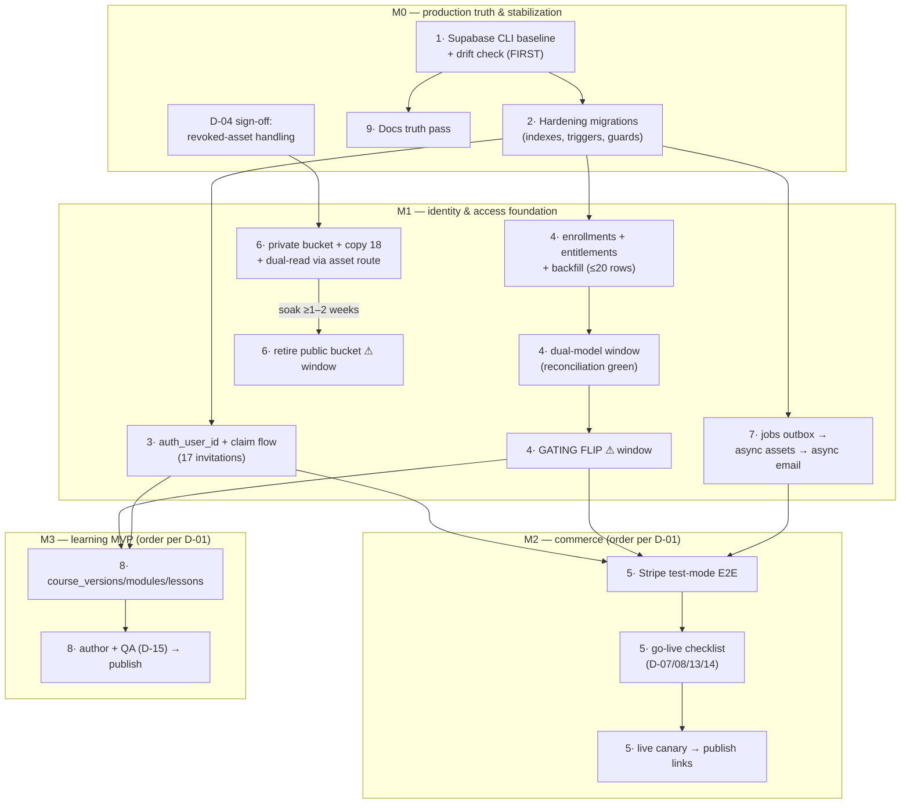

# Migration strategy — per-area current→target sequences, backfills, cutovers, outage windows, rollback

**Date:** 2026-08-01 · **Basis:** read-only live-database probes (all row counts and invariants verified in prod 2026-08-01), full code audit with `file:line` evidence, and the locked architecture decisions A-01…A-12. Deliverable 6 of the scope package (see [README.md](README.md)); entity detail lives in [04-data-model.md](04-data-model.md), verification machinery in [05-production-safety-plan.md](05-production-safety-plan.md), milestone contents in [07-milestone-backlog.md](07-milestone-backlog.md).

---

## Migration philosophy

Production data is tiny and clean: **17 participants, 20 assignments, 23 attempts, 9 certificates, 18 storage assets, zero invariant violations** (verified in prod 2026-08-01). Every backfill in this document is a single `INSERT … SELECT` or a sub-second index build. Consequences:

1. **Data volume is never the risk.** The risk is behavioural and configurational: a wrong RLS predicate, a gating check that consults the wrong table, an env var absent in the client-owned Vercel account, a migration applied to the wrong project. Plans below spend their verification effort there, not on batch sizing.
2. **Brief announced maintenance windows are cheaper than zero-downtime engineering.** With ~20 live access links and no continuous traffic, a 15-minute window in which every affected link is individually re-verified costs less than building dual-write shims. Only two steps want a window at all (see the closing table).
3. **Additive-first, roll-forward-only.** Every schema change is expand → migrate → contract: new columns nullable-or-defaulted, code deployed, constraints tightened after. No down-migrations; each migration notes its compensation (usually `DROP INDEX`/`DROP TRIGGER`/flag flip) in its header.
4. **Nothing moves before the tooling does.** Area 1 (Supabase CLI adoption) is a hard prerequisite for every other area — the current SQL-editor-pasting practice (README.md:46-50; `supabase/migrations/0004_certificate_assets.sql:2` "apply manually") is itself the first thing migrated, in M0, before any schema change.
5. **Tiny data is a verification luxury.** Where a large platform samples, we enumerate: all 20 token links can be fetched after the entitlement flip; all 18 storage objects can be fetched through the new asset route before the public bucket dies. Plans below exploit this.

Field template used for every area: current state / target state / migration sequence / data backfill / compatibility period / cutover / verification / rollback-or-compensation / expected outage / risk.

---

## 1. Migration tooling: SQL-editor pasting → Supabase CLI + drift check (M0 — do this FIRST)

**Current state.** Seven migration files (`supabase/migrations/0001`–`0007`) applied by hand-pasting into the Supabase SQL editor; 0004–0006 carry explicit "apply manually" headers. No `supabase/config.toml` exists (grep-verified) — the CLI has never been linked. Live parity was confirmed by probe, not tooling: all seven migrations are applied in prod and the PostgREST table list matches `src/types/database.ts` exactly (verified in prod 2026-08-01). Known unrecorded-drift candidates: the `account_history` append-only trigger has been disabled at least once via the SQL editor for participant deletion (documented operational practice), and the `certificates` storage bucket exists only as dashboard state.

**Target state.** CLI-linked project; migrations 0001–0007 baselined into `supabase_migrations.schema_migrations`; all subsequent migrations applied via `supabase db push`; CI (from the M0 observability work, A-10) runs `supabase db diff --linked` as a drift gate; SQL-editor DDL is forbidden except during incident response, and any such change must be captured as a follow-up migration the same day.

**Migration sequence.**
1. `supabase init` + `supabase link` against the live project ref (confirm the ref interactively — this is the one step where "wrong project" is possible).
2. Baseline: mark 0001–0007 as applied (`supabase migration repair --status applied` per file) **without executing them**.
3. Run `supabase db diff --linked`. Expected: near-empty. Reconcile any drift found — either write a migration that codifies the live state (e.g. re-enable the append-only trigger if the diff shows it disabled) or fix prod to match the repo. This diff also finally settles the trigger-state open question from the audit.
4. Wire the diff into CI as a required check; add the rule to CLAUDE.md as part of the docs pass (area 9).
5. Codify what SQL can express about storage; document dashboard-only settings (bucket policies) in `05-production-safety-plan.md`'s runbook.

**Data backfill.** None — only `schema_migrations` metadata rows.

**Compatibility period.** None needed; zero app-visible change.

**Cutover.** The moment the baseline + drift check is green. Every migration in areas 2–8 goes through the CLI from then on.

**Verification.** `supabase db diff --linked` returns empty; one no-op test migration applied through the CLI end-to-end; CI turns red on a deliberately introduced local drift (then reverted).

**Rollback / compensation.** Delete the baseline rows / unlink. No schema is touched; there is nothing to unwind.

**Expected outage.** None.

**Risk.** Low. The main "hazard" — discovering unrecorded prod drift at step 3 — is the point of the exercise; it must be resolved before any area-2 migration runs. Secondary hazard: repairing against the wrong project ref; mitigated by interactive confirmation and the read-only probe re-run afterwards.

---

## 2. M0 hardening migrations (attempt races, immutability, fail-path, email uniqueness)

**Current state.** Four gaps, all app-level-only today, all probed clean in prod so retrofitting constraints is safe: no DB constraint prevents two open attempts per assignment (only `UNIQUE(assignment, attempt_number)`, `0001_core_schema.sql:222`); submitted attempts and `attempt_answers` are freely mutable/deletable under `admins_all` RLS (unlike append-only `account_history`); the fail-path assignment update lacks the `.neq('status','passed')` guard the pass path has, and the submit UPDATE's 0-row result is unchecked, allowing double-submit duplicates (`src/lib/certification/data.ts:353-413`); `participants.email` has no uniqueness or format constraint. Prod invariants 2026-08-01: 0 double-open attempts, 0 duplicate emails, 0 passed-without-`passed_at`, 0 confirmed-without-email — every constraint below applies without violation.

**Target state.** DB-enforced: partial unique index `uniq_open_attempt_per_assignment ON attempts(certification_assignment_id) WHERE submitted_at IS NULL`; trigger `guard_attempt_immutable` raising on UPDATE/DELETE of submitted attempts (with a column whitelist pre-designed for the M4 invalidation columns, so M4 does not weaken it) plus a companion trigger on `attempt_answers`; partial unique index on `lower(participants.email) WHERE email IS NOT NULL`; CHECKs `(status <> 'passed' OR passed_at IS NOT NULL)` on assignments and `(email_confirmed = false OR email IS NOT NULL)` on participants. App-side: `recordAttempt`'s submit UPDATE chains `.select('id')` and aborts on 0 rows; the fail path gains `.neq('status','passed')`. (The sibling M0 retrofit — `certificates.assets_status`/`assets_error` + the issue-retry action — follows the identical pattern; it is specified in [04-data-model.md](04-data-model.md) and sequenced with area 7.)

**Migration sequence.**
1. Pre-flight: re-run the invariant probe suite against prod (same queries as the 2026-08-01 audit) — must be clean.
2. Apply the index migrations (plain `CREATE UNIQUE INDEX` — at 23 attempt rows, `CONCURRENTLY` is unnecessary).
3. Apply the CHECKs and triggers.
4. Deploy the app-code guards (DB-first ordering is safe: the app already behaves as if the constraints existed; no code path legitimately updates a submitted attempt).
5. Re-run the probes; run the staging violation tests (below).

**Data backfill.** None — constraints only, verified pre-satisfied.

**Compatibility period.** None; the DB is being aligned with what the app already assumes.

**Cutover.** Immediate on apply.

**Verification.** Catalogue check that index/triggers/CHECKs exist; staging negative tests: open a second attempt for one assignment → expect unique violation; UPDATE a submitted attempt's score → expect raise; double-submit the same attempt → second submit rejected with 0 rows; insert a duplicate email → expect violation. Full unit suite + typecheck green in CI.

**Rollback / compensation.** Each object drops with a single statement (`DROP INDEX` / `DROP TRIGGER` / `ALTER TABLE … DROP CONSTRAINT`); app guards revert by deploy. No data was changed.

**Expected outage.** None (table locks are momentary at this size).

**Risk.** Low. The one behavioural edge: any hidden admin path that mutates submitted attempts would now fail loudly instead of silently corrupting history — which is the desired outcome, and Sentry (M0, A-10) will surface it. The trigger whitelist must anticipate the M4 columns (`invalidated_at`, `invalidated_by_admin_id`, `invalidation_kind`, `invalidation_reason`) now, to avoid re-touching the trigger later.

---

## 3. Participant identity (A-02): `participants.auth_user_id` + claim flow (M1)

**Current state.** Participants have no login of any kind; access = permanent assignment `access_token` + email OTP (`email_verification_codes`: 14 rows, all consumed, max guess count 0 — verified in prod 2026-08-01). 17 participants, 17/17 with email, 11 email-confirmed, 0 duplicates. The only auth users are the 3 admins; every RLS policy gates on `is_admin()` membership (`0001_core_schema.sql:509-520`), never on bare `authenticated` — which is what makes adding participant auth users safe.

**Target state.** `participants.auth_user_id uuid NULL UNIQUE → auth.users ON DELETE SET NULL`. A claim flow links a participant row to a newly created Supabase Auth account **only after a fresh email verification** (the existing OTP machinery is reused). The token+OTP exam flow is untouched and remains the exam-access mechanism permanently; the account is the durable home for the future portal (M5), dashboard (M3) and GDPR surface (M6). Participant-self RLS policies (`USING (auth.uid() = auth_user_id)`) are added surface-by-surface as portal pages ship.

**Migration sequence.**
1. Migration: add the column + unique index. Never `NOT NULL` — admin-created participants may legitimately never claim.
2. Safety review: confirm no policy or code path equates "authenticated" with "admin" (audit: all policies check `is_admin()`; `src/proxy.ts:39-43` refreshes sessions on all routes but gates nothing — confirmed safe).
3. Build the claim flow: sign-up → verify email by OTP → match against `participants.email` → set `auth_user_id` → audit event. Mismatched or unknown email creates a fresh unlinked participant-less account or is rejected (product choice inside M1, not a migration concern).
4. Comms: one batch email to the 17 existing participants inviting them to create their account. Optional and unhurried — nobody is locked out; token links keep working regardless.
5. Add participant-self RLS policies only as each portal surface ships.

**Data backfill.** Deliberately **none**: linkage happens only through the claim flow, because an email string match alone is not proof of mailbox control. The "backfill" is 17 invitation emails.

**Compatibility period.** Indefinite **by design** — this is not a transition state. Unclaimed participants stay fully functional on token+OTP forever; the dual identity (token for exams, account for portal) is the target architecture, not scaffolding.

**Cutover.** None in the breaking sense. New account-gated surfaces (portal, dashboard) require login from birth; no existing surface ever grows a login wall.

**Verification.** Staging: claim a seeded participant → `auth_user_id` set, participant-self policy returns exactly own rows, cross-participant read fails; the unclaimed participant's full exam flow (token → OTP → attempt → result) passes the regression checklist unchanged; admin surfaces unchanged; a participant auth user cannot reach `/admin` (requireAdmin rejects — no `admin_profiles` row).

**Rollback / compensation.** Feature-flag the claim UI off; the nullable column is harmless at rest. Unlink an individual mistaken claim: set `auth_user_id = NULL` + delete the auth user.

**Expected outage.** None.

**Risk.** Medium — identity mistakes are the class of risk this whole programme worries about (see [09-risk-register.md](09-risk-register.md)). Specific hazards: claiming without a *fresh* OTP round → account takeover of a participant record (mitigated: verification is mandatory in the flow, not skippable for already-confirmed emails); a future policy accidentally trusting `authenticated`; session-cookie interaction on candidate pages (proxy refreshes sessions everywhere — candidate pages must keep ignoring auth state).

---

## 4. Enrollment/entitlement layer (A-03): create, backfill, dual-model window, gating flip (M1)

**Current state.** `certification_assignments` is simultaneously enrollment, entitlement, invitation and exam ticket. Candidate access = token lookup + `active` flag; nothing separates "may access" from "was assigned an exam". 20 assignments across 17 participants and 2 courses (statuses: 9 passed / 7 not_started / 4 failed — verified in prod 2026-08-01).

**Target state.** `enrollments` (registration fact; pins `course_version_id`; carries the reserved nullable `cohort_id`) and `entitlements` (authoritative access state machine: pending/active/expiring/expired/revoked/suspended; source: order/manual/complimentary/invitation; coherence CHECKs and a partial unique active-entitlement index) per [04-data-model.md](04-data-model.md). `certification_assignments` gains nullable `enrollment_id` and stays exactly what it is — the exam ticket. Candidate access gating consults the entitlement.

**Migration sequence.**
1. Migration: create `course_versions` (dependency of `enrollments.course_version_id NOT NULL`; backfill one `version_number 1, status 'published'` row per existing course — 2 rows), then `enrollments`, `entitlements`, and `certification_assignments.enrollment_id`.
2. Backfill (below), including the `enrollment_id` backlink on all 20 assignments.
3. **Dual-model window:** assignments remain authoritative for candidate access; entitlements are written by all new admin actions but not yet consulted. Admin UI shows both records. A reconciliation query (later a standing job, area 7) asserts: every active assignment ↔ an active entitlement for that participant+course; zero mismatches required.
4. Ship the entitlement check in `getCandidateContext` behind a feature flag (default off).
5. **Gating flip:** in an announced maintenance window, flip the flag. Assignment `active` remains as exam-ticket validity; access truth is now the entitlement.

**Data backfill.** One `INSERT … SELECT DISTINCT` creating an enrollment per (participant, course) pair derived from active assignments via their questionnaires, plus one active entitlement each — `source='manual'`, `expires_at NULL` (existing learners are grandfathered perpetual; the D-09 12-month default applies to new sales only). ≤20 enrollment rows, ≤20 entitlement rows, 20 backlink updates. Instant; counts asserted in the migration.

**Compatibility period.** Dual-model window of 1–2 weeks, exited only after the reconciliation query has reported zero mismatches continuously.

**Cutover.** The feature-flag flip, inside a ~15-minute maintenance window (see closing table).

**Verification.** Pre-flip: reconciliation zero-mismatch streak. In-window: scripted fetch of **all 20** live token links → each returns its expected state (this enumeration is feasible precisely because data is tiny). Post-flip: staging assertions that a new manual enrollment grants access, a revoked entitlement blocks access with the correct candidate-facing copy, and an expired entitlement behaves per state machine.

**Rollback / compensation.** Flip the flag back — instant, no data loss; tables and backfill remain valid for a retry. The backfill itself is idempotent (keyed on participant+course) if it ever needs re-running.

**Expected outage.** None for table creation/backfill. The flip window: minutes; candidates mid-attempt are unaffected (attempt pages re-read context but backfilled entitlements are active+perpetual).

**Risk.** Medium — this is the one migration that changes *who can access what*. A wrong flip locks real candidates out. Mitigations: flag (instant reversal), reconciliation gate, and per-link enumeration inside the window. Watch-item: any admin path that deactivates an assignment must now also decide entitlement consequences — covered by the M1 admin UI work, asserted by the reconciliation query.

---

## 5. Commerce (A-04): pure greenfield — Stripe test-mode first (M2, manual orders from M1)

**Current state.** Nothing. Zero payment code, zero commerce tables, no mention anywhere in src (grep-verified in the audit). There is **no legacy to migrate** — this is the only area with a truly empty "current" column.

**Target state.** Stripe Checkout (one-time payments), a signature-verified `/api/webhooks/stripe` receiver, `stripe_events` insert-first idempotency (`ON CONFLICT DO NOTHING` on the Stripe event id PK), first-class `orders`/`payments`/`refunds`/`disputes` with guarded forward-only state transitions, entitlement activation on paid, daily reconciliation job. Stripe confirms payment; **entitlements gate access** — Stripe state never gates anything directly. Coupons = Stripe promotion codes, no academy engine.

**Migration sequence.**
1. M1 (precedes Stripe): `orders`/`payments`/`refunds` tables ship for **manual payments** — admin records a manual order → paid → entitlement `source='order'`. This exercises the order→entitlement chain months before Stripe touches it.
2. M2, entirely in **Stripe test mode** against a preview deployment: products/prices, checkout session creation, webhook route, event processing, order transitions, entitlement activation, refund → entitlement policy per D-08.
3. Go-live checklist (all items block the first live sale): live keys set in the client-owned Vercel account (the same env-opacity that bit rate limiting — verify by runtime check, not by assumption); live-mode webhook endpoint registered + signing secret set; pricing/currency confirmed (D-07); Stripe Tax / Kleinunternehmerregelung configured per professional review (D-13); AGB/Widerruf checkout texts in place (D-14); refund policy published (D-08).
4. Live canary: one real self-purchase with a real card → webhook → order paid → entitlement active → access verified → refund → policy applied. Then publish the first buy link (soft launch; watch the first purchases manually against `stripe_events`).
5. Reconciliation job (area-7 infrastructure): daily Stripe-vs-orders comparison; mismatch alerts.

**Data backfill.** None — no legacy commerce data exists. Optionally, historical off-platform payments can be recorded retroactively as manual orders for reporting completeness (client's call, zero technical pressure).

**Compatibility period.** Not applicable (nothing to be compatible with). The manual-payment path is permanent, not transitional.

**Cutover.** Publishing the first live checkout link. No window needed — before that moment the code is inert in production.

**Verification.** Test-mode E2E suite: checkout → webhook → paid → entitlement → access. Negative tests: bad signature rejected; replayed event processed exactly once (idempotency); out-of-order events tolerated. Live canary purchase + refund as step 4.

**Rollback / compensation.** Unpublish the checkout links. Entitlements already granted stay honoured (access promises survive a commerce rollback). No schema unwind; `stripe_events` retains the full audit trail for reconciliation.

**Expected outage.** None.

**Risk.** Medium-high in absolute stakes (money + consumer law) but **low migration risk** — greenfield, fully rehearsable in test mode before a cent moves. The real exposure is the decision register, not engineering: D-07/D-08/D-13/D-14 must be closed before go-live, and the unverifiable-prod-env problem (production-truth) makes step 3's runtime verification of live keys mandatory.

---

## 6. Certificate storage privatization (A-09): public bucket → private + signed URLs (D-04 in M0; execution M1)

**Current state.** Bucket `certificates` exists and is **public** (verified via storage API in prod 2026-08-01). 18 assets (9 × `official_pdf`, 9 × `official_png_preview`) at stable paths `{certificateId}/official.pdf|official-preview.png` (`src/lib/certificate/storage.ts:15-20`), served by blind `getPublicUrl` (`storage.ts:35`). Revoked certificates would remain publicly downloadable — currently a latent defect only because prod has 0 revocations. `file_url` is read in exactly three places: the candidate download DTO (`src/lib/certification/data.ts:625`) and the admin participant page (`src/app/(dashboard)/admin/participants/[participantId]/page.tsx:101-114`) — an enumerable flip surface. Important comms nuance, code-verified: **no email embeds a storage URL** (the certificate email attaches the SVG and links `/verify`; grep of `src/lib/email` finds zero asset references), so "emailed historical links break" overstates the blast radius — what actually dies is any public URL a user copied from a download button or bookmarked.

**Target state.** Private bucket `certificates-private`; `certificate_assets.storage_path` (bucket-relative) + `content_version` (path-embedded, cache-busting); all access mediated by `GET /api/certificates/assets/[certificateId]/[assetType]` → status check → 302 to a short-TTL signed URL (valid), 403 (revoked), successor redirect (replaced, M5). This one change is simultaneously the revocation fix, the M5 portal download surface, and the M6 download-analytics hook.

**Migration sequence.**
1. D-04 sign-off (M0 decision; recommendation is exactly this design).
2. Migration: add `storage_path` + `content_version` columns (additive).
3. Create the private bucket; copy all 18 objects (service-role script; instant); write `storage_path` on all 18 rows.
4. Ship the authorizing route; flip the three `file_url` read sites plus the verify-page image to it; new issuance/regeneration writes **only** to the private bucket from this deploy. **Dual-read window opens:** app serves via the route; old public URLs still resolve.
5. Soak ≥1–2 weeks: confirm no surface emits a public URL (code grep is exhaustive — three sites; optionally watch storage logs in the dashboard for residual public-bucket hits).
6. **Retire the public bucket** (flip it private or empty it, keeping the name as a tombstone). This is the moment copied URLs die.
7. Later contract migration: drop the deprecated `certificates.file_url` column and retire `certificate_assets.file_url` in favour of derived URLs.

**Data backfill.** 18 object copies + 18 `storage_path` updates + `content_version = 1`. Instant; row-count asserted.

**Compatibility period.** The dual-read window (steps 4–6), minimum one week, closed only after soak.

**Cutover.** Step 6, in a short maintenance window — not technically required (app surfaces already moved at step 4) but cheap, and it aligns the breaking moment with the comms message.

**Verification.** Before retirement: fetch **all 18** assets through the route → 200 with working signed URL; staging: revoke a certificate → route returns 403 and the verify page shows revoked state without a download; regenerate an asset → new versioned path served, stale CDN copy irrelevant. After retirement: an old public URL returns 4xx; verify page renders; certificate email (SVG attachment + `/verify` link) unaffected; admin download buttons work.

**Rollback / compensation.** Re-publicize the bucket — a config flip, instant, because the public objects are kept in place until soak completes (step 6 empties only after the decision is final). The route works identically in either bucket state.

**Expected outage.** None for any app surface. **Permanent, intentional link-rot** for user-copied public URLs — by design; a short courtesy note to the 9 certificate holders ("download always from your certificate page; previously copied direct links stop working") is the D-04 comms deliverable.

**Risk.** Low-medium. Hazards: an authorization bug in the route serving revoked assets (explicit negative test above); a missed `file_url` surface (mitigated: only three read sites exist, all enumerated); signed-URL TTL vs download time (irrelevant at these file sizes). The certification-domain audit flags that this change and the M0 verify-page XSS fix touch the same page — coordinate so the page is modified once.

---

## 7. Async jobs adoption (A-05): outbox table, then asset generation, then email (M1)

**Current state.** Everything runs inline in the request. Certificate asset generation — a 300-DPI native resvg render (~10000×7000 px) + pdf-lib embed + two storage uploads — is awaited inside the candidate's submit request (`src/lib/certificate/issue.ts:186-189`), the single most likely timeout/OOM point on default Vercel limits, with failure recorded only as an `account_history` row. Emails are fire-and-forget with no retry and no delivery truth (no webhook receiver; there are no API routes at all). Crucially, the candidate UI **already tolerates missing assets**: the certificate page shows a "being prepared" state (`src/app/certification/[accessToken]/certificate/page.tsx:53-57`; `candidate.certificate.preparing_*` / `assets_pending` message keys) — the async UX exists today by accident and needs no candidate-facing change.

**Target state.** `jobs` outbox table (queued/running/succeeded/failed/dead; attempts/max_attempts; `locked_at`/`locked_by` lease; `dedupe_key` for idempotent enqueue) drained by a secret-gated `/api/cron/jobs` route (Vercel Cron) plus an on-demand poke after enqueue. Job types first: `certificate.generate_assets`; then `send_email` (invite, certificate). `email_events` fed by a signature-verified Resend webhook makes `emailed_at` ("send attempted") distinct from delivered/bounced. A `reconcile_invariants` heartbeat job feeds `/api/health`.

**Migration sequence.**
1. Migration: `jobs` (+ sibling `email_events`); ship drainer + admin jobs view (visibility before load).
2. Move asset generation: `issueCertificate` enqueues instead of awaiting; the retry semantics absorb the M0 `assets_status` retry buttons (same state machine, now driven by the job); admin "regenerate" becomes an enqueue. Candidate flow: unchanged UI, assets appear one drain cycle later.
3. Soak, then move invite + certificate emails onto `send_email` jobs with retries and `email_events` correlation. **The OTP verification-code email stays synchronous** (or enqueue + immediate poke): the candidate is blocking on it at a code-entry screen; a cron-interval delay there is a UX regression.
4. Wire the heartbeat job into `/api/health` deep mode; alert when the last success is stale.

**Data backfill.** None — new table; nothing historical to enqueue (9/9 existing certificates already have complete assets, verified in prod 2026-08-01).

**Compatibility period.** Per-producer: each call site flips from inline to enqueue independently behind a flag, and the inline code path is retained for one release as the fallback.

**Cutover.** Per producer, no global moment, no window.

**Verification.** Staging: submit → pass → certificate row `assets_status='pending'` → assets complete within one drain cycle → candidate page transitions from "preparing" to downloads. Negative: wrong cron secret → jobs stay queued → health check red (proves the alerting loop); forced generation failure → attempts increment → `dead` after max, admin retry works; email job re-run with same `dedupe_key` → exactly one send.

**Rollback / compensation.** Flip a producer back to its inline call (deploy); drain or manually complete the residual queue; the table stays. Compensation for a dead `generate_assets` job is the admin retry button — the same surface M0 built.

**Expected outage.** None. Candidate-visible change: the certificate appears seconds-to-a-minute later than today, inside an already-designed "preparing" state.

**Risk.** Low-medium. Hazards: Vercel Cron minimum interval adds latency (mitigated by the post-enqueue poke); overlapping drains double-running a job (lease columns + short lease TTL); payload shape drift across deploys (version field in payload). The failure mode this *removes* — silent inline OOM inside a candidate submit — is one of the audit's top fragilities; net risk goes down sharply.

---

## 8. Learning content (A-06): additive greenfield tables (M3)

**Current state.** No learning delivery exists at all — no modules, lessons, media, or progress anywhere (grep-verified). `courses` (2 rows) is the program root and already carries `kind`.

**Target state.** `course_versions` (publish/archive + enrollment version pin — already created and backfilled in the area-4 M1 migration) → `modules` → `lessons` (video/written/download/external/quiz) → `lesson_progress`, per [04-data-model.md](04-data-model.md). New text columns are `_de`/`_en` only — **no legacy single column**, deliberately avoiding the permanent dual-write burden migration 0003 created. Video on a hosted provider per D-02; cohorts stay schema-ready (`cohort_id` reserved) pending D-03. Version-lock trigger mirrors the existing questionnaire content-lock pattern (`0001_core_schema.sql:427-443`).

**Migration sequence.**
1. Tables via CLI migrations (areas 1's tooling by now routine).
2. Admin authoring UI; content locked-vs-editable split mirrors the questionnaire lock (structure freezes under enrolled versions; copy stays editable).
3. Participant surfaces, gated by entitlements (the area-4 flip already happened — learning never builds its own access check).
4. Client authors content; German native-speaker QA (D-15) on candidate-facing copy.
5. Publish the first version.

**Data backfill.** `course_versions`: 2 rows (done in M1 if area 4 ran first; otherwise here). Nothing else — there is no legacy learning content anywhere.

**Compatibility period.** Not applicable. The certification chain is untouched; lessons connect to assessment only via `final_exam_questionnaire_id` later.

**Cutover.** Publishing the first course version to enrolled participants — an editorial decision, not a technical event.

**Verification.** Staging walkthrough of the full chain: enrol → dashboard → lessons → progress → resume → final exam → certificate (the exam half is a pure regression — zero diffs expected on candidate exam flow). Version-lock negative tests: structural edit under an enrolled published version → raise. Video playback + progress heartbeat against the chosen provider.

**Rollback / compensation.** Unpublish the version; all tables additive; no existing surface depends on them.

**Expected outage.** None.

**Risk.** Low technically. The real risks are external: D-02 (provider + budget) blocks video build start, and content production is on the client's critical path, not engineering's. Schema risk is contained by copying the two battle-tested house patterns (content locking, version pinning) rather than inventing new ones.

---

## 9. Docs/CLAUDE.md truth pass (M0, zero risk)

**Current state.** The repo's own documentation is materially stale and internally contradictory (docs-truth audit, line-by-line): CLAUDE.md claims rate limiting is "in-memory only" (an Upstash backend exists and is tested — `src/lib/rate-limit.ts:78-121`), lists Slice 6 as unbuilt (PDF/PNG generation + Storage shipped), documents only migrations 0001–0003 + 0007 (0004–0006 exist and are live in prod), calls automated tests "deferred" (171 unit tests exist), and status lives in five disagreeing places. This has already caused planning-against-false-facts hazards during the audit itself.

**Target state.** Docs match code; one canonical status source (ROADMAP) with the others linking to it; README's migration instructions replaced with the CLI workflow (area 1) and SQL-editor pasting explicitly forbidden; this academy package referenced as the forward plan.

**Migration sequence.** Rewrite the stale CLAUDE.md sections; correct ROADMAP status; update README setup/migration steps; mark superseded slice docs as historical; add the drift-check rule (area 1) and the append-only-trigger incident rule to the operational notes.

**Data backfill.** Not applicable. **Compatibility period.** Not applicable.

**Cutover.** The merge itself.

**Verification.** Re-run the docs-truth checklist — every flagged claim individually resolved; a fresh agent/developer session sanity check ("does CLAUDE.md mislead about rate limiting, migrations, tests, Slice 6?" — all four must answer no).

**Rollback / compensation.** `git revert`.

**Expected outage.** None.

**Risk.** Zero runtime risk. The risk of *not* doing it is concrete and demonstrated: every future contributor (human or agent) plans against false facts. Cheapest item in the entire programme; do it inside M0.

---

## Cutover order

Reading order of the arrows: tooling precedes all schema work; hardening precedes every M1 change; commerce requires entitlements (activation target), jobs (webhook/reconciliation infrastructure) and identity (purchaser accounts); learning requires entitlements (gating) and identity (dashboards). Areas 5 and 8 swap order freely per D-01 — both sit on the same M1 foundation.

## Maintenance windows

| Step | Window? | Suggested duration | Rationale |
|---|---|---|---|
| 1 · CLI baseline + drift check | No | — | Metadata only; zero app-visible change |
| 2 · Hardening migrations | No | — | Additive; momentary locks at 23–392 rows |
| 9 · Docs truth pass | No | — | Repo-only |
| 3 · Identity column + claim flow | No | — | Additive; token flow untouched |
| 4 · Enrollment/entitlement tables + backfill | No | — | Additive writes; nothing consults them yet |
| **4 · Entitlement gating flip** | **Yes** | ~15 min | Access-authority change; all 20 token links re-verified inside the window; flag-revert on any failure |
| 6 · Private bucket copy + dual-read flip | No | — | Old public URLs still resolve throughout |
| **6 · Public bucket retirement** | **Yes (recommended)** | ~15 min | Not technically required (app surfaces moved earlier) but aligns the URL-breaking moment with D-04 comms and gives a clean revert point |
| 7 · Jobs producer flips (assets, email) | No | — | Per-producer flags; candidate UX already has the "preparing" state |
| 5 · Stripe go-live | No | — | Soft launch by publishing links; nothing existing changes |
| 8 · Learning publish | No | — | Editorial act on additive tables |

Both windows are cheap by construction: tiny data means full enumeration (20 links; 18 assets) fits inside the window, and both cutovers revert with a single flag/config flip rather than a data restore.
