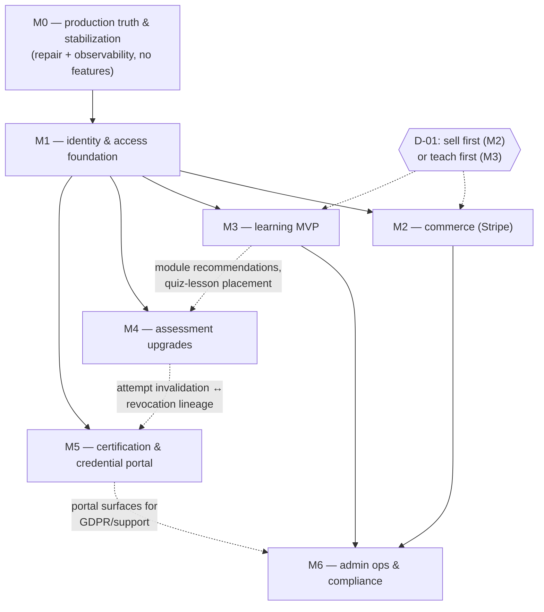

# Milestone backlog — M0–M6: goals, scope, acceptance criteria, verification, rollback, risks

2026-08-01 · Derived from the 112-row capability matrix ([01-capability-matrix.md](01-capability-matrix.md)),
the locked architecture decisions A-01..A-12 ([03-target-architecture.md](03-target-architecture.md)),
and verified production state ([00-executive-assessment.md](00-executive-assessment.md)). The
milestone assignments here are canonical; every matrix row's **Milestone** column resolves to a
bullet in this file. Decision IDs (D-xx) refer to [08-decision-register.md](08-decision-register.md);
risk references are loose pointers into [09-risk-register.md](09-risk-register.md). No calendar
dates — sequencing only.

---

## First-release boundary

**First release = M0 + M1 + (M2 or M3, per D-01).** M0 and M1 are unconditional and start
immediately; the choice between selling first (M2) and teaching first (M3) is the client's
(D-01) and blocks nothing before it — both sit independently on M1, and M1's manual-payment
path already lets the business onboard paying customers before Stripe exists. Engineering
default if the client is indifferent: **M2 first** (smaller, unblocks self-serve revenue).
Everything from M4 onward is post-launch.

## Milestone dependency graph

Solid arrows are hard prerequisites; dashed arrows are soft couplings (the later milestone is
better, not blocked, when the earlier one exists). M0 additionally has one **backward**
coupling worth naming: the post-submit attempt-immutability trigger built in M0 must whitelist
the four M4 invalidation columns from day one, or M4 forces a second trigger migration.

## Pull-forward candidates

The decisions brief itself flags two M4 rows as pull-forward-eligible, and the matrix
concretizes the recommendation:

- **Admin attempt viewer** — recommend pulling the read-only core into **M1** as a drill-in on
  the participant detail page. Zero schema change (the entire dataset already exists in
  `attempt_answers` snapshots), and it has direct support/dispute value the moment paying
  customers exist via M2. It must render the `manual_pass` flag prominently so synthetic 100 %
  attempts are never mistaken for real exams.
- **Attempt invalidation** — the four additive columns (`invalidated_at`,
  `invalidated_by_admin_id`, `invalidation_kind`, `invalidation_reason`) can land with **M0's**
  immutability-trigger migration (they are its column whitelist); the admin UI can wait for M4.

A third, already executed in the matrix rather than proposed: the question **duplicate** action
was moved from M4 into M1's **Question bank manager: search, filter, duplicate** row.

## Row accounting (traceability with [01](01-capability-matrix.md) / [10](10-traceability-matrix.md))

| Milestone | Matrix rows | Complexity mix | Roll-up |
|---|---|---|---|
| M0 | 27 | 16 S · 10 M · 1 L | **M–L** (many small deploys) |
| M1 | 20 | 3 S · 13 M · 4 L | **XL** (largest structural milestone) |
| M2 | 8 | 1 S · 5 M · 2 L | **L** |
| M3 | 14 | 4 S · 6 M · 3 L · 1 XL | **XL** (largest build effort) |
| M4 | 11 | 2 S · 8 M · 1 L | **L** (content is the long pole) |
| M5 | 8 | 2 S · 5 M · 1 L | **M–L** |
| M6 | 20 | 3 S · 12 M · 3 L · 2 XL | **L**, XL if cohorts confirmed |
| client-decision (no milestone) | 4 | — | see final section |
| **Total** | **112** | | |

---

## M0 — Production truth & stabilization

**Goal:** fix every known live defect and end operational blindness, so that all subsequent
change happens on a platform that can tell us when it is broken — no new product features.

### In scope

All 27 M0 matrix rows, grouped. Feature names are verbatim from
[01-capability-matrix.md](01-capability-matrix.md).

**A — Live-defect repairs (behaviour changes; each ships as its own small deploy)**

1. **Stored-XSS fix (admin content into dangerouslySetInnerHTML on candidate pages)** — first
   PR of the programme: HTML-escape `t()` parameters before substitution (or restructure the
   two strings to avoid innerHTML entirely) + a unit test asserting params are escaped
   (`src/lib/i18n/dict.ts:33-35`, `src/app/certification/[accessToken]/page.tsx:56`,
   `result/page.tsx:92`).
2. **Attempt state machine & exam-integrity guards (DB-enforced)** — one migration: partial
   unique index `uniq_open_attempt_per_assignment ON attempts(certification_assignment_id)
   WHERE submitted_at IS NULL`; BEFORE UPDATE/DELETE trigger raising on any grading-field
   change after submit (column whitelist includes the four M4 invalidation fields from day
   one); CHECK constraints; app-side `.neq('status','passed')` guard on the fail path
   (`src/lib/certification/data.ts:353-413`).
3. **Final certification exam chain (token attempt flow, server grading, snapshots)** — the
   app-side half of the same A-08 hardening: chain `.select('id')` on the guarded submit
   update and abort on 0 rows; start writing the currently-dead `in_progress` assignment
   status at attempt-start (gives admins started-but-not-submitted visibility for free —
   verified in prod 2026-08-01 that `in_progress` has never been written).
4. **Question bank core: CRUD + implemented types + core fields** — move the delete-all-
   options-then-reinsert update into a single RPC/transaction (live data-loss risk at
   `admin/questions/actions.ts:176-190`); precheck `question_is_locked()` so locked questions
   render a read-only notice instead of failing at save.
5. **Core authorization invariants: preserve + small hardenings (RBAC, RLS, service-role, CSRF, verification privacy, upload validation)**
   — two one-line defect-class fixes: explicit active-admin check in `requireAdmin()` (today
   an RLS side-effect), last-superadmin count guard; plus regression tests (disabled admin,
   verification-privacy field set, SVG sanitizer).
6. **Admin account hardening & credential lifecycle (audit-derived)** — M0 carries only the
   two code guards above; reset flow, invite-based onboarding and auth-event logging move to
   M1.
7. **Rate limiting: durable activation, fail-open visibility, login lockout** — confirm/set
   the Upstash vars in the client-owned production Vercel account (**the single biggest
   unverified security variable**, verified absent from `.env.local` 2026-08-01); add a
   Sentry warning on memory-fallback (`src/lib/rate-limit.ts:105-121`). Login lockout moves
   to M1. Fail-open semantics stay — but the failure becomes visible.
8. **Certificate asset download authorization + revoked-asset handling (A-09)** — close the
   live defect: the revoke action also deletes the storage objects; reinstate regenerates
   them (`admin/certificates/actions.ts:49-57`). D-04's private bucket + signed-URL migration
   **begins** here and completes its cutover in M1 (dual-read window; old emailed public URLs
   die by design — client comms required).
9. **Revocation and reinstatement** — same migration adds `public_revocation_note` (nullable,
   rendered on the verify page when set). Future-dated revocation and reason categories are
   deliberately skipped.

**B — Certificate pipeline recoverability**

10. **Issuance pipeline with explicit partial-failure handling and retry** — admin "Issue
    certificate" action for passed-without-certificate assignments (the idempotent
    `issueCertificate` already supports it — the missing piece is a caller,
    `src/lib/certificate/issue.ts:167-169`); log every failure path (structured log +
    `account_history` `certificate_issue_failed`); fail hard at boot/issue when
    `NEXT_PUBLIC_SITE_URL` is unset; fix the 23505 unique-collision retry to re-fetch the
    winner's row.
11. **Certificate state machine** — extend `certificates.status` CHECK to
    `valid|revoked|replaced`; add `assets_status` (`pending|generating|complete|failed`) +
    `assets_error`; per-row status on `certificate_assets`; consistency CHECKs
    (revoked→`revoked_at`, replaced→`replaced_by` NOT NULL); backfill the 9 live certificates
    to `assets_status='complete'` (instant — 9 rows, verified in prod 2026-08-01). `expired`
    and `pending review` states are deliberately excluded (certificates never expire — locked
    decision).
12. **Certificate issuance & asset-generation state machine + admin issue-retry** — the
    safety-domain twin of 10/11: every write result checked and logged; generation stays
    inline-but-stateful in M0 (the async move to jobs is M1 — do not build a one-off queue
    here).
13. **Official print formats (PDF + high-res raster)** — riders only: content-hash
    cache-busting in storage paths so "Regenerate files" actually propagates; fold paths into
    the D-04 bucket migration. The requested JPG variant is deliberately dropped (300-DPI PNG
    covers every use; one-line encoder change later if a real need appears).
14. **Public verification page** — inherited touches only: consume signed/proxied asset URLs
    after A-09 and render the revoked presentation + optional note. No feature work; this is
    the strongest surface in the domain and ships as-is.

**C — Observability, failure visibility & alerting (lands BEFORE section A where possible)**

15. **Observability core: error tracking, structured logging, error boundaries** — Sentry SDK
    + `instrumentation.ts`, a thin logger, `error.tsx` boundaries with support-reference IDs,
    and the standing rule "every catch site logs with context" (today: `grep console\. src/`
    → 0 hits).
16. **User-visible failure states (participant + admin), no fake success** — convert void
    `ActionButton` actions to checked results with a visible failure state; extend
    `FormState` with an optional `supportRef` (Sentry event id).
17. **Health checks (/api/health shallow + deep)** — the app's first API route: shallow mode
    for uptime pings; deep mode (token-gated) checking DB, storage bucket, Resend + Upstash
    env presence. Jobs-heartbeat and webhook-lag probes join in M1/M2.
18. **Alerting (actionable, low-noise)** — Sentry alert rules (new issue, error-rate spike),
    uptime monitor on `/api/health`, CI/smoke failure notifications. Business-invariant
    alerts arrive with M1/M2 reconciliation. Keep the total alert count small enough that
    each one is acted on.
19. **Synthetic smoke tests (post-deploy + scheduled)** — Playwright over the flows that exist
    today (admin sign-in, token resolve, verify resolve, certificate download; pass→cert
    against a staging Supabase project, never prod), wired as a post-deploy gate and a
    scheduled run.

**D — Delivery & environment discipline**

20. **Deployment safety: CI gate, rollback discipline, maintenance mode** — GitHub Actions
    (`pnpm typecheck` + `lint` + the 171 existing tests) with main branch protection — the
    single highest-leverage safety item; smoke suite as post-deploy job; two-page
    deploy/rollback playbook. The maintenance-mode switch waits for M1 feature flags.
21. **DB migration discipline: Supabase CLI tracking + drift check** — `supabase link`,
    baseline the 7 applied migrations into `schema_migrations`, add `supabase db diff
    --linked` as a CI drift check. Prerequisite plumbing for every other domain's schema work.
22. **Backups & restore verification (DB, storage, config)** — verify/upgrade the backup tier
    (PITR — cost trivial vs. the asset), run one real restore into a scratch project,
    document RPO/RTO, write the config-recovery sheet.
23. **Production environment audit + boot-time env validation** — scheduled client-dashboard
    session (Vercel + Supabase): Upstash vars, auth settings, bucket policies, the
    account_history trigger state; ship a Zod env schema at boot + the relative-URL issuance
    guard in the same PR as the health check.
24. **Security headers / CSP** — `headers()` block in `next.config.ts`; CSP report-only into
    Sentry for a few days, then enforce (needs an explicit `img-src` allowance for the
    data:-URI certificate view).

**E — Verified launch-ready: regression-protect only, zero repairs**

25. **Configurable pass threshold per certification** — no work; freeze-once-assigned is the
    integrity guarantee, keep it.
26. **Participant result feedback — current compliant surface** — no work; document the
    latent mixed-language edge (EN has never been enabled in prod, verified 2026-08-01).
27. **Manual pass** — no work; fold "note" into the existing reason field permanently.

**Plus (from the decisions brief, not a matrix row):** the **docs truth pass** —
CLAUDE.md/ROADMAP/README corrections for the stale and false claims enumerated in the audit,
so all later work is planned against reality.

### Out of scope

Any new product feature; the jobs/outbox table (M1 — M0 issuance stays synchronous but
stateful); moving asset generation off the candidate request (M1); login lockout, admin MFA,
password-reset flows (M1); participant accounts (M1); completing the A-09 public-bucket
cutover (M1); maintenance-mode switch (needs M1 flags); parser-based SVG sanitizer
(post-launch nice-to-have — ``/resvg isolation is the load-bearing layer).

### Dependencies

- No prior milestones — M0 starts immediately.
- **Client dashboard access** (Vercel + Supabase) for rows 7, 22, 23 — the only two M0 items
  blocked on someone other than engineering. Schedule early; everything else proceeds without
  it.
- **D-04** sign-off on revoked-asset handling (recommendation pre-agreed: private bucket +
  signed URLs).
- A Sentry (or equivalent) account.

### Acceptance criteria

- Sentry receives a forced test error from prod, server- and client-side, tagged with the
  release.
- `/api/health` shallow returns 200 from an external uptime monitor; deep mode reports
  per-dependency status and flips unhealthy when a dependency env var is removed in a preview
  environment.
- Submitting the same attempt twice concurrently creates **exactly one** `attempt_answers`
  set and one `attempt_submitted` history row; a second INSERT of an open attempt for the
  same assignment is rejected by the partial unique index (SQL test).
- UPDATE of any grading field on a submitted attempt raises an exception; UPDATE of the four
  invalidation columns succeeds (whitelist test).
- An admin-entered questionnaire title containing `` renders as
  inert text on the candidate start and result pages (unit + Playwright assertion).
- A staging assignment seeded as passed-without-certificate shows the "Issue certificate"
  action; clicking it produces a certificate row, both assets, and `assets_status='complete'`.
- Revoking a certificate makes its PDF/PNG URLs unreachable within one minute; reinstating
  restores working downloads; the verify page shows the revoked state (+ note when set).
- A PR with a type error cannot merge to main; a red CI run blocks deploy; `supabase db diff
  --linked` in CI is clean against prod.
- One documented restore of a production backup into a scratch project, with row counts
  matching the production-truth figures.
- Rate limiting verified durable: either a 429 observed across two requests hitting different
  serverless instances, or (if Upstash was missing) the vars are now set and the Upstash
  dashboard shows commands; the memory-fallback path emits a Sentry warning when forced.
- A deploy missing `NEXT_PUBLIC_SITE_URL` fails at boot, not at certificate-issue time.
- A forced `ActionButton` failure renders a visible error with a support reference — never a
  silent success.
- CSP enforced with zero violation reports from a full pass over admin + candidate flows.

### Production verification (after ship)

Re-run the production-truth invariant suite (double-open attempts, passed-without-cert,
relative URLs, duplicate emails — all must remain zero); confirm all 9 certificates read
`assets_status='complete'`; load the verify page for a real certificate; confirm the forced
Sentry test event arrived from the production environment; confirm CI + drift check green on
the deployed commit; confirm the smoke suite passed post-deploy.

### Rollback criteria

Every M0 change is its own small deploy → rollback = instant redeploy of the previous Vercel
build. All migrations are additive (indexes, triggers, columns) with prepared down-scripts
(drop trigger/index; columns stay, inert). **Trigger:** post-deploy smoke failure, a Sentry
new-issue spike attributable to the release, or candidates unable to submit attempts.
**Caveat:** the XSS fix and DB integrity guards close live defects — roll them back only for
breakage they themselves cause, and re-land within days.

### Complexity & sequencing

27 rows: 16 S · 10 M · 1 L → **M–L overall**, delivered as a stream of small deploys.
Sequence: (1) migration tooling + CI first (prerequisite for all schema work), Sentry before
any behaviour change so rollouts are watchable; (2) XSS fix + attempt-integrity migration in
the same week; (3) certificate state machine + retry; (4) A-09/D-04 revoked-asset work; (5)
env/backup audit whenever client access is granted (parallel track); (6) docs truth pass
last.

### Primary risks

Changing a live credentialing system while observability is still landing (mitigated by
ordering); the client-access dependency stalling, leaving the Upstash question open;
previously distributed public asset URLs dying at the A-09 cutover (accepted, needs comms); a
defective trigger/index migration blocking submits (mitigated by staging smoke + instant
rollback). See [09-risk-register.md](09-risk-register.md).

---

## M1 — Identity & access foundation

**Goal:** give the academy durable participant identity and an authoritative access model
(enrollments + entitlements), plus the shared operational spine — jobs, email truth, audit
log, admin list scalability — that every later milestone reuses.

### In scope

**Identity**

- **Participant role — account identity & self-management** — per A-02: additive nullable
  `participants.auth_user_id → auth.users`; claim flow reusing the existing OTP-verified
  email; unique partial index on `lower(email)` first (0 duplicates in prod, verified
  2026-08-01 — backfill instant); token surface stays for exam access; the account becomes
  the durable home.
- **Admin credential lifecycle: password reset, rotation, MFA, session management** — reset
  flow (`resetPasswordForEmail`), invite-based onboarding (new admin sets own password on
  first login — ends the superadmin-knows-every-password state), auth events into the audit
  log, login lockout. MFA (TOTP for the 3 admins) recommended but not launch-blocking.
- **Academy administrator role — capability envelope & capability map** — code-level
  namespaced action registry (`content.write`, `certificates.revoke`, `finance.read`, …)
  consulted by `requireAdmin()`; cheap now, makes instructor/support tiers additive later and
  gives the audit log its action vocabulary. Roles stay admin/superadmin (A-11).

**Access model (A-03 / A-04)**

- **Entitlements — the authoritative access record (state machine)** — new `enrollments`
  (registration fact, carries `course_version_id` pin + reserved nullable `cohort_id`) +
  `entitlements` (six states: pending/active/expiring/expired/revoked/suspended; source:
  order/manual/complimentary/invitation); `certification_assignments` gains nullable
  `enrollment_id` and keeps exactly its exam-ticket role; backfill the 20 live assignments.
- **Entitlement-based gating, lookup + reconciliation** — `getActiveEntitlement()` helper in
  `src/lib/access/`, expiry enforced at read time, per-request `cache()` only, fail-closed
  with an error boundary.
- **Orders + payment records: state machine and stored Stripe references** — the FULL orders
  schema lands in M1 (all states, nullable Stripe columns) so manual payments write real
  orders immediately and M2 only wires Stripe transitions.
- **Manual payment recording (offline payments as real orders)** — admin form → order
  (`status='paid'`, method bank_transfer/invoice/cash/partner/complimentary) + enrollment +
  active entitlement in one flow. This is the revenue bridge while D-01 is decided.
- **Manual enrollment (admin grant with audit)** — participant + course (version pinned) +
  duration + required reason + payment classification + auto-stamped admin + audit event.
- **Private invitation links (signed, expiring invitation entity)** / **Signed expiring
  invitations (separate from the permanent access token)** — new `invitations` entity
  (192-bit token, stored hashed like the OTP codes), v1 `grant_type='free'`: redeeming
  creates enrollment + complimentary entitlement (+ a zero-amount order for reporting);
  discount/fixed-price grants arrive with M2 via Stripe promotion codes/prices. Existing
  access tokens keep working (dual-accept window).
- **Commerce state machines: orders, payments, entitlements** — the M1 half: explicit status
  columns with CHECKs, transitions helpers, audit writes; Stripe transitions extend the same
  tables in M2.
- **Conceptual separation guardrail: enrollment ≠ entitlement ≠ progress ≠ assessment ≠
  certification ≠ order ≠ payment ≠ invitation** — each entity owns its status column and
  transitions helper; gating code imports the entitlement-check helper so "has assignment"
  can never quietly become the access predicate; every M1–M3 migration reviewed against this
  row.

**Operational spine (A-05)**

- **Background jobs (outbox) + email delivery state machines** — Postgres `jobs` table
  (queued/running/succeeded/failed/dead + attempts + last_error) + Vercel Cron drainer +
  on-demand trigger; migrate the three existing email senders and certificate asset
  generation onto it; Resend webhook receiver (signature-verified) writing `email_events`
  (delivery/bounce truth — today `emailed_at` records API acceptance, not delivery). Build
  once, early — reconciliation, alerting and commerce all sit on it.
- **Generalized audit log** / **Audit-log integrity + generalized audit trail + admin auth
  events** — new `audit_log` table (append-only trigger pattern, actor_type/actor_id,
  action vocabulary = capability map, nullable participant_id ON DELETE SET NULL,
  `impersonation_session_id` reserved); `account_history` remains the participant-lifecycle
  timeline; design the erasure path as anonymization so GDPR never again requires disarming
  the trigger.
- **Feature flags (temporary rollout switches)** — small `feature_flags` table + cached
  helper (mirrors `getActiveLanguage`) + superadmin UI; booleans only. First consumers:
  entitlement-gating cutover, maintenance mode.
- **A-09 completion (carried from M0):** private-bucket cutover for certificate assets,
  signed-URL serving everywhere, certificate email switches to PDF attachment, regeneration
  moves onto jobs.

**Admin console scalability**

- **Participant list: search, pagination, filters** — server-side search + pagination + the
  filter dimensions that exist (course, enrollment date, assessment status, certificate
  status, access source); data-driven filter bar so M2/M3/M6 dimensions slot in.
- **Participant detail page (360° view)** — enrollments/entitlements panel, internal notes,
  email-events feed, audit feed; recommended home for the pulled-forward **Admin attempt
  viewer** (see pull-forward note above).
- **Question bank manager: search, filter, duplicate** — server-side search over
  `question_text_de/_en`, topic/type/active filters, shared pagination, duplicate action
  (copy + options, `active=false` default).
- **Admin dashboard metrics (ops + business)** — M1 ships assessment tiles (attempts, pass
  rate, certificates issued) + ops-health tiles (failed jobs, failed emails, generation
  failures, dead-letter count) from the new tables; revenue tiles are M2, course metrics M3.

### Out of scope

Stripe anything (M2); learning content (M3); credential portal (M5); instructor/support role
*implementation* (A-11: design the role enum + RLS predicate shapes on paper in M1, build in
M6); formal impersonation (needs participant accounts + M6 safeguards); in-app support inbox
(D-10); CSV import (defer — 17 participants); percentage-rollout flag machinery; MFA
enforcement.

### Dependencies

- **M0 complete** — jobs, webhook receivers and an identity migration must not land on a
  platform that is operationally blind; CI + tracked migrations are prerequisites for this
  milestone's ~8 migrations.
- Supabase Auth email settings verified (from the M0 prod audit) for reset/claim emails.
- Resend dashboard access to configure the webhook endpoint + signing secret.
- **D-09** (default access duration, proposed 12 months) — non-blocking; proposed default
  ships, admin override exists.
- Client comms slot for the A-09 public-URL cutover (old emailed links die).

### Acceptance criteria

- An existing participant claims an account via verified email → `auth_user_id` set; a second
  claim attempt against the same participant fails; inserting a duplicate
  (case-insensitively) participant email is rejected by the index.
- Backfill: entitlement + enrollment count matches the live assignment population (20,
  verified in prod 2026-08-01); after cutover, an invariant query for
  assignments-without-enrollment_id returns 0 for new assignments.
- `getActiveEntitlement()` returns nothing for an entitlement with `expires_at` in the past
  (unit + integration test); the tokenized exam flow is bit-for-bit unaffected by gating
  (smoke test).
- Recording a manual payment creates exactly one order (`status='paid'`,
  `payment_method='bank_transfer'` etc.), one enrollment, one active entitlement and one
  audit event — atomically; re-submitting the form does not double-create.
- A seeded always-failing job retries with backoff and lands in `dead` with `last_error`
  populated; the jobs heartbeat appears in `/api/health` deep mode; a stuck-queue condition
  raises an alert.
- With the Resend key removed in staging, sending a certificate email produces a **failed job
  visible to admins** — not a silent success; restoring the key and retrying succeeds.
- A test send produces a `delivered` row in `email_events` via the Resend webhook; a
  forced bounce records `bounced` and surfaces on the participant detail page.
- Redeeming an invitation creates enrollment + complimentary entitlement exactly once —
  a second redemption is a friendly no-op; an expired invitation link shows a friendly
  expired page, not an error.
- `audit_log` rejects UPDATE and DELETE (trigger test); admin sign-in, admin management and
  settings writes each produce an event with the registry action name.
- With 1 000 seeded participants in staging, the participant list paginates server-side and
  any search returns in under a second.
- A disabled admin cannot authenticate (regression); the last active superadmin cannot be
  deactivated; password reset completes end-to-end.
- Flipping a feature flag changes gating behaviour without a deploy.

### Production verification (after ship)

Claim one real participant account end-to-end on production; count backfilled
enrollments/entitlements against assignments; send a real invite and watch the
`email_events` delivery row arrive; confirm the cron drainer runs on schedule (heartbeat in
deep health); confirm certificate assets now serve via signed URLs and one legacy public URL
no longer resolves (comms sent beforehand); re-run the invariant suite.

### Rollback criteria

The gating cutover ships **behind a feature flag** — rollback = flip the flag back to
assignment-implicit access (minutes, no deploy). Email/asset jobs can revert to inline
sending via flag. Account claim is additive (`auth_user_id` nullable) — disable the claim UI
if defective. **Trigger:** an entitled participant blocked from access, email delivery
stopping, the job queue dead-lettering across job types, or the audit trigger blocking
legitimate writes.

### Complexity & sequencing

20 rows: 3 S · 13 M · 4 L → **XL roll-up**; the largest *structural* milestone. Sequence:
jobs + `email_events` first (shared foundation, sets the webhook-handler convention the
Stripe receiver will copy), then `audit_log` + capability map, then accounts + claim, then
enrollments/entitlements + backfill, then manual payments + invitations, then admin list
upgrades, **gating cutover last** (flagged, with the A-09 cutover window). Cross-domain
column contract to honour: `enrollments.course_version_id` (NN) and `enrollments.cohort_id`
(NULL) must be in the M1 migration or M3 starts by migrating the access backbone.

### Primary risks

Identity/access-model mistakes — the decisions brief's headline risk class — are concentrated
here (mitigated by additive schema, flags, tiny data); gating-cutover lockout of entitled
participants; append-only trigger misfires blocking writes; admin-console scope creep
delaying the foundation. See [09-risk-register.md](09-risk-register.md).

---

## M2 — Commerce (Stripe)

**Goal:** self-serve revenue via Stripe Checkout with server-authoritative entitlements,
explicit financial state machines, and reconciled truth between Stripe and the academy.

### In scope

- **Course commercial offering + Stripe Checkout (one-time payments)** — `course_offers`
  (one active offer per course), server action creating a Checkout Session; the success page
  shows a friendly message but **never grants access** — the grant comes exclusively from the
  webhook → entitlement (A-04, non-negotiable acceptance criterion). Stripe Tax for tax
  configuration.
- **Stripe payment flow, verified webhook receiver + event pipeline** — signature-verified
  receiver; insert-first into `stripe_events` with `ON CONFLICT DO NOTHING` for idempotency;
  `checkout.session.completed` → order paid → entitlement active, all state-machine-guarded
  so duplicate and out-of-order events are no-ops.
- **Stripe webhook security + payment environment separation** — the first commit of the
  Stripe slice, not a hardening pass afterwards; distinct keys per environment enforced by
  the M0 env schema (refuse live keys outside prod).
- **Coupons / promotion codes** — replace disposition: `allow_promotion_codes` on Checkout +
  codes managed in the Stripe dashboard; academy-side only attribution snapshots on the order
  (code, discount, campaign, partner source). No academy coupon engine.
- **Access expiry + duration management (separate from certificate validity)** — expiry on
  `entitlements.expires_at` (NULL = perpetual), default from
  `course_offers.access_duration_days` (365, per D-09); read-time enforcement; expiring/
  expired transitions + reminder emails via the jobs runner. Certificate validity untouched
  (locked: certificates never expire).
- **Refund handling (access + credential policy)** — refund events → `refunds` rows → order
  arithmetic; explicit policy per D-08: full refund with no certificate issued → entitlement
  revoked (reason=refund); any refund where a certificate exists → entitlement per admin
  choice, **certificate never auto-revoked**.
- **Dispute (chargeback) handling** — `charge.dispute.created` → `disputes` row + order
  `disputed` + entitlement suspended (reversible) + admin notification via jobs; closure
  events resolve to won (restore) or lost (revoke).
- **Reconciliation sweeps (detect + surface, never silently rewrite)** — the production-truth
  invariant queries become the first reconciliation job on the M1 runner
  (passed-vs-certs, certs-vs-assets, stuck jobs, emails-vs-events); Stripe-vs-orders and
  orders-vs-entitlements join in M2. Findings create alerts + admin-visible items with
  one-click guided repair — reconciliation reports, humans repair.

### Out of scope

Subscriptions, instalments, payment plans (one-time only, per D-07); an academy-side coupon/
discount engine; hand-built tax logic (Stripe Tax + D-13 professional review); custom
invoicing beyond Stripe receipts (D-13); B2B purchase-order flows; automated refund
decisioning beyond the explicit policy; cross-border storefront localization.

### Dependencies

- **M1** — entitlements, orders, jobs/outbox, `email_events`, feature flags.
- **M0** — observability (a silent webhook failure is silent revenue loss; today nothing
  would surface it), env schema, CI.
- **External:** Stripe account + live/test keys + webhook secret provisioned in the
  client-owned Vercel account (unverifiable from the repo — needs the same client-access
  channel as the M0 env audit).
- **D-01** — whether M2 is in the first release. **D-07** prices/currency. **D-08** refund
  policy (with professional review). **D-13** tax/VAT setup. **D-14** AGB/Widerruf checkout
  wording (professional review). **D-09** default duration.

### Acceptance criteria

- A test-mode checkout completes → webhook creates order `paid` + entitlement `active`; with
  webhook delivery suppressed in staging, the success page alone grants **nothing** (no
  entitlement row exists).
- **Webhook replay of a processed event is a no-op** — same event id re-POSTed changes no
  rows and returns 2xx.
- A webhook with an invalid signature returns 400 and writes nothing.
- Out-of-order events (refund before paid) leave a consistent final state (state-machine
  guard test).
- Full refund on a certificate-less enrollment revokes the entitlement on the next request;
  a refund on a certified enrollment leaves the certificate untouched and routes the
  entitlement to the admin review queue.
- Dispute created → order `disputed`, entitlement `suspended`, admin notification job sent;
  dispute won restores the entitlement.
- A promotion code used at checkout appears snapshotted on the order (code + discount).
- A seeded paid-order-without-entitlement is detected and surfaced by reconciliation within
  one cron cycle, with a working guided repair.
- An entitlement with `expires_at` in the past blocks access with a friendly page; reminder
  emails enqueue at the configured offsets (Stripe test clock / manual clock test).
- Boot fails in a non-production environment configured with live Stripe keys.

### Production verification (after ship)

One real live-mode purchase end-to-end (buy → webhook → entitlement → access), then a real
refund of it; Stripe dashboard shows 100 % webhook deliveries 2xx; `stripe_events` row count
matches the dashboard event count for the period; one full reconciliation cycle reports
clean; revenue tiles match the Stripe balance for the test window.

### Rollback criteria

Checkout ships behind a feature flag / unpublished offers — rollback = hide the purchase
surface (no deploy). The webhook receiver is **never** rolled back once live (the event
ledger must keep accruing; entitlement writes can be flag-paused into review-only mode).
**Trigger:** a webhook failure streak, checkout error-rate spike, or a reconciliation
mismatch that cannot be explained within a day.

### Complexity & sequencing

8 rows: 1 S · 5 M · 2 L → **L roll-up**. Sequence: webhook receiver + `stripe_events` + env
separation as the first commit; checkout + offers; refunds/disputes; expiry + reminders;
reconciliation completes the milestone. The Resend webhook (M1) sets the receiver
convention; the Stripe receiver copies it.

### Primary risks

Silent webhook failure = silent revenue loss (the class M0/M1 exist to prevent);
paid-without-access support incidents in the gap between payment and webhook processing;
legal/tax non-compliance (D-13/D-14 — professional review, non-blocking for build but
blocking for launch); double-grant on event replay (closed by idempotency ledger). See
[09-risk-register.md](09-risk-register.md).

---

## M3 — Learning experience MVP

**Goal:** make the academy teachable — course content structure, participant delivery and
progress tracking, gated by entitlements, without touching the certification chain.

### In scope

- **Course content structure (course → version → module → lesson hierarchy)** — purely
  additive per A-06: `course_versions` → `modules` → `lessons`; the final exam remains the
  existing questionnaire chain (`course_versions.final_exam_questionnaire_id`); quiz lessons
  reference questionnaires. Questionnaires used as module quizzes must **not** run through
  `certification_assignments` (that chain locks content and issues certificates).
- **Course versioning (publish/archive + enrollment version pin)** — simplified per the
  standing challenge: draft/published/archived status, a guard trigger freezing structural
  content of a published version once enrollments exist (mirrors
  `guard_questionnaires_update`), edit = duplicate to new draft,
  `enrollments.course_version_id` pinned at enrollment. No draft/publish version trees, no
  participant-migration tooling.
- **Module flags, ordered progression, subtopics** — required/visibility/sort_order;
  "locked" is derived, not stored; `modules.parent_module_id` reserved (no subtopic UI at
  launch).
- **Lesson types + participant rendering** — enum video / written (markdown) / download /
  external / quiz; PDF collapses into download; mixed-media deferred.
- **Lesson metadata** — title/description/objective/duration/required/instructor notes +
  resource attachments in the same migration.
- **Completion tracking + course completion rules** — `lesson_progress` keyed
  (enrollment_id, lesson_id), `completion_source` enum incl. manual_admin (audited);
  progress % = completed required / total required, unweighted at launch.
- **Minimum watch requirement (video completion threshold)** — simplified per the standing
  disposition: ~10 s heartbeat records position + watched %, auto-complete at a configurable
  threshold (default 90 %); seeking/speed/rewatch allowed; a completion signal, not
  anti-cheat.
- **Locked progression dependencies** — two DTO-enforced gates: active entitlement + valid
  enrollment on every learning read; linear progression toggleable per course version.
- **Self-paced mode (default delivery model)** — the documented v1 delivery model, so cohort
  mode stays a clean additive layer.
- **Continue where you left off (resume)** — derived from `lesson_progress.updated_at` +
  `last_position_seconds`; no new state.
- **Resource library + authorized downloads** — the load-bearing core: `resources` +
  attachments + entitlement-authorized signed URLs from a NEW private `course-content`
  bucket (A-09 pattern — never repeat the public-bucket mistake). Central faceted library is
  post-launch.
- **Course builder (admin authoring)** — the XL long pole: version list → module list →
  lesson editor, following the existing admin feature shape; reorder via the proven up/down
  pattern (drag-drop is polish); media direct-to-storage / direct-to-provider (never through
  the Next.js server).
- **Participant dashboard (cross-course account home)** — course cards with progress,
  resume link, certification status, access expiry, certificates list.
- **Course dashboard (per-enrollment course home)** — module list with lock/release state,
  progress bar, resources, expiry, exam eligibility (all required modules complete AND
  active entitlement) surfaced as **status only** — assignment creation stays admin-manual.

### Out of scope (deferred within M3, per the decisions brief)

Glossary, personal notes, bookmarks, content search, audio mode, drip release (`release_rule`
jsonb ships schema-ready with only `immediate` honoured), subtopic UI, weighted progress,
cohorts (D-03), in-app notifications, cross-course faceted resource library, auto-creating
exam assignments from eligibility.

### Dependencies

- **M1** — accounts (dashboards are account surfaces), enrollments (with the version-pin and
  cohort_id columns already in place), entitlements + gating helper.
- **D-02** — video hosting provider + budget (Mux/Bunny/Vimeo): a hard external blocker for
  video lessons and the builder's upload flow; every non-video part of M3 proceeds without
  it.
- **D-03** — cohorts: only to keep the schema ready (no build).
- **Client curriculum** — real course content to author; the builder is useless empty.
- Quiz-lesson semantics decision: ship quizzes as ungraded inline self-checks in M3, or pull
  the M4 practice-vs-exam distinction partially forward (matrix flags this as the M3/M4
  sequencing decision; the lighter option is the default).

### Acceptance criteria

- Admin creates version → modules → lessons of every type and publishes; editing structural
  content of a published version with enrollments raises the guard trigger.
- An enrolled, entitled participant sees the course dashboard; an **expired entitlement
  blocks course content with a friendly page** (not an error, not a blank).
- Publishing v2 changes nothing for a v1-pinned enrollee (version-pin test).
- Video heartbeat writes position ~every 10 s; the lesson auto-completes at the threshold;
  resume returns within a few seconds of the recorded position, across devices
  (last-write-wins).
- With linear progression on, lesson N+1 is locked until lesson N completes; toggling it off
  unlocks immediately.
- Course progress % equals completed-required / total-required on seeded fixtures; course
  completion flips exam eligibility to visible.
- A resource download URL is signed and short-lived; the same object fetched without a
  signature (or with an expired entitlement) is denied.
- An admin manual completion override writes an audited `completion_source='manual_admin'`
  row.
- The existing certification smoke suite passes unchanged — the exam chain is untouched.

### Production verification (after ship)

Client loads real course content through the builder; one pilot participant completes a full
module on production (video + written + download); probe a course-content storage object
without a signed URL → denied; heartbeat rows accruing for the pilot; version pin verified on
a real publish; entitlement expiry page verified with a short-dated test entitlement.

### Rollback criteria

Learning routes ship behind a feature flag — rollback = flag off (participant surfaces
disappear; authoring and content data are additive and persist). Video provider integration
is isolated behind the lesson renderer. **Trigger:** entitled participants blocked from
content, systematic video delivery failure, or progress data loss/corruption.

### Complexity & sequencing

14 rows: 4 S · 6 M · 3 L · 1 XL → **XL roll-up**; the largest *build* milestone. Sequence:
schema + course builder first (content entry starts while participant surfaces are
finished), video-provider integration as a parallel track once D-02 lands, progress +
gating next, dashboards last. If D-01 chose M2 first, M3 follows it; nothing in M3 depends
on M2.

### Primary risks

Video provider selection/cost drift (D-02); content readiness — a client dependency
engineering cannot close; builder scope creep (drag-drop, rich media); progress-tracking
correctness disputes (the friendly-block and completion rules must be exact). See
[09-risk-register.md](09-risk-register.md).

---

## M4 — Assessment engine upgrades

**Goal:** deepen exam integrity and insight — question pools with topic balancing, retry
cooldowns, attempt invalidation, the admin attempt viewer, practice-vs-exam distinction, and
first analytics.

### In scope

- **Question bank metadata extensions (module, difficulty, author, review state, versioning)**
  — difficulty (nullable), `created_by_admin_id`, `superseded_by_question_id` lineage;
  review state simplified to draft/published.
- **True/false question type** — deliberately NOT a DB type: an authoring preset seeding two
  Richtig/Falsch options on a `single_choice` question. Zero migration, zero scoring change.
- **Order randomization (existing shuffle flags)** — folded into the frozen attempt
  blueprint: `attempts.question_set` (ordered question ids + per-question option order)
  frozen at attempt-start fixes reshuffle-on-resume and is the same structure pool sampling
  needs (both prod questionnaires have shuffle off — verified 2026-08-01 — so nothing
  regresses meanwhile).
- **Question pool selection (sampling, balancing, repeat prevention)** —
  `questionnaire_selection_rules` (per-topic required_count + optional difficulty mix),
  `pool_mode` flag, selection executed at attempt-start into the frozen blueprint,
  repeat-penalty against the previous attempt's set.
- **Attempts, retries, cooldowns, practice-vs-exam rules** — per-questionnaire cooldown
  columns (suggested defaults 0 / 12 h / 24 h, per D-05), enforced server-side at
  attempt-start, next-eligible time surfaced on the hub; attempts stay uncapped pending
  D-05.
- **New assessment types: lesson quiz, module quiz, practice exam** —
  `questionnaires.purpose` (`final_exam` default | practice_exam | diagnostic | lesson_quiz
  | module_quiz), frozen by the content-lock trigger; certificate issuance gated to
  `final_exam` only; per-purpose `show_explanations` policy.
- **Pre-course diagnostic (baseline, non-certifying)** — `purpose='diagnostic'` rides the
  existing chain with pass/fail + certificate semantics suppressed; recommendations reuse
  `buildRecommendations` as "start here" guidance.
- **Enhanced participant feedback (topic scores, module recommendations, readiness, practice explanations)**
  — freeze `attempts.topic_scores` at submit (one write in `recordAttempt`); module
  recommendations via topic→module mapping once M3 exists; explanations **only** on
  non-final purposes — the final-exam no-leak policy is never loosened.
- **Admin attempt viewer** — per-question snapshot vs selected vs correct, duration,
  `manual_pass` flag prominent. (Strongest pull-forward candidate — see the note above;
  recommended to land with M1.)
- **Attempt invalidation** — four additive columns + all-or-none CHECK; the original row is
  untouched forever (the M0 immutability trigger whitelists exactly these columns);
  results/analytics exclude invalidated attempts.
- **Assessment analytics** — deliberately thin v1: two SQL views (`question_stats`,
  `questionnaire_stats`) rendered as admin dashboard cards.

**Client-decision rows that dock here only if confirmed (not in the M4 baseline):**
**Weighted questions with understandable participant results** (schema-ready inert
`questions.weight`, wired only on confirmation), **Topic floors + critical-safety question
rules** (D-06 — today's serve-every-question exam already limits the risk the floors target),
**Ordering + matching question types** (challenged: partial-credit semantics with no
demonstrated curriculum need).

### Out of scope

Advanced question types (scenario-branching, hotspot, written, file, video — M6/backlog,
demand-driven); question discrimination statistics; a full review workflow (reviewer roles,
comments); question bank import/export (M6 exports bundle at best); attempt caps beyond
cooldowns unless D-05 sets them.

### Dependencies

- **M0** — the attempt-immutability trigger with the invalidation-column whitelist (hard
  coupling, already designed in).
- **M1** — admin list/detail infrastructure (viewer home), jobs (nothing hard).
- **M3** — modules, for module recommendations and lesson/module quiz placement (soft: pools,
  cooldowns, viewer, invalidation all work without M3).
- **D-05** — cooldown values + attempt caps. **D-06** — topic floors (client, curriculum).
- **Content:** pool selection needs an authoring surplus (~2–3× questions per topic; prod has
  44 questions across 8 topics, verified 2026-08-01) — the true long pole of M4 is content,
  not code.

### Acceptance criteria

- Attempt-start with `pool_mode` on freezes a `question_set` satisfying every per-topic
  required_count (property-based test over seeded banks); two consecutive attempts on the
  same assignment receive different sets (repeat-penalty test).
- Resuming an attempt shows byte-identical question and option order (blueprint test).
- An attempt started inside the cooldown window is rejected server-side with the
  next-eligible time; the hub shows the same time.
- Invalidating a submitted attempt sets exactly the four columns; every grading field is
  unchanged (trigger passes); results and analytics exclude it; the certifying-attempt case
  routes to certificate revocation, never silent edits.
- The attempt viewer renders snapshot vs selected vs correct for a seeded attempt and shows
  `manual_pass` prominently on a manual-pass attempt.
- A `practice_exam` attempt shows explanations and can never issue a certificate; a
  `final_exam` attempt never returns correct answers to the client (existing policy,
  re-asserted as a regression test).
- Analytics views match hand-computed statistics on a seeded fixture set.

### Production verification (after ship)

Run pool mode first on a staging replica of a production questionnaire; in prod, enable it
only once the content surplus exists, then verify a real attempt's frozen blueprint and
topic balance by SQL; confirm cooldown enforcement on a real retry; confirm analytics cards
against direct SQL on live data.

### Rollback criteria

`pool_mode` is per-questionnaire — flipping it off restores serve-all-questions instantly;
cooldowns are configurable to 0; invalidation and metadata are additive. **Trigger:** a
sampling defect blocking attempt starts or producing topic-unbalanced exams, or any scoring
mismatch against the pre-M4 engine.

### Complexity & sequencing

11 rows: 2 S · 8 M · 1 L → **L roll-up**. Sequence: attempt blueprint first (randomization
and pools share it), `purpose` column early (M3's quiz lessons may want it), viewer +
invalidation next (unless already pulled forward), pools + cooldowns, analytics last.
Client question-authoring runs in parallel from the start of M4 or earlier.

### Primary risks

Sampling correctness (an unbalanced or repeating exam damages certification credibility);
content shortage delaying pool activation; regression risk to the one engine that is
production-proven (mitigated: the scoring path itself is untouched). See
[09-risk-register.md](09-risk-register.md).

---

## M5 — Certification & credential portal

**Goal:** turn issued certificates into managed, shareable credentials — an account-based
portal, replacement with lineage, social/LinkedIn formats — on the state machine M0 built.

### In scope

- **Credential portal** — authenticated page listing all certificates across the
  participant's assignments: status badge, verify link, per-format downloads via the A-09
  signed-URL endpoint (made participant-aware), LinkedIn button. Hard-blocked on M1
  accounts.
- **Certificate replacement with lineage** — replacement mints a NEW certificates row
  (fresh token + snapshot) that RETAINS the `certificate_number` (the number identifies the
  credential, the token the document); predecessor → `status='replaced'` +
  `replaced_by_certificate_id`; verify on the old token shows the replaced state and points
  forward.
- **Social share formats + social template manager** — reuse the proven designer-SVG →
  placeholder → resvg pipeline at native pixel dims; extend the hardcoded
  `template_type='official_certificate'` into a picker. **Blocked on client-supplied
  designs.**
- **Certificate ID scheme** — keep the existing scheme; adopt the series segment
  (`IIS-<SERIES>-YYYY-XXXXXX`, per D-16) only for newly issued certificates once
  `courses.series_code` exists; never rename existing certificates.
- **LinkedIn credential support** — Add-to-Profile deep link (name, org, issue year/month,
  certId=`certificate_number`, certUrl=verification URL) + a copy-paste metadata card. The
  cheapest high-value item in the domain.
- **Website badge** — simplified v1: downloadable badge asset + documented
  `` snippet; no iframe/script embed, no Open-Badges spec.
- **Bulk certificate operations** — every bulk action = N idempotent jobs on the M1 outbox +
  a progress/failure view; never a synchronous loop. "Review generation failures" =
  filtering `assets_status='failed'` (exists since M0).
- **Certificate template manager (official artwork)** — challenge answered: NO parametric
  editor; the designer-SVG-with-placeholders pipeline is live and proven (every production
  certificate shipped through it) — keep it and extend the template-type dimension only.

### Out of scope

A parametric/WYSIWYG template editor; Open Badges / third-party credential standards; iframe
or script embeds; certificate expiry (locked: certificates never expire); per-visitor share
analytics (M6 keeps a minimal aggregate counter); certificate-language switching work while
EN remains disabled (D-17 — the gap is latent; EN has never been enabled in prod, verified
2026-08-01).

### Dependencies

- **M1** — participant accounts (portal hard blocker), jobs (bulk, re-render).
- **M0** — certificate state machine incl. `replaced`; A-09 signed-URL serving.
- **Client:** social + badge designs (hard blocker for those two rows); LinkedIn company
  page / organization ID confirmation; **D-16** series-code adoption (low stakes); **D-17**
  EN timing.
- **M4 (soft):** invalidation of a certifying attempt routes into revocation/replacement
  lineage.

### Acceptance criteria

- The portal lists exactly the logged-in participant's certificates; an RLS test proves
  another participant's certificates are not selectable with the first participant's
  session.
- Portal downloads are short-lived signed URLs; a revoked certificate offers no download and
  shows its status.
- Replacing a certificate: new row carries the same `certificate_number` and a fresh token;
  the old token's verify page states "replaced" and links forward; the new token verifies;
  exactly one non-replaced certificate exists per assignment (partial unique index).
- The LinkedIn link opens Add-to-Profile with all fields prefilled correctly against a real
  LinkedIn account.
- A social asset renders at the exact pixel dimensions of the client design and appears in
  `certificate_assets` with correct type + status.
- A bulk regenerate over N certificates enqueues N jobs; the progress view shows per-item
  success/failure; failed items are individually retryable; re-running the bulk action is a
  no-op for already-succeeded items.

### Production verification (after ship)

One real participant claims and opens the portal on production; perform one real replacement
and verify both tokens' public pages; add one real certificate to a LinkedIn profile;
spot-check a bulk regeneration batch of the 9+ live certificates and confirm
`assets_status='complete'` across the board afterwards.

### Rollback criteria

The portal ships behind a feature flag — flag off on any cross-participant data exposure
(immediate). Replacement is reversible by administrative action (flip predecessor back to
`valid`, revoke the replacement). Social/badge generation failures affect only new assets.
**Trigger:** portal authorization defect, verify-page regression, or replacement lineage
producing two live certificates for one assignment.

### Complexity & sequencing

8 rows: 2 S · 5 M · 1 L → **M–L roll-up**. Sequence: LinkedIn + ID scheme first (cheap,
high value); portal once M1 account adoption is real; replacement next; social/badge
whenever client designs arrive (fully parallel track); bulk operations last (needs nothing
but jobs + the M0 states).

### Primary risks

Client-design dependency stalling the social/badge half; trust regressions on the verify
page (the platform's public face); leftover public-URL references from before the A-09
cutover. See [09-risk-register.md](09-risk-register.md).

---

## M6 — Admin ops & compliance

**Goal:** scale administration and close the compliance loop — additional roles, exports,
support workflow, GDPR, impersonation, analytics, and (if D-03 confirms) cohorts.

### In scope

**Roles & access**

- **Instructor/mentor role (assigned-courses-only tier)** — build per A-11 (designed on
  paper in M1): role value + `instructor_courses` + scoped RLS predicates + scoped chrome;
  only when instructor headcount exists (D-11).
- **Support administrator role** — capability-map subset (read participants +
  email_events + support_requests; resend actions only).
- **Roles beyond admin/superadmin + formal impersonation safeguards** — the safety-domain
  envelope for both rows above.
- **Controlled impersonation** — `impersonation_sessions` (required reason, read-only
  default, short expiry), banner, sensitive-action blocklist, every action stamped with
  `impersonation_session_id` in the audit log. Requires participant accounts (M1).

**Compliance & data**

- **GDPR & privacy program** — export, deletion-request, anonymization workflows; retention
  policy per D-12 (professional review). The matrix's evidence-backed challenge stands: pull
  the **anonymization primitive** forward into M1 so erasure never again requires disarming
  the append-only trigger (today participant hard-delete is impossible without SQL-editor
  surgery — documented workaround in project memory).
- **Reporting & data exports** — simplified: filter-aware CSV downloads on each admin list
  (reusing M1 filter infra), each export writing a `data.exported` audit event.
- **Question bank import/export** — export rides the exports bundle; import stays deferred
  (44 questions — manual authoring outpaces building a validated importer).
- **CSV import (participants + enrollments)** + **Import pipeline state machine (CSV/bulk
  imports)** — defer-low-value; build only on a concrete bulk-onboarding trigger (e.g. a
  seminar cohort purchase), then as preview-then-commit `import_batches` on the jobs table,
  never a synchronous action.

**Communication & support**

- **Email templates & copy editing** — replace disposition: NO WYSIWYG editor; code-owned
  layout + DB-stored editable copy blocks (`template_key × locale × block_key`) edited via a
  plain admin form; variables interpolate through an HTML-escaping substitute.
- **Support workflow (participant contact + admin inbox)** — v1 per D-10: reference-ID
  mailto/form on candidate + account surfaces + a minimal `support_requests` log; a full
  in-app inbox only if volume demands.

**Learning & assessment depth (post-launch backlog items that dock here)**

- **Cohort mode** (client decision D-03; XL) — `cohorts` + `cohort_module_releases` +
  `enrollments.cohort_id` (column reserved since M1); announcements ride jobs/email.
- **Drip release** — logic over the `release_rule` jsonb shipped schema-ready in M3.
- **Personal notes** — private-only v1 (no sharing mechanism).
- **Bookmarks + favorite resources** — one polymorphic `bookmarks` table covering both.
- **Participant search (content search)** — Postgres tsvector (german config), course-level
  first; no external search infrastructure.
- **Glossary** — terms + lesson join + "terms in this lesson" panel; no hover auto-linking.
- **Audio-only mode** — nullable `audio_url` per lesson if the curriculum supplies files; no
  extraction/transcoding.
- **Advanced question types (scenario-branching, hotspot, written, file, video)** —
  backlog-only, built solely against concrete curriculum demand.
- **Share and verification analytics** — minimal, privacy-conscious aggregate counters
  (`certificate_stats` per day/metric; no per-visitor rows, no IP/UA).

### Out of scope

Multi-tenant / white-label (excluded, A-01); a WYSIWYG email template editor; a full
helpdesk/inbox product; per-visitor analytics or session recording; open-ended BI
dashboards; human-graded assessment workflows beyond the demand-driven backlog row.

### Dependencies

- **M1** — capability map, audit log, accounts, jobs (all role/compliance work sits on
  them).
- **M3** — content for cohorts/drip/search/glossary/notes to operate on.
- **M2 + M3** — as the graph shows: admin-ops analytics and compliance close over commerce
  and learning data.
- **D-03** cohorts (gates the XL item), **D-10** support channel, **D-11** instructor
  timing, **D-12** GDPR retention/anonymization policy (professional review).

### Acceptance criteria

- A GDPR erasure on a test participant anonymizes personal data while `account_history` and
  `audit_log` remain append-only throughout (the trigger is never disabled) and referential
  integrity holds; a data export contains every personal-data field the model stores.
- A filtered CSV export matches the on-screen filtered list row-for-row and writes a
  `data.exported` audit event.
- An impersonation session cannot start without a reason; the banner shows; a blocked
  sensitive action is refused; every action taken carries `impersonation_session_id` in the
  audit log; sessions auto-expire.
- An instructor account sees only assigned courses (RLS test: unassigned course queries
  return empty) and is refused on financial/settings surfaces.
- Editing an email copy block changes the next sent email without a deploy; a block
  containing markup is escaped in the send.
- A support request from a candidate surface arrives with the correct reference ID and
  creates a `support_requests` row.
- If cohorts ship: a module with a cohort release date is locked before and open after
  `release_at` for that cohort's members only.

### Production verification (after ship)

Execute one full GDPR erasure + export on a real (consenting/test) participant in
production; verify the audit trail of one real impersonation session; verify an instructor
account against the live course list; send and answer one real support request end-to-end.

### Rollback criteria

Everything here is additive and flag- or role-gated: new roles revert to the binary
admin/superadmin check; copy blocks fall back to code defaults; cohort/drip logic reverts to
self-paced (`immediate`). **Trigger:** any permission regression (a scoped role seeing
unscoped data — immediate), an erasure damaging referential integrity, or copy-block
rendering breaking transactional emails.

### Complexity & sequencing

20 rows: 3 S · 12 M · 3 L · 2 XL (both XLs conditional/demand-driven) → **L roll-up, XL if
cohorts confirmed**. Sequence: GDPR + exports first (standing compliance priority and the
professional-review register feeds them), support workflow + copy blocks next, role tiers
only when headcount/volume justify them (A-11), learning-depth items ordered purely by
client demand, cohorts last and only on D-03.

### Primary risks

Building role tiers with zero users of them (guarded by A-11's build-when-needed gate);
GDPR erasure colliding with append-only history (designed out in M1 if the anonymization
primitive is pulled forward); cohort complexity expanding into scheduling/communication
scope. See [09-risk-register.md](09-risk-register.md).

---

## Rows outside the milestone skeleton (client-decision)

Four matrix rows carry no milestone; each is schema-ready or paper-designed at near-zero
cost and enters the plan only on client confirmation:

| Feature (verbatim) | Decision | Earliest landing | Standing preparation |
|---|---|---|---|
| Cohort management | D-03 | M6 | `enrollments.cohort_id` reserved in M1 |
| Ordering + matching question types | client (curriculum) | post-M4 | challenged: no demonstrated pedagogy need; partial-credit semantics |
| Weighted questions with understandable participant results | client (curriculum) | M4+ | inert nullable `questions.weight` ships in the M4 migration |
| Topic floors + critical-safety question rules | D-06 | M4+ | today's serve-all-topics exam already bounds the risk |

These, plus D-01 (M2 vs M3 order), are the only client decisions that shape sequencing.
Nothing in M0 or M1 waits on any of them — see
[11-implementation-recommendation.md](11-implementation-recommendation.md) for the next
concrete action.
